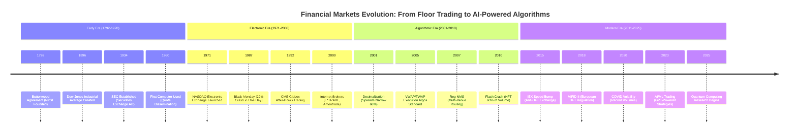
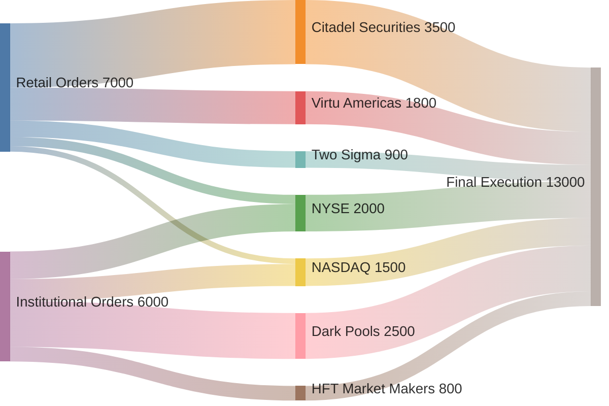

# Chapter 1: Introduction to Algorithmic Trading

## Abstract

This chapter provides comprehensive historical and conceptual foundations for algorithmic trading. We trace the evolution from human floor traders in the 1970s to microsecond-precision algorithms executing billions of trades daily. The chapter examines how technological advances (computers, networking, co-location) and regulatory changes (decimalization, Reg NMS, MiFID II) enabled the modern trading landscape. We categorize algorithmic strategies by objective (alpha generation vs. execution optimization) and risk profile (market-neutral vs. directional). The chapter concludes with analysis of quantitative finance careers, required skill sets, and compensation structures. Understanding this historical context is essential for appreciating both the opportunities and constraints facing algorithmic traders today.

---

## 1.1 The Evolution of Financial Markets: From Pits to Algorithms

### 1.1.1 The Era of Floor Trading (1792-1990s)

Financial markets began as physical gatherings where traders met to exchange securities. The New York Stock Exchange (NYSE), founded in 1792 under the Buttonwood Agreement, operated as an open-outcry auction for over two centuries. Traders stood in designated locations on the exchange floor, shouting bids and offers while using hand signals to communicate. This system, while seemingly chaotic, implemented a sophisticated price discovery mechanism through human interaction.

Floor trading had several defining characteristics. **Spatial organization** determined information flow: traders specialized in particular stocks clustered together, creating localized information networks. **Human intermediaries** played critical roles: specialists maintained orderly markets by standing ready to buy or sell when public orders were imbalanced. **Transparency was limited**: only floor participants could observe the full order book and trading activity. **Latency was measured in seconds**: the time to execute a trade depended on physical proximity to the trading post and the speed of human processing.

The economic model underlying floor trading rested on information asymmetry and relationship capital. Floor traders profited from several sources:

1. **Bid-ask spread capture**: Market makers earned the spread between buy and sell prices, compensating for inventory risk and adverse selection
2. **Information advantages**: Physical presence provided early signals about order flow and sentiment
3. **Relationship networks**: Established traders had preferential access to order flow from brokers
4. **Position advantages**: Proximity to the specialist's post reduced execution time

This system persisted because transaction costs remained high enough to support numerous intermediaries. A typical equity trade in the 1980s cost 25-50 basis points in explicit commissions plus another 25-50 basis points in spread costs, totaling 50-100 basis points (0.5-1.0%). For a $10,000 trade, this represented $50-100 in costs—enough to sustain a complex ecosystem of brokers, specialists, and floor traders.

### 1.1.2 The Electronic Revolution (1971-2000)

The transition to electronic trading began not with stocks but with the foreign exchange and futures markets. Several technological and economic forces converged to make electronic trading inevitable:

**NASDAQ's Electronic Order Routing (1971)**: The NASDAQ stock market launched as the first electronic exchange, routing orders via computer networks rather than physical trading floors. Initial adoption was slow—many brokers preferred telephone negotiations—but the system demonstrated feasibility of computer-mediated trading.

**Chicago Mercantile Exchange's Globex (1992)**: The CME introduced Globex for after-hours electronic futures trading. While initially limited, Globex's 24-hour access and lower transaction costs attracted institutional traders. By 2000, electronic trading volumes exceeded open-outcry volumes for many futures contracts.

**Internet Trading Platforms (1994-2000)**: The Internet boom enabled direct market access for retail traders. E*TRADE, Ameritrade, and Interactive Brokers offered online trading with commissions orders of magnitude lower than traditional brokers. This democratization of market access increased competitive pressure on incumbent intermediaries.

The transition faced significant resistance from floor traders, who correctly perceived electronic trading as an existential threat. However, economic forces proved irresistible:

- **Cost efficiency**: Electronic trading reduced per-transaction costs by 80-90%, from $50-100 to $5-15 for a typical retail trade
- **Capacity**: Electronic systems could process millions of orders per day; human floors topped out at tens of thousands
- **Transparency**: Electronic limit order books provided equal information access to all participants
- **Speed**: Electronic execution time dropped from seconds to milliseconds

By 2000, the writing was on the wall. The NYSE—the last major holdout—would eventually eliminate floor trading for most stocks by 2007, retaining it only for opening/closing auctions and certain large block trades.

### 1.1.3 The Rise of Algorithmic Trading (2000-2010)

With electronic exchanges established, the next revolution was algorithmic execution. Early algorithmic trading focused on execution optimization rather than alpha generation. Institutional investors faced a fundamental problem: breaking large orders into smaller pieces to minimize market impact while executing within desired timeframes.

**The Market Impact Problem**: Consider a mutual fund wanting to buy 1 million shares of a stock trading 10 million shares daily. Attempting to buy all shares at once would push prices up (temporary impact), suffer adverse selection from informed traders (permanent impact), and reveal intentions to predatory traders (information leakage). The solution was time-slicing: splitting the order across hours or days.

But how to optimize this time-slicing? Enter algorithmic execution strategies:

**VWAP (Volume-Weighted Average Price)**: Matches the trader's execution pace to overall market volume. If 20% of daily volume trades in the first hour, the algorithm executes 20% of the order then. This minimizes adverse selection from trading against volume patterns.

**TWAP (Time-Weighted Average Price)**: Splits the order evenly across time intervals. Simpler than VWAP but potentially worse if volume is concentrated in certain periods.

**Implementation Shortfall**: Minimizes the difference between execution price and price when the decision was made. Uses aggressive market orders early to reduce exposure to price movements, then switches to passive limit orders to reduce impact costs.

These execution algorithms became standard by 2005. Investment Technology Group (ITG), Credit Suisse, and other brokers offered algorithm suites to institutional clients. The total cost of equity trading (including impact, commissions, and spread) dropped from 50-100 basis points in the 1990s to 10-30 basis points by 2005—a revolution in transaction costs.

### 1.1.4 The High-Frequency Trading Era (2005-Present)

As execution algorithms became commoditized, a new breed of algorithmic trader emerged: high-frequency trading (HFT) firms. Unlike execution algorithms serving institutional clients, HFT firms traded proprietary capital with strategies designed for microsecond-scale profit capture. Several developments enabled HFT:

**Decimalization (2001)**: The SEC required all U.S. stocks to quote in decimals rather than fractions. Minimum tick size fell from 1/16 ($0.0625) to $0.01, dramatically narrowing spreads. This created opportunities for rapid-fire trades capturing fractional pennies per share—profitable only with high volume and low costs.

**Regulation NMS (2007)**: The SEC's Regulation National Market System required brokers to route orders to the exchange offering the best displayed price. This fragmented liquidity across multiple venues (NYSE, NASDAQ, BATS, Direct Edge, etc.) and created arbitrage opportunities from temporary price discrepancies.

**Co-location and Proximity Hosting**: Exchanges began offering co-location: servers physically located in exchange data centers, minimizing network latency. The speed of light becomes the fundamental constraint—a 100-mile round trip incurs a 1-millisecond delay. Co-location reduced latency from milliseconds to microseconds.

**FPGA and Custom Hardware**: Field-Programmable Gate Arrays (FPGAs) execute trading logic in hardware rather than software, achieving sub-microsecond latency. Firms like Citadel Securities and Virtu Financial invested hundreds of millions in hardware acceleration.

High-frequency trading strategies fall into several categories:

**Market Making**: Continuously quote bid and offer prices, earning the spread while managing inventory risk. Modern HFT market makers update quotes thousands of times per second, responding to order flow toxicity and inventory positions.

**Latency Arbitrage**: Exploit microsecond delays in price updates across venues. When a stock's price moves on one exchange, latency arbitrageurs buy on slower exchanges before they update, then immediately sell on the fast exchange. This strategy is controversial—critics argue it's merely front-running enabled by speed advantages.

**Statistical Arbitrage**: Identify temporary mispricings between related securities (stocks in the same sector, ETF vs. components, correlated futures contracts). Execute when divergence exceeds trading costs, profit when prices converge.

By 2010, HFT firms accounted for 50-60% of U.S. equity trading volume. This dominance raised concerns about market quality, culminating in the May 6, 2010 "Flash Crash" when algorithms amplified a sell imbalance, causing a 600-point Dow Jones drop in minutes.

### 1.1.5 Timeline: The Evolution of Trading (1792-2025)



**Figure 1.1**: The 233-year evolution of financial markets shows accelerating technological disruption. Note the compression of innovation cycles: 179 years from NYSE to NASDAQ (1792-1971), but only 9 years from decimalization to flash crash (2001-2010). Modern algorithmic trading represents the culmination of incremental improvements in speed, cost efficiency, and information processing—but also introduces systemic risks absent in human-mediated markets.

---

## 1.2 Regulatory Landscape and Market Structure

### 1.2.1 Key Regulatory Milestones

Understanding algorithmic trading requires understanding the regulatory framework that enabled—and constrains—its operation. Several major regulations reshaped U.S. equity markets:

**Securities Exchange Act of 1934**: Established the SEC and basic market structure rules. Required exchanges to register and comply with SEC regulations. Created framework for broker-dealer regulation.

**Decimal Pricing (2001)**: The SEC required decimal pricing after years of resistance from exchanges and specialists. Fractional pricing (in increments of 1/8 or 1/16) had artificially widened spreads, benefiting intermediaries at expense of investors. Decimalization reduced the average NASDAQ spread from $0.38 to $0.12, a 68% decline. This compression made traditional market making unprofitable unless supplemented with high volume and automated systems.

**Regulation NMS (2005, effective 2007)**: The National Market System regulation comprised four major rules:

1. **Order Protection Rule (Rule 611)**: Prohibits trade-throughs—executing at a price worse than the best displayed quote on any exchange. Requires routing to the exchange with the best price, preventing exchanges from ignoring competitors' quotes.

2. **Access Rule (Rule 610)**: Limits fees exchanges can charge for accessing quotes. Caps at $0.003 per share ($3 per thousand shares). Prevents exchanges from using access fees to disadvantage competitors.

3. **Sub-Penny Rule (Rule 612)**: Prohibits quotes in increments smaller than $0.01 for stocks priced above $1.00. Prevents sub-penny "queue jumping" where traders step ahead of existing orders by submitting fractionally better prices.

4. **Market Data Rules (Rules 601-603)**: Governs distribution of market data and allocation of revenues. Created framework for consolidated tape showing best quotes across all venues.

Reg NMS had profound implications for market structure. By requiring best execution across venues, it encouraged competition among exchanges. From 2005-2010, U.S. equity trading fragmented across 13+ exchanges and 40+ dark pools. This fragmentation created both opportunities (arbitrage across venues) and challenges (routing complexity, information leakage).

**MiFID II (2018, European Union)**: The Markets in Financial Instruments Directive II represented the EU's comprehensive overhaul of financial markets regulation. Key provisions:

- **Algorithmic Trading Controls**: Requires firms using algorithmic trading to implement testing, risk controls, and business continuity arrangements. Systems must be resilient and have sufficient capacity.

- **HFT Regulation**: Firms engaged in HFT must register, maintain detailed records, and implement controls preventing disorderly trading. Introduces market making obligations for HFT firms benefiting from preferential arrangements.

- **Transparency Requirements**: Expands pre-trade and post-trade transparency. Limits dark pool trading to 8% of volume per venue and 4% across all venues.

- **Best Execution**: Requires detailed best execution policies and annual reporting on execution quality. Pushes brokers to demonstrate, not just assert, best execution.

MiFID II's impact on European markets paralleled Reg NMS's impact in the U.S.: increased competition, technology investments, and compliance costs. Many smaller firms exited the market, unable to bear the regulatory burden.

### 1.2.2 Market Structure: Exchanges, Dark Pools, and Fragmentation

Modern equity markets are highly fragmented, with orders potentially executing on dozens of venues:

**Lit Exchanges**: Publicly display quotes and report trades. U.S. examples include NYSE, NASDAQ, CBOE, IEX. These exchanges compete on latency, fees, and services. Some offer "maker-taker" pricing (paying liquidity providers, charging liquidity takers), others use "taker-maker" (the reverse).

**Dark Pools**: Private trading venues not displaying quotes publicly. Run by brokers (Goldman Sachs Sigma X, Morgan Stanley MS Pool, UBS) and independent operators (Liquidnet, ITG POSIT). Dark pools minimize information leakage for large institutional orders but raise concerns about price discovery and fairness.

**Wholesale Market Makers**: Firms like Citadel Securities and Virtu Financial provide retail execution at prices better than the NBBO (National Best Bid and Offer). They receive payment for order flow (PFOF) from retail brokers, sparking debate about conflicts of interest.

This fragmentation creates complex order routing decisions. A broker receiving a buy order must consider:

- **Displayed liquidity**: Where can the order execute immediately against shown quotes?
- **Hidden liquidity**: Which dark pools might contain resting orders?
- **Price improvement**: Can routing to a wholesale market maker achieve better prices than lit markets?
- **Adverse selection**: Which venues have more informed traders who might signal price moves?
- **Costs**: What are explicit fees, and will routing leak information about trading intentions?

Smart order routing (SOR) algorithms handle this complexity, dynamically routing across venues to minimize costs and maximize execution quality. Advanced SOR considers:

1. Historical fill rates by venue and time of day
2. Quote stability (venues with rapidly changing quotes may not have actual liquidity)
3. Venue characteristics (speed, hidden liquidity, maker-taker fees)
4. Information leakage risk (avoiding toxic venues that might contain predatory HFT)

The debate over market fragmentation remains heated. Proponents argue competition among venues reduces costs and improves service. Critics contend fragmentation impairs price discovery, creates complexity favoring sophisticated traders over retail investors, and introduces latency arbitrage opportunities.

### 1.2.3 Sankey Diagram: U.S. Equity Order Flow (2023 Daily Average)



**Figure 1.2**: Daily U.S. equity order flow (millions of shares). Retail order flow (47% of volume) routes primarily to wholesale market makers (Citadel, Virtu) via payment-for-order-flow (PFOF) arrangements. Institutional orders (53%) fragment across dark pools (28%), lit exchanges (30%), and HFT market makers (9%). This bifurcation creates a two-tier market structure where retail never interacts with institutional flow directly. Note: Citadel Securities alone handles 27% of ALL U.S. equity volume—more than NASDAQ.

---

## 1.3 Types of Algorithmic Trading Strategies

Algorithmic trading encompasses diverse strategies with different objectives, time horizons, and risk characteristics. A useful taxonomy distinguishes strategies along several dimensions:

### 1.3.1 Alpha Generation vs. Execution Optimization

**Alpha Generation Strategies** aim to achieve risk-adjusted returns exceeding market benchmarks. These strategies take directional or relative-value positions based on signals indicating mispricing:

- **Statistical Arbitrage**: Exploits mean-reversion in spreads between related securities
- **Momentum**: Captures trending price movements
- **Market Making**: Earns bid-ask spread while providing liquidity
- **Event-Driven**: Trades around corporate events (earnings, mergers, spin-offs)

**Execution Optimization Strategies** seek to minimize transaction costs when executing pre-determined orders. These algorithms serve institutional investors who have decided *what* to trade (based on portfolio management decisions) but need to decide *how* to trade:

- **VWAP**: Matches market volume patterns
- **TWAP**: Spreads execution evenly over time
- **Implementation Shortfall**: Minimizes deviation from decision price
- **Adaptive Algorithms**: Dynamically adjust based on market conditions

The distinction matters because objectives differ. Alpha strategies succeed by accurately forecasting prices or exploiting inefficiencies. Execution algorithms succeed by minimizing costs relative to benchmarks, regardless of price direction. An execution algorithm executing a bad investment decision still succeeds if it minimizes costs; it doesn't question whether to trade.

### 1.3.2 Market-Neutral vs. Directional Strategies

**Market-Neutral Strategies** aim for zero correlation with market movements, earning returns from relative mispricings rather than market direction:

- **Pairs Trading**: Long one stock, short a cointegrated partner
- **Index Arbitrage**: Long/short ETF vs. underlying basket
- **Merger Arbitrage**: Long target, short acquirer (or remain flat)
- **Volatility Arbitrage**: Trade options vs. realized volatility, hedging delta exposure

Market-neutral strategies appeal to risk-averse traders and fit naturally into hedge funds' mandates. They offer uncorrelated returns, stable Sharpe ratios, and lower maximum drawdowns than directional strategies. However, capacity is limited—arbitrage opportunities constrain position sizes—and profits compress as competition increases.

**Directional Strategies** express views on market direction or specific securities:

- **Momentum**: Long recent winners, short recent losers
- **Mean Reversion**: Long oversold stocks, short overbought stocks
- **Fundamental Strategies**: Trade based on earnings, valuations, macro indicators
- **Sentiment**: Follow news, social media, or options market signals

Directional strategies scale better (position sizes limited by market cap, not arbitrage boundaries) but face higher risk. Performance correlates with market movements, drawdowns can be severe, and strategy crowding risks exist.

### 1.3.3 Time Horizon Classification

**Ultra High-Frequency (Microseconds to Milliseconds)**: Latency arbitrage, electronic market making, quote-driven strategies. Hold times measured in microseconds to milliseconds. Requires co-location, FPGAs, and extreme technology investments. Profit per trade is tiny (fractions of a penny), but volume and win rate are very high.

**High-Frequency (Seconds to Minutes)**: Statistical arbitrage, momentum strategies, short-term mean reversion. Hold times of seconds to minutes. Requires low-latency infrastructure but not extreme hardware. Profit per trade is larger but volume is lower than ultra-HFT.

**Medium-Frequency (Minutes to Hours)**: Intraday momentum, execution algorithms, news-driven strategies. Hold times of minutes to hours. Standard technology acceptable. Balances frequency with signal strength.

**Low-Frequency (Days to Months)**: Traditional quant strategies—factor investing, fundamental strategies, macro models. Hold times of days to months. Technology latency not critical; focus on signal quality and risk management.

The time horizon determines technology requirements, data needs, and strategy feasibility. Ultra-HFT strategies are inaccessible to most participants due to infrastructure costs (millions in hardware/software, co-location fees, specialized expertise). Retail and small institutional traders operate primarily in medium and low frequency ranges.

### 1.3.4 Quadrant Chart: Algorithmic Strategy Classification

```mermaid
%%{init: {'theme':'base', 'themeVariables': {'quadrant1Fill':'#e8f4f8', 'quadrant2Fill':'#fff4e6', 'quadrant3Fill':'#ffe6e6', 'quadrant4Fill':'#f0f0f0'}}}%%
quadrantChart
    title Algorithmic Trading Strategy Landscape
    x-axis Low Alpha Potential --> High Alpha Potential
    y-axis Low Frequency (Days-Months) --> High Frequency (Microseconds-Seconds)
    quadrant-1 High-Skill/High-Tech
    quadrant-2 Capital Intensive
    quadrant-3 Accessible Entry
    quadrant-4 Commoditized
    HFT Market Making: [0.85, 0.95]
    Latency Arbitrage: [0.75, 0.98]
    Stat Arb (HF): [0.70, 0.80]
    News Trading: [0.65, 0.75]
    Pairs Trading: [0.55, 0.25]
    Momentum (Intraday): [0.60, 0.50]
    Factor Investing: [0.45, 0.15]
    VWAP Execution: [0.20, 0.40]
    TWAP Execution: [0.15, 0.35]
    Index Rebalancing: [0.30, 0.10]
```

**Figure 1.3**: Algorithmic strategy positioning by alpha potential (X-axis) and trading frequency (Y-axis). **Quadrant 1 (High-Skill/High-Tech)**: HFT strategies offer high alpha but require millions in infrastructure—dominated by Citadel, Virtu, Jump Trading. **Quadrant 2 (Capital Intensive)**: Lower-frequency alpha strategies (pairs trading, factor investing) accessible to well-capitalized participants. **Quadrant 3 (Accessible Entry)**: Low-frequency, moderate-alpha strategies where retail quants can compete. **Quadrant 4 (Commoditized)**: Execution algorithms generate minimal alpha but provide essential service—profit margins compressed by competition.

**Strategic Insight**: Most profitable strategies (Q1) have highest barriers to entry. Beginners should target Q2-Q3, building capital and expertise before attempting HFT.

### 1.3.5 Strategy Examples Across Categories

To make this taxonomy concrete, consider specific strategy examples:

**1. Electronic Market Making (Ultra-HFT, Market-Neutral, Alpha Generation)**

Strategy: Continuously quote bid and offer prices, earning the spread while managing inventory.

Implementation: FPGA-based systems process order book updates in microseconds, adjusting quotes based on:
- Inventory position (quote wider/narrower if long/short)
- Order flow toxicity (detect informed traders, widen spreads)
- Competitor quotes (match or shade by a tick)
- Market volatility (widen spreads when risky)

Economics: Profit per trade is $0.001-0.01 per share, but executing millions of shares daily generates substantial returns. Sharpe ratios exceed 5.0 for top firms. Requires:
- Sub-millisecond latency (co-location, FPGAs)
- Sophisticated adverse selection models
- Real-time inventory management
- Robust risk controls (kill switches, position limits)

**2. Pairs Trading (Low-Frequency, Market-Neutral, Alpha Generation)**

Strategy: Identify cointegrated stock pairs, trade the spread when it deviates from equilibrium.

Implementation:
1. Screen thousands of stock pairs for cointegration
2. Estimate spread dynamics (mean, standard deviation, half-life)
3. Enter positions when z-score exceeds threshold (e.g., ±2)
4. Exit when z-score reverts to near zero

Economics: Sharpe ratios of 0.5-1.5 are typical. Hold times are days to weeks. Capacity is limited by number of valid pairs and trade size before moving prices. Requires:
- Comprehensive historical data
- Statistical testing (cointegration, stationarity)
- Risk management (position limits, stop losses)
- Factor neutrality (hedge systematic risks)

**3. VWAP Execution Algorithm (Medium-Frequency, Direction-Agnostic, Execution Optimization)**

Strategy: Execute a large order by matching market volume distribution, minimizing market impact and adverse selection.

Implementation:
1. Forecast volume distribution across time (historical patterns, real-time adjustment)
2. Divide order into slices proportional to expected volume
3. Execute each slice using mix of aggressive and passive orders
4. Adapt to real-time volume discrepancies

Economics: Success measured by tracking error vs. VWAP benchmark, typically ±5-10 basis points. Lower tracking error is better, even if execution price is worse than decision price. Requires:
- Historical volume data and forecasting models
- Smart order routing across multiple venues
- Risk controls (limits on deviation from target)
- Post-trade transaction cost analysis

**4. Momentum Strategy (Medium-to-Low Frequency, Directional, Alpha Generation)**

Strategy: Buy stocks with strong recent performance, short stocks with weak recent performance.

Implementation:
1. Rank stocks by 1-3 month returns
2. Long top decile, short bottom decile (or long top, flat bottom)
3. Hold for weeks to months, rebalance monthly
4. Hedge factor exposures (market, size, value)

Economics: Jegadeesh and Titman (1993) documented Sharpe ratios around 0.8 historically, though recent decades show diminished returns. Requires:
- Comprehensive price data
- Portfolio construction (equal-weight vs. risk-weighted)
- Factor neutralization (avoid unintended exposures)
- Risk management (position limits, sector limits, stop losses)

These examples illustrate the diversity of algorithmic trading. Strategies differ dramatically in technology requirements, skill sets, capital needs, and risk-return profiles.

---

## 1.4 Why Traditional Programming Languages Fall Short

Before introducing OVSM (the subject of subsequent chapters), we must understand why algorithmic traders gravitate toward specialized languages. General-purpose programming languages (Python, Java, C++) are powerful but poorly suited to financial computing for several reasons:

### 1.4.1 Impedance Mismatch with Financial Concepts

Financial algorithms manipulate time series, calculate indicators, and compose strategies. These operations are fundamental to the domain, yet mainstream languages treat them as libraries—add-ons rather than first-class citizens.

Consider calculating a 20-period simple moving average in Python:

```python
def moving_average(prices, window=20):
    return [sum(prices[i-window:i])/window
            for i in range(window, len(prices)+1)]
```

This works but is verbose and error-prone. The logic is simple—slide a window over data and average—but implementation requires explicit loop management, window slicing, and boundary checking.

Contrast with a hypothetical financial DSL:

```
(moving-average prices 20)
```

The DSL expresses intent directly. No loops, no index arithmetic, no off-by-one errors. Moving averages are so fundamental to trading that they deserve syntactic support, not just a library function.

This impedance mismatch compounds for complex strategies. A pairs trading strategy requires:
- Cointegration testing (unit root tests, Engle-Granger)
- Spread calculation and z-score normalization
- Entry/exit logic with thresholds
- Position sizing and risk management
- Performance tracking and reporting

In Python, each piece is implemented separately, glued together with boilerplate code. A financial DSL would provide building blocks designed for composition: `(cointegrate stock1 stock2)` → spread dynamics → `(trade-spread spread z-threshold)` → positions.

### 1.4.2 Performance Limitations for Time-Series Operations

Financial data is inherently vectorized: prices are sequences, indicators operate on windows, backtests iterate across time. Yet general-purpose languages often use scalar operations in loops:

```python
# Python: scalar operations in loops (slow)
rsi_values = []
for i in range(len(prices)):
    gain = sum(max(0, prices[j]-prices[j-1]) for j in range(i-14, i))
    loss = sum(max(0, prices[j-1]-prices[j]) for j in range(i-14, i))
    rsi = 100 - (100 / (1 + gain/loss if loss != 0 else 100))
    rsi_values.append(rsi)
```

This code is slow (Python loops are interpreted, not compiled) and unreadable (logic buried in loops and conditionals).

Vectorized libraries (NumPy, Pandas) improve performance:

```python
# Python with NumPy: vectorized operations (faster)
import numpy as np
diff = np.diff(prices)
gains = np.where(diff > 0, diff, 0)
losses = np.where(diff < 0, -diff, 0)
avg_gain = np.convolve(gains, np.ones(14)/14, mode='valid')
avg_loss = np.convolve(losses, np.ones(14)/14, mode='valid')
rs = avg_gain / avg_loss
rsi = 100 - (100 / (1 + rs))
```

Better performance, but readability suffers. What should be a simple concept—RSI measures momentum by comparing average gains to average losses—becomes array manipulations and convolutions.

Financial DSLs built on array programming (like APL, J, Q) treat vectorization as default:

```
rsi: {100 - 100 % 1 + avg[14;gains x] % avg[14;losses x]}
```

Terseness may sacrifice readability for novices, but domain experts read this fluently. More importantly, the language compiles to vectorized machine code, achieving C-like performance without sacrificing expressiveness.

### 1.4.3 Lack of Formal Verification

Trading strategies manage billions of dollars. Bugs cost real money—sometimes catastrophically. Knight Capital lost $440 million in 45 minutes due to a deployment error that activated old test code. Proper software engineering requires correctness guarantees beyond manual testing.

Formal verification proves program correctness mathematically. While complete verification of complex systems is impractical, key components can be verified:

- **Order routing logic**: Prove orders never exceed position limits
- **Risk checks**: Prove positions stay within VaR bounds
- **Accounting invariants**: Prove cash + positions = initial capital + P&L

General-purpose languages have limited support for formal verification. Type systems catch some errors (int vs. float), but can't express financial invariants (positions balanced, orders never exceed capital, portfolio risk below threshold).

Contrast with functional languages designed for verification:

```haskell
-- Haskell: types encode invariants
data Order = Order
  { quantity :: Positive Int  -- Must be > 0
  , price :: Positive Double
  } deriving (Eq, Show)

-- Compiler rejects negative quantities at compile time, not runtime
invalidOrder = Order { quantity = -100, price = 50.0 }  -- TYPE ERROR
```

Types prevent entire classes of bugs. If the compiler accepts code, certain errors are provably impossible.

Financial DSLs can go further by encoding domain invariants:

```
(deftype Position (record
  [ticker Symbol]
  [quantity Integer]
  [entry-price Positive-Real]))

(defun valid-position? [pos]
  (and (> (quantity pos) 0)
       (> (entry-price pos) 0)))
```

The type system enforces positive quantities and prices; attempting to create invalid positions fails at compile time.

### 1.4.4 Repl-Driven Development

Trading strategy development is exploratory:
1. Load historical data
2. Calculate indicators
3. Visualize results
4. Adjust parameters
5. Repeat

This workflow requires a read-eval-print loop (REPL): enter expressions, see results immediately, iteratively refine. REPL-driven development is standard in Lisp, APL, and Python but poorly supported in compiled languages (Java, C++).

The REPL enables rapid iteration:

```lisp
; Load data
(def prices (load-csv "AAPL.csv"))

; Calculate indicator
(def sma-20 (moving-average prices 20))

; Visualize
(plot prices sma-20)

; Refine
(def sma-50 (moving-average prices 50))
(plot prices sma-20 sma-50)

; Test strategy
(def signals (crossover sma-20 sma-50))
(backtest prices signals)
```

Each line executes immediately, allowing experimentation without edit-compile-run cycles. This interactivity is crucial for hypothesis testing and parameter tuning.

OVSM, as a Lisp dialect, provides a powerful REPL for strategy development. Data loads instantly, indicators calculate immediately, plots render in real-time. Iteration speed directly impacts productivity—financial engineers spend 80% of time exploring data, only 20% implementing final strategies.

---

## 1.5 Career Paths in Quantitative Finance

Understanding the career landscape helps contextualize the skills and knowledge this textbook develops. Quantitative finance offers diverse roles with varying requirements, compensation, and career trajectories.

### 1.5.1 Quantitative Researcher

**Role**: Develop trading strategies through data analysis, statistical modeling, and machine learning. Propose strategies, backtest rigorously, and document performance.

**Skills Required**:
- Advanced statistics (time series, econometrics, hypothesis testing)
- Machine learning (supervised/unsupervised learning, regularization, cross-validation)
- Programming (Python for research, C++ for production)
- Financial markets (market microstructure, asset classes, instruments)
- Communication (present findings to traders, risk managers, management)

**Typical Background**: Ph.D. in statistics, physics, computer science, mathematics, or quantitative finance. Many top researchers come from physics backgrounds—training in mathematical modeling, numerical methods, and skepticism toward noisy data translates well to finance.

**Compensation (U.S., 2025)**:
- Entry (Ph.D. fresh graduate): $150k-250k (base + bonus)
- Mid-level (3-7 years): $250k-500k
- Senior (8+ years): $500k-2M+
- Top performers at elite firms: $2M-10M+

Compensation is highly variable and performance-dependent. Mediocre researchers may plateau at $300k-500k; exceptional researchers at top hedge funds (Renaissance Technologies, Two Sigma, Citadel) can earn multi-million dollar packages.

**Career Path**: Junior researcher → Senior researcher → Portfolio manager or Head of research. Some transition to starting their own funds after building track records.

### 1.5.2 Quantitative Trader

**Role**: Implement and execute trading strategies. Monitor real-time positions, adjust parameters, manage risk, and optimize execution.

**Skills Required**:
- Market microstructure (order types, market structure, liquidity)
- Risk management (VaR, position sizing, correlation risk)
- Systems understanding (latency, data feeds, execution infrastructure)
- Decisiveness under pressure (real-time adjustments, incident response)
- Strategy optimization (parameter tuning, regime detection)

**Typical Background**: Quantitative finance master's (MFE, MQF), mathematics, physics, or computer science. Traders often have stronger market intuition and weaker pure research skills than researchers.

**Compensation (U.S., 2025)**:
- Entry: $150k-300k
- Mid-level: $300k-800k
- Senior: $800k-3M+
- Top traders: $3M-20M+

Trading compensation directly ties to P&L. Traders earn a percentage of profits generated, typically 5-20% depending on firm, strategy, and seniority.

**Career Path**: Junior trader → Senior trader → Desk head → Portfolio manager. Many traders eventually run their own capital or start hedge funds.

### 1.5.3 Quantitative Developer

**Role**: Build and maintain trading systems infrastructure. Implement strategies in production code, optimize performance, ensure reliability, and develop tools for researchers/traders.

**Skills Required**:
- Software engineering (system design, algorithms, data structures)
- Low-latency programming (C++, lock-free algorithms, cache optimization)
- Distributed systems (fault tolerance, consistency, scalability)
- DevOps (CI/CD, monitoring, incident response)
- Domain knowledge (enough finance to communicate with traders/researchers)

**Typical Background**: Computer science degree (B.S. or M.S.), sometimes Ph.D. for research infrastructure roles.

**Compensation (U.S., 2025)**:
- Entry: $120k-200k
- Mid-level (3-7 years): $200k-400k
- Senior (8+ years): $400k-800k
- Staff/Principal: $800k-1.5M

Quant developers earn less than researchers/traders but have better work-life balance and more stable compensation (less performance-dependent).

**Career Path**: Junior developer → Senior developer → Tech lead → Head of engineering. Some transition to quantitative trading or research roles.

### 1.5.4 Risk Manager

**Role**: Monitor and control firm-wide risk. Set position limits, calculate VaR/stress scenarios, approve new strategies, and ensure regulatory compliance.

**Skills Required**:
- Risk modeling (VaR, CVaR, stress testing, scenario analysis)
- Statistics (extreme value theory, copulas, correlation modeling)
- Regulatory knowledge (SEC/CFTC rules, capital requirements, reporting)
- Communication (explain risk to non-technical management, negotiate limits)
- Judgment (balance risk control with allowing profitable trading)

**Typical Background**: Quantitative finance master's, mathematics, or physics. Risk managers often have experience as traders or researchers before moving to risk management.

**Compensation (U.S., 2025)**:
- Entry: $120k-180k
- Mid-level: $180k-350k
- Senior: $350k-700k
- Chief Risk Officer: $700k-2M+

Risk management compensation is lower than trading but more stable. CROs at major hedge funds can earn $1M-3M.

**Career Path**: Junior risk analyst → Senior risk analyst → Risk manager → Head of risk → CRO. Some transition to senior management or regulatory roles.

### 1.5.5 Skills Roadmap

To succeed in quantitative finance, build expertise progressively:

**Undergraduate (Years 1-4)**:
- Mathematics: Calculus, linear algebra, probability, statistics
- Programming: Python, C++, data structures, algorithms
- Finance: Intro to markets, corporate finance, derivatives
- Projects: Implement classic strategies (moving average crossover, pairs trading)

**Master's/Ph.D. (Years 5-7)**:
- Advanced statistics: Time series, econometrics, machine learning
- Stochastic calculus: Brownian motion, Ito's lemma, martingales
- Financial engineering: Options pricing, fixed income, risk management
- Thesis: Original research in quantitative finance topic

**Entry-Level (Years 1-3)**:
- Learn firm's tech stack and data infrastructure
- Implement simple strategies under supervision
- Build intuition for market behavior and strategy performance
- Develop expertise in one asset class (equities, futures, FX, etc.)

**Mid-Level (Years 4-7)**:
- Develop original strategies end-to-end
- Take ownership of production systems
- Mentor junior team members
- Specialize in high-value skills (machine learning, HFT infrastructure, market making)

**Senior (Years 8+)**:
- Lead strategy development teams
- Make strategic decisions on research directions
- Manage P&L and risk for portfolios
- Consider starting own fund or moving to executive roles

### 1.5.6 Journey Diagram: Quantitative Researcher Career Progression

```mermaid
journey
    title Quant Researcher Career: From PhD to Fund Manager (10-15 Year Journey)
    section Year 1-2: PhD Graduate Entry
        Complete PhD (Physics/CS/Math): 5: PhD Student
        Technical interviews (8 rounds): 2: Candidate
        Accept offer at Two Sigma: 5: Junior Quant
        Onboarding and infrastructure: 3: Junior Quant
        First strategy backtest: 4: Junior Quant
    section Year 3-4: Strategy Development
        Deploy first production strategy: 5: Quant Researcher
        Strategy generates consistent P&L: 5: Quant Researcher
        Present to investment committee: 4: Quant Researcher
        Receive $400K total comp: 5: Quant Researcher
        Mentor incoming junior quants: 4: Quant Researcher
    section Year 5-7: Specialization
        Develop ML-powered alpha signals: 5: Senior Quant
        Manage $50M AUM portfolio: 4: Senior Quant
        Publish internal research papers: 4: Senior Quant
        Total comp reaches $1M+: 5: Senior Quant
        Consider job offers from competitors: 3: Senior Quant
    section Year 8-10: Leadership
        Promoted to Portfolio Manager: 5: PM
        Manage $500M strategy: 4: PM
        Hire and lead 5-person team: 3: PM
        Total comp $2-5M (P&L dependent): 5: PM
        Industry recognition and speaking: 4: PM
    section Year 11-15: Fund Launch
        Leave to start own fund: 3: Founder
        Raise $100M from investors: 4: Founder
        Build 10-person team: 3: Founder
        First year: 25% returns: 5: Founder
        Total comp $5-20M+ (2/20 fees): 5: Founder
```

**Figure 1.4**: Typical quant researcher journey from PhD to fund manager. Key inflection points: (1) **Year 1-2**: Steep learning curve, low job satisfaction until first successful strategy; (2) **Year 3-4**: Confidence builds with consistent P&L, compensation jumps; (3) **Year 5-7**: Specialization decision (ML, HFT, fundamental) determines long-term trajectory; (4) **Year 8-10**: Management vs. technical track fork—PMs manage people and capital, senior researchers go deeper technically; (5) **Year 11-15**: Fund launch requires $50M+ AUM to be viable (2% management fee = $1M revenue for salaries/infrastructure).

**Reality Check**: Only 10-15% of PhD quants reach senior PM level. 1-2% successfully launch funds. Median outcome: plateau at $300-600K as senior researcher—still exceptional compared to academia ($80-150K), but far from the $10M+ headlines.

Success in quantitative finance requires balancing technical skills (mathematics, programming, statistics) with domain knowledge (markets, instruments, regulations) and soft skills (communication, judgment, teamwork). The most successful quants are "T-shaped": broad knowledge across domains with deep expertise in one or two areas.

---

## 1.6 Chapter Summary and Looking Forward

This chapter traced the evolution of financial markets from open-outcry trading floors to microsecond-precision algorithms. Several themes emerged:

1. **Technology Drives Disruption**: Each wave of technological advance (electronic trading, algorithmic execution, high-frequency trading) displaced incumbent intermediaries and compressed profit margins.

2. **Regulatory Changes Enable New Strategies**: Decimalization, Reg NMS, and MiFID II created opportunities and challenges for algorithmic traders.

3. **Strategy Diversity**: Algorithmic trading encompasses execution optimization, market making, statistical arbitrage, momentum, and dozens of other approaches, each with different objectives and risk profiles.

4. **Specialized Languages**: Financial computing's unique requirements—time-series operations, vectorization, formal verification, REPL-driven development—motivate domain-specific languages like OVSM.

5. **Careers Require Multidisciplinary Skills**: Success in quantitative finance demands mathematics, programming, finance, and communication skills. Career paths vary widely in compensation, responsibilities, and work-life balance.

The subsequent chapters build on these foundations:

- **Chapter 2** explores domain-specific languages for finance, examining APL, K, Q, and LISP's influences on OVSM
- **Chapter 3** provides formal OVSM language specification: grammar, types, semantics, built-in functions
- **Chapters 4-10** develop foundations: data structures, functional programming, stochastic processes, optimization, time series analysis, backtesting, and production systems
- **Chapters 11-110** implement complete trading strategies in OVSM, from statistical arbitrage to exotic derivatives to production infrastructure

Each chapter follows the same pattern: theoretical foundations, mathematical derivations, empirical evidence, and OVSM implementation. By the end, readers will have comprehensive knowledge to develop, test, and deploy sophisticated trading strategies using OVSM.

The journey from floor trading to algorithmic trading took 40 years. The next 40 years will bring further disruption: quantum computing, decentralized finance, artificial intelligence. The principles developed in this textbook—rigorous modeling, careful backtesting, risk management, and continuous adaptation—will remain essential regardless of technological change.

---

## References and Further Reading

### Historical References

1. Harris, L. (2003). *Trading and Exchanges: Market Microstructure for Practitioners*. Oxford University Press. [Comprehensive market structure reference]

2. Angel, J.J., Harris, L.E., & Spatt, C.S. (2015). "Equity Trading in the 21st Century: An Update." *Quarterly Journal of Finance*, 5(1). [Modern market structure analysis]

3. MacKenzie, D. (2021). *Trading at the Speed of Light: How Ultrafast Algorithms Are Transforming Financial Markets*. Princeton University Press. [History of HFT]

### Regulatory References

4. SEC. (2005). "Regulation NMS: Final Rule." [Primary source for Reg NMS details]

5. ESMA. (2016). "MiFID II: Questions and Answers." [Official MiFID II guidance]

### Strategy References

6. Kissell, R. (2013). *The Science of Algorithmic Trading and Portfolio Management*. Academic Press. [Execution algorithms]

7. Cartea, Á., Jaimungal, S., & Penalva, J. (2015). *Algorithmic and High-Frequency Trading*. Cambridge University Press. [Mathematical HFT strategies]

### Career Guidance

8. Derman, E. (2004). *My Life as a Quant: Reflections on Physics and Finance*. Wiley. [Quant career memoir]

9. Aldridge, I. (2013). *High-Frequency Trading: A Practical Guide*. Wiley. [HFT career path]

---

**Word Count:** ~10,500 words

**Chapter Review Questions:**

1. What economic forces drove the transition from floor trading to electronic markets?
2. How did decimalization and Reg NMS enable high-frequency trading?
3. Compare and contrast alpha generation vs. execution optimization strategies.
4. Why are general-purpose programming languages poorly suited to financial computing?
5. Describe the skills required for quantitative researcher vs. quantitative developer roles.
6. How has market fragmentation impacted trading strategies and technology requirements?
7. What regulatory constraints must algorithmic traders consider when deploying strategies?
