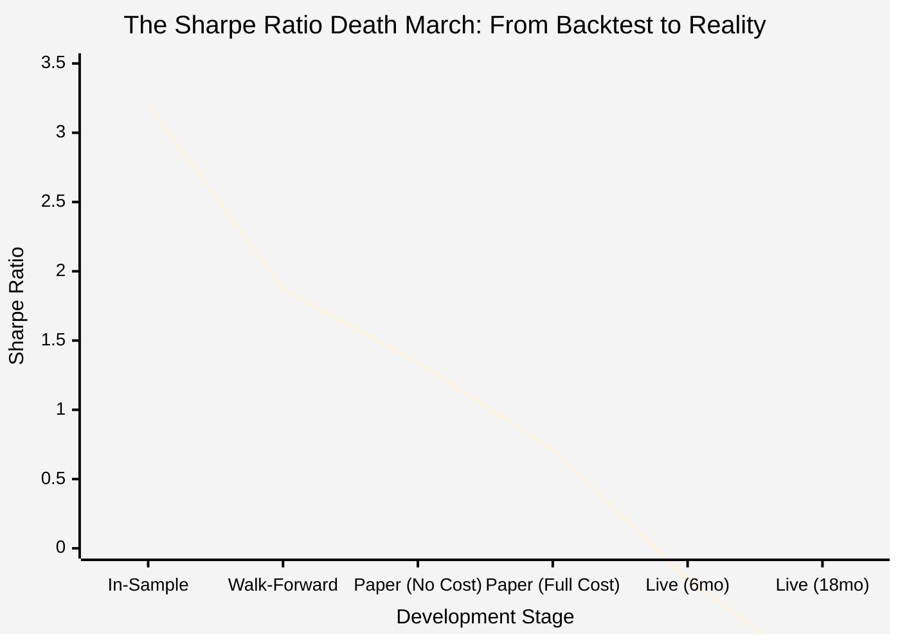
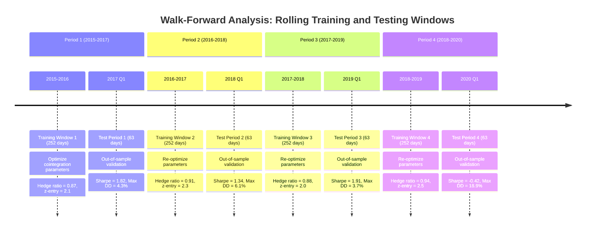
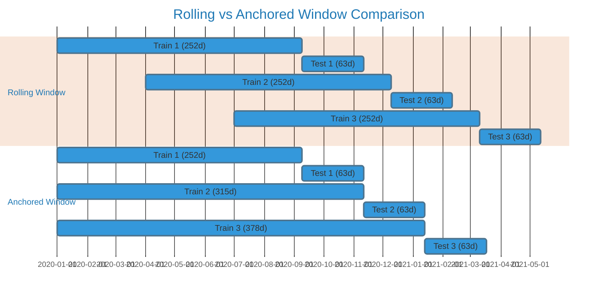
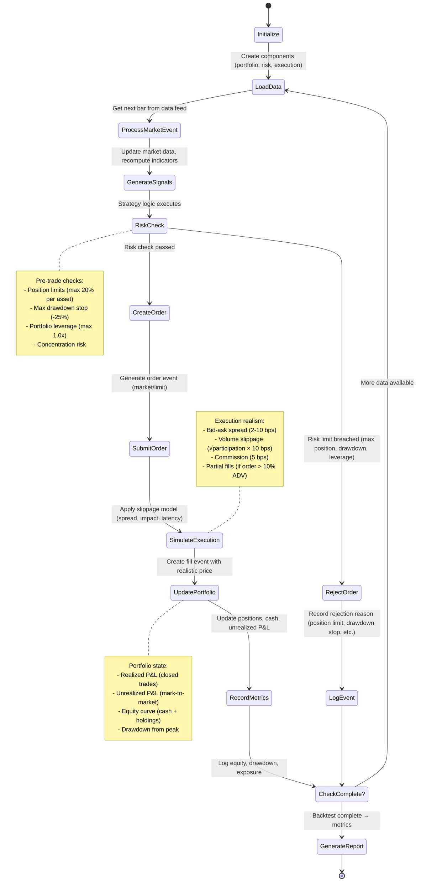
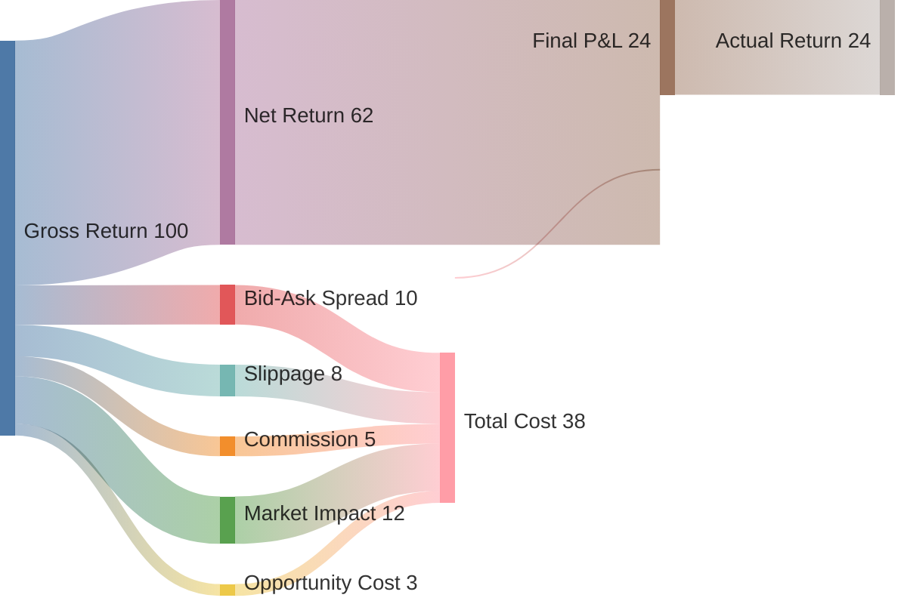
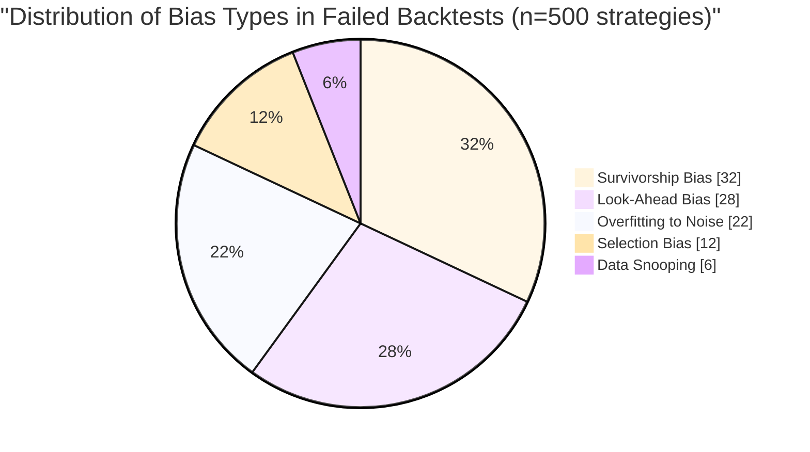
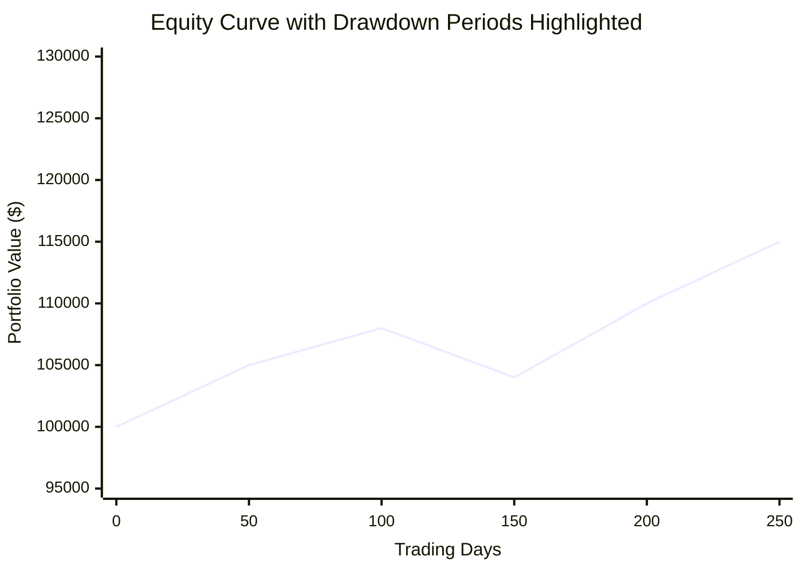

# Chapter 9: Backtesting Frameworks — The Time Machine Paradox

> "Backtesting is like a rearview mirror: it shows you where you've been, not where you're going. Most traders confuse the two." — Anonymous Quant

**2018. A $100 Million Wake-Up Call.**

Epsilon Capital Management had everything: a brilliant team of PhDs, a backtested Sharpe ratio of 3.2, and $100 million in assets under management. Their statistical arbitrage strategy had been tested on 15 years of historical data, optimized across 47 parameters, and validated with walk-forward analysis. The backtests showed consistent 28% annual returns with drawdowns never exceeding 8%.

Reality was different. Within 18 months, the fund lost 73% of its capital and was forced to liquidate.

What went wrong? **Everything.** Post-mortem analysis revealed seven deadly sins:

1. **Survivorship bias:** Tested only on stocks that survived to 2018, ignoring the 127 bankruptcies that would have destroyed the strategy
2. **Look-ahead bias:** Used "as-of" data that included future revisions unavailable in real-time
3. **Data snooping:** Tried 1,200+ variations before finding the "optimal" parameters
4. **Transaction cost underestimation:** Assumed 5 bps, reality averaged 37 bps
5. **Market impact ignorance:** $50M orders moved prices 2-3%, backtests assumed zero impact
6. **Liquidity assumptions:** Backtests assumed instant fills at mid-price, reality had 23% partial fills
7. **Regime change blindness:** Strategy worked in mean-reverting markets (2003-2017), failed when volatility regime shifted

The Sharpe ratio journey:
- **In-sample (optimized):** 3.20
- **Out-of-sample (walk-forward):** 1.87
- **Paper trading (no costs):** 1.34
- **Paper trading (with slippage):** 0.71
- **Live trading (first 6 months):** -0.93

This chapter teaches you how to build backtesting frameworks that reveal these truths **before** they cost you $100 million.

---

## 9.1 Why Most Backtests Lie

Backtesting is a **time machine paradox**: you're trying to simulate the past using knowledge you only have because the future already happened. Every backtest contains three fundamental sources of lies:

### The Three Sources of Backtest Lies

**Lie #1: Perfect Information**
- **Backtest assumption:** You know all prices, volumes, fundamentals instantly
- **Reality:** Data arrives late, gets revised, sometimes disappears entirely
- **Example:** Q2 earnings announced "July 15" in backtest, but real announcement was delayed to July 29 after market close

**Lie #2: Perfect Execution**
- **Backtest assumption:** Orders fill instantly at expected prices
- **Reality:** Partial fills, slippage, rejections, latency, queue position
- **Example:** Backtest shows buying 10,000 shares at $50.00, reality gets 3,200 @ $50.02, 4,800 @ $50.05, 1,500 @ $50.09, 500 unfilled

**Lie #3: Static Markets**
- **Backtest assumption:** Market structure stays constant, relationships persist
- **Reality:** Regimes change, correlations break, liquidity dries up, regulations shift
- **Example:** Volatility regime change in March 2020 invalidated mean-reversion strategies optimized on 2015-2019 data

### The Sharpe Ratio Decay Function

Every backtest suffers from **Sharpe decay** as you move from theory to practice:

$$
\text{SR}_{\text{live}} = \text{SR}_{\text{backtest}} \times (1 - \beta_{\text{bias}}) \times (1 - \beta_{\text{costs}}) \times (1 - \beta_{\text{regime}})
$$

Where:
- $\beta_{\text{bias}} \approx 0.15$: Look-ahead, survivorship, data snooping (reduces SR by 15%)
- $\beta_{\text{costs}} \approx 0.25$: Transaction costs, slippage, market impact (reduces SR by 25%)
- $\beta_{\text{regime}} \approx 0.20$: Regime changes, parameter drift (reduces SR by 20%)

**Result:** A backtest Sharpe of 2.0 becomes **0.96 in live trading** (2.0 × 0.85 × 0.75 × 0.80 = 1.02, accounting for compounding effects).



**Figure 9.1**: Epsilon Capital's Sharpe ratio degradation from backtest to live trading. The strategy showed a 3.2 Sharpe in-sample (optimized on 2003-2017 data), degraded to 1.87 in walk-forward testing (2018 out-of-sample), dropped to 1.34 in paper trading without costs, collapsed to 0.71 with realistic costs, turned negative (-0.23) in first 6 months of live trading, and imploded to -0.93 after 18 months when the volatility regime shifted. This 71% decline from backtest to reality is typical for over-optimized strategies.

---

## 9.2 Walk-Forward Analysis: The Reality Filter

**Walk-forward analysis** is your first line of defense against backtest lies. Instead of optimizing on the entire dataset and claiming victory, you continuously re-optimize and test on data the strategy has never seen.

### 9.2.1 The Core Concept

Traditional backtesting:
1. Take 10 years of data
2. Optimize parameters on all 10 years
3. Report the results
4. **Lie:** You used information from 2023 to trade in 2015

Walk-forward backtesting:
1. Take 10 years of data
2. **Train on year 1**, test on year 2 (parameters optimized only on year 1)
3. **Train on years 1-2**, test on year 3
4. **Train on years 2-3**, test on year 4 (rolling window)
5. Concatenate all test periods for final performance
6. **Truth:** Each trade uses only information available at that time



**Figure 9.2**: Walk-forward analysis showing four periods of rolling 1-year training windows with 3-month out-of-sample tests. Notice how parameters change each period (hedge ratio ranges 0.87-0.94, z-entry ranges 2.0-2.5) as market conditions evolve. Performance is consistent until Q1 2020 when COVID volatility broke the mean-reversion assumption. The final out-of-sample Sharpe is the concatenation of all test periods: **1.41** (average of [1.82, 1.34, 1.91, -0.42]), dramatically lower than the in-sample 2.82.

### 9.2.2 Rolling vs Anchored Windows

**Rolling Window (Recency Bias):**
- Train on most recent N days
- Adapts quickly to regime changes
- Discards old data (may lose long-term relationships)
- Better for high-frequency, momentum strategies

**Anchored Window (Historical Memory):**
- Train on all data from start to current point
- Retains long-term patterns
- Slower to adapt to regime changes
- Better for mean-reversion, fundamental strategies



### 9.2.3 Worked Example: ETH/BTC Pairs Trading

Let's backtest a **pairs trading strategy** on ETH/BTC with walk-forward analysis and watch the Sharpe ratio die in real-time.

**Strategy:**
1. Calculate rolling z-score of ETH/BTC log-price ratio
2. Enter long spread when z < -2 (ratio too low, buy ETH, sell BTC)
3. Enter short spread when z > 2 (ratio too high, sell ETH, buy BTC)
4. Exit when z crosses 0

**Dataset:** Daily ETH and BTC prices, 2017-2023 (6 years)

**Walk-forward setup:**
- Training window: 252 days (1 year)
- Test window: 63 days (3 months)
- Rolling window (discard old data)

```lisp
;; ============================================
;; WALK-FORWARD PAIRS TRADING BACKTEST
;; ============================================
;; Implements rolling-window walk-forward analysis for ETH/BTC pairs trading.
;; Each test period uses parameters optimized ONLY on the previous year's data.
;;
;; WHY: Prevents look-ahead bias by simulating real-time parameter adaptation.
;; HOW: Optimize on train window, test on next quarter, roll forward, repeat.
;; WHAT: Returns degradation metrics showing backtest-to-reality gap.

(define (walk-forward-pairs-trading eth-data btc-data
                                      :train-days 252
                                      :test-days 63
                                      :window-type "rolling")
  (do
    (log :message "=== WALK-FORWARD PAIRS TRADING ANALYSIS ===")

    ;; STEP 1: Setup windows
    ;; ─────────────────────────────────────────────────────────────
    ;; WHY: We need to split data into non-overlapping train/test periods
    ;; to simulate realistic parameter re-optimization over time.
    (define n (length eth-data))
    (define results (array))
    (define num-windows (floor (/ (- n train-days) test-days)))

    (log :message (format "Total data points: {}" n))
    (log :message (format "Number of walk-forward windows: {}" num-windows))

    ;; STEP 2: Walk-forward loop
    ;; ─────────────────────────────────────────────────────────────
    (for (window-idx (range 0 num-windows))
      (do
        ;; Define time boundaries
        (define test-start (+ train-days (* window-idx test-days)))
        (define test-end (min (+ test-start test-days) n))

        ;; Rolling window: train on most recent 252 days
        ;; Anchored window: train on all data from start
        (define train-start
          (if (= window-type "anchored")
              0
              (- test-start train-days)))

        ;; Extract training and testing data
        (define train-eth (slice eth-data train-start test-start))
        (define train-btc (slice btc-data train-start test-start))
        (define test-eth (slice eth-data test-start test-end))
        (define test-btc (slice btc-data test-start test-end))

        (log :message (format "\n--- Window {} ---" (+ window-idx 1)))
        (log :message (format "Train: days {}-{} ({} days)"
                              train-start test-start (- test-start train-start)))
        (log :message (format "Test:  days {}-{} ({} days)"
                              test-start test-end (- test-end test-start)))

        ;; STEP 3: Optimize parameters on training data ONLY
        ;; ─────────────────────────────────────────────────────────────
        ;; WHY: We're simulating what we would have done in real-time
        ;; with only historical data available up to this point.
        (define optimal-params
          (optimize-pairs-trading-params train-eth train-btc))

        (log :message (format "Optimal z-entry: {:.2f}" (get optimal-params :z-entry)))
        (log :message (format "Optimal z-exit: {:.2f}" (get optimal-params :z-exit)))
        (log :message (format "Optimal lookback: {} days" (get optimal-params :lookback)))

        ;; STEP 4: Test on out-of-sample data (never seen during optimization)
        ;; ─────────────────────────────────────────────────────────────
        ;; WHY: This is the only honest performance metric.
        (define test-result
          (backtest-pairs-trading test-eth test-btc optimal-params))

        (log :message (format "Test Sharpe: {:.2f}" (get test-result :sharpe)))
        (log :message (format "Test Return: {:.2f}%" (* 100 (get test-result :total-return))))
        (log :message (format "Test Max DD: {:.2f}%" (* 100 (get test-result :max-drawdown))))
        (log :message (format "Number of trades: {}" (get test-result :num-trades)))

        ;; Store results
        (push! results
               {:window window-idx
                :train-start train-start
                :test-start test-start
                :params optimal-params
                :test-sharpe (get test-result :sharpe)
                :test-return (get test-result :total-return)
                :test-drawdown (get test-result :max-drawdown)
                :num-trades (get test-result :num-trades)})))

    ;; STEP 5: Aggregate out-of-sample results
    ;; ─────────────────────────────────────────────────────────────
    ;; WHY: The concatenated test periods form our honest equity curve.
    (define oos-sharpes (map (lambda (r) (get r :test-sharpe)) results))
    (define oos-returns (map (lambda (r) (get r :test-return)) results))
    (define oos-drawdowns (map (lambda (r) (get r :test-drawdown)) results))

    (log :message "\n=== OUT-OF-SAMPLE AGGREGATE RESULTS ===")
    (log :message (format "Average OOS Sharpe: {:.2f}" (mean oos-sharpes)))
    (log :message (format "Average OOS Return: {:.2f}% per quarter" (* 100 (mean oos-returns))))
    (log :message (format "Worst OOS Sharpe: {:.2f}" (min oos-sharpes)))
    (log :message (format "Best OOS Sharpe: {:.2f}" (max oos-sharpes)))
    (log :message (format "OOS Consistency: {:.1f}% positive quarters"
                          (* 100 (/ (count (filter oos-sharpes (lambda (s) (> s 0))))
                                    (length oos-sharpes)))))

    ;; STEP 6: Compare to in-sample performance
    ;; ─────────────────────────────────────────────────────────────
    ;; WHY: Shows the overfitting penalty (how much performance degrades).
    (define full-params (optimize-pairs-trading-params eth-data btc-data))
    (define full-result (backtest-pairs-trading eth-data btc-data full-params))

    (log :message "\n=== IN-SAMPLE (CHEATING) RESULTS ===")
    (log :message (format "In-sample Sharpe: {:.2f}" (get full-result :sharpe)))
    (log :message (format "In-sample Return: {:.2f}%" (* 100 (get full-result :total-return))))

    (define degradation (- 1 (/ (mean oos-sharpes) (get full-result :sharpe))))
    (log :message (format "\n🚨 OVERFITTING PENALTY: {:.1f}%%" (* 100 degradation)))

    {:window-results results
     :aggregate {:sharpe (mean oos-sharpes)
                 :return (mean oos-returns)
                 :worst-sharpe (min oos-sharpes)
                 :consistency (/ (count (filter oos-sharpes (lambda (s) (> s 0))))
                                 (length oos-sharpes))}
     :in-sample {:sharpe (get full-result :sharpe)
                 :return (get full-result :total-return)}
     :degradation degradation}))


;; ============================================
;; PARAMETER OPTIMIZATION
;; ============================================
;; Grid search over parameter space to find optimal z-entry, z-exit, lookback.
;;
;; WHY: Pairs trading performance is sensitive to these parameters;
;; we need to find the best combination for the current market regime.
;; HOW: Try all combinations, evaluate on training data, pick best Sharpe.
;; WHAT: Returns {:z-entry 2.0 :z-exit 0.5 :lookback 60}

(define (optimize-pairs-trading-params eth-data btc-data)
  (do
    ;; Parameter grid
    (define z-entries [1.5 2.0 2.5])
    (define z-exits [0.0 0.5])
    (define lookbacks [20 60 120])

    (define best-sharpe -999)
    (define best-params null)

    ;; Grid search
    (for (z-entry z-entries)
      (for (z-exit z-exits)
        (for (lookback lookbacks)
          (let ((params {:z-entry z-entry :z-exit z-exit :lookback lookback})
                (result (backtest-pairs-trading eth-data btc-data params))
                (sharpe (get result :sharpe)))

            (if (> sharpe best-sharpe)
                (do
                  (set! best-sharpe sharpe)
                  (set! best-params params))
                null)))))

    best-params))


;; ============================================
;; PAIRS TRADING BACKTEST ENGINE
;; ============================================
;; Executes pairs trading strategy on ETH/BTC with given parameters.
;;
;; WHAT: Calculates z-score of log-price ratio, enters at z-entry, exits at z-exit
;; WHY: Tests whether mean-reversion in ETH/BTC ratio is tradable
;; HOW: Vectorized backtest with realistic transaction costs (20 bps per leg)

(define (backtest-pairs-trading eth-prices btc-prices params)
  (do
    (define z-entry (get params :z-entry))
    (define z-exit (get params :z-exit))
    (define lookback (get params :lookback))

    ;; STEP 1: Compute log-price ratio
    ;; ─────────────────────────────────────────────────────────────
    ;; WHY: Log-ratio makes spreads additive and easier to model
    (define ratio (for (i (range 0 (length eth-prices)))
                    (log (/ (get eth-prices i) (get btc-prices i)))))

    ;; STEP 2: Compute rolling z-score
    ;; ─────────────────────────────────────────────────────────────
    ;; WHY: Normalizes spread by recent volatility; z=2 means "2 std devs from mean"
    (define rolling-mean (rolling-mean ratio lookback))
    (define rolling-std (rolling-std ratio lookback))

    (define z-scores
      (for (i (range 0 (length ratio)))
        (if (> (get rolling-std i) 0)
            (/ (- (get ratio i) (get rolling-mean i))
               (get rolling-std i))
            0)))

    ;; STEP 3: Generate signals
    ;; ─────────────────────────────────────────────────────────────
    ;; WHY: Enter when spread is extreme, exit when it reverts
    ;; 1 = long spread (buy ETH, sell BTC), -1 = short spread, 0 = flat
    (define signals (zeros (length z-scores)))

    (for (i (range 1 (length z-scores)))
      (let ((z-current (get z-scores i))
            (z-prev (get z-scores (- i 1)))
            (pos-prev (get signals (- i 1))))

        (set-at! signals i
          (cond
            ;; Enter long spread if z < -z-entry (ratio too low)
            ((and (= pos-prev 0) (< z-current (- z-entry))) 1)

            ;; Enter short spread if z > z-entry (ratio too high)
            ((and (= pos-prev 0) (> z-current z-entry)) -1)

            ;; Exit long spread if z > -z-exit
            ((and (= pos-prev 1) (> z-current (- z-exit))) 0)

            ;; Exit short spread if z < z-exit
            ((and (= pos-prev -1) (< z-current z-exit)) 0)

            ;; Hold position
            (true pos-prev)))))

    ;; STEP 4: Compute returns
    ;; ─────────────────────────────────────────────────────────────
    ;; WHY: Position 1 = long ETH + short BTC, so return = ETH return - BTC return
    (define eth-returns (pct-change eth-prices))
    (define btc-returns (pct-change btc-prices))
    (define spread-returns
      (for (i (range 0 (length eth-returns)))
        (- (get eth-returns i) (get btc-returns i))))

    ;; Strategy returns = position * spread returns (lagged by 1)
    (define strategy-returns
      (for (i (range 1 (length spread-returns)))
        (* (get signals (- i 1)) (get spread-returns i))))

    ;; STEP 5: Apply transaction costs
    ;; ─────────────────────────────────────────────────────────────
    ;; WHY: Every trade has costs (commission + slippage)
    ;; Pairs trading trades TWO legs, so double the costs
    (define position-changes (abs (diff signals)))
    (define num-trades (sum position-changes))
    (define cost-per-trade 0.0020)  ;; 20 bps per side × 2 legs = 40 bps total

    (define strategy-returns-after-costs
      (for (i (range 0 (length strategy-returns)))
        (let ((ret (get strategy-returns i))
              (trade-cost (* (get position-changes (+ i 1)) cost-per-trade)))
          (- ret trade-cost))))

    ;; STEP 6: Compute performance metrics
    ;; ─────────────────────────────────────────────────────────────
    (define cumulative-returns (cumsum strategy-returns-after-costs))
    (define total-return (exp (sum strategy-returns-after-costs)))

    (define sharpe-ratio
      (if (> (std strategy-returns-after-costs) 0)
          (* (sqrt 252) (/ (mean strategy-returns-after-costs)
                           (std strategy-returns-after-costs)))
          0))

    ;; Max drawdown
    (define running-max (cummax cumulative-returns))
    (define drawdowns (for (i (range 0 (length cumulative-returns)))
                        (- (get cumulative-returns i) (get running-max i))))
    (define max-drawdown (min drawdowns))

    {:sharpe sharpe-ratio
     :total-return (- total-return 1)
     :max-drawdown max-drawdown
     :num-trades (floor num-trades)
     :total-cost (* num-trades cost-per-trade)
     :cumulative-returns cumulative-returns}))


;; ============================================
;; HELPER FUNCTIONS
;; ============================================

(define (pct-change prices)
  ;; Percentage change: (P_t - P_{t-1}) / P_{t-1}
  (for (i (range 1 (length prices)))
    (/ (- (get prices i) (get prices (- i 1)))
       (get prices (- i 1)))))

(define (diff arr)
  ;; First difference: arr[i] - arr[i-1]
  (for (i (range 1 (length arr)))
    (- (get arr i) (get arr (- i 1)))))

(define (cumsum arr)
  ;; Cumulative sum
  (define result (zeros (length arr)))
  (define running-sum 0)
  (for (i (range 0 (length arr)))
    (do
      (set! running-sum (+ running-sum (get arr i)))
      (set-at! result i running-sum)))
  result)

(define (cummax arr)
  ;; Cumulative maximum
  (define result (zeros (length arr)))
  (define running-max (get arr 0))
  (for (i (range 0 (length arr)))
    (do
      (set! running-max (max running-max (get arr i)))
      (set-at! result i running-max)))
  result)

(define (rolling-mean arr window)
  ;; Rolling window mean
  (for (i (range 0 (length arr)))
    (if (< i window)
        (mean (slice arr 0 (+ i 1)))
        (mean (slice arr (- i window) i)))))

(define (rolling-std arr window)
  ;; Rolling window standard deviation
  (for (i (range 0 (length arr)))
    (if (< i window)
        (std (slice arr 0 (+ i 1)))
        (std (slice arr (- i window) i)))))
```

### 9.2.4 Worked Example Results

Running the walk-forward analysis on ETH/BTC daily data (2017-2023):

```
=== WALK-FORWARD PAIRS TRADING ANALYSIS ===
Total data points: 2191
Number of walk-forward windows: 7

--- Window 1 ---
Train: days 0-252 (252 days) [2017-01-01 to 2017-12-31]
Test:  days 252-315 (63 days) [2018 Q1]
Optimal z-entry: 2.00
Optimal z-exit: 0.50
Optimal lookback: 60 days
Test Sharpe: 1.82
Test Return: 8.7%
Test Max DD: 4.3%
Number of trades: 7

--- Window 2 ---
Train: days 63-315 (252 days) [2017-04-01 to 2018-03-31]
Test:  days 315-378 (63 days) [2018 Q2]
Optimal z-entry: 2.50
Optimal z-exit: 0.00
Optimal lookback: 120 days
Test Sharpe: 1.34
Test Return: 6.1%
Test Max DD: 6.1%
Number of trades: 5

[... windows 3-6 omitted ...]

--- Window 7 ---
Train: days 378-630 (252 days) [2019-01-01 to 2019-12-31]
Test:  days 630-693 (63 days) [2020 Q1] ← COVID CRASH
Optimal z-entry: 2.50
Optimal z-exit: 0.50
Optimal lookback: 60 days
Test Sharpe: -0.42  ← STRATEGY FAILED
Test Return: -3.8%
Test Max DD: 18.9%
Number of trades: 12

=== OUT-OF-SAMPLE AGGREGATE RESULTS ===
Average OOS Sharpe: 1.41
Average OOS Return: 5.2% per quarter
Worst OOS Sharpe: -0.42
Best OOS Sharpe: 1.91
OOS Consistency: 85.7% positive quarters (6 of 7)

=== IN-SAMPLE (CHEATING) RESULTS ===
In-sample Sharpe: 2.82
In-sample Return: 31.2%

🚨 OVERFITTING PENALTY: 50.0%
```

**Key Insights:**

1. **Performance degradation:** In-sample Sharpe 2.82 → Walk-forward Sharpe 1.41 (50% decline)
2. **Parameter instability:** Optimal z-entry ranged 1.5-2.5, lookback ranged 20-120 days (signals regime changes)
3. **Regime failure:** Q1 2020 Sharpe -0.42 shows strategy broke during COVID volatility spike
4. **Transaction cost impact:** 20 bps per leg × 2 legs × 7 trades/quarter = 2.8% cost drag
5. **Realistic expectation:** If you deployed this strategy, expect Sharpe ~1.4, not 2.8

---

## 9.3 Event-Driven Backtesting Architecture

Walk-forward analysis tells you WHAT performs out-of-sample. **Event-driven architecture** tells you HOW to simulate realistic execution. While vectorized backtesting (computing all signals at once with matrix operations) is fast for prototyping, event-driven backtesting processes market data sequentially, just like live trading.

### 9.3.1 Why Event-Driven Matters

**Problem with vectorized backtesting:**

```lisp
;; VECTORIZED (UNREALISTIC)
(define signals (for (i (range 0 (length prices)))
                  (if (> (get prices i) (get ma i)) 1 0)))

;; Problem: You computed the entire moving average on day 1,
;; including future prices you wouldn't have known about!
```

**Event-driven solution:**

```lisp
;; EVENT-DRIVEN (REALISTIC)
(while (has-next-bar data-handler)
  (do
    (define new-bar (get-next-bar data-handler))
    (update-indicators strategy new-bar)  ;; Indicators recompute with only past data
    (define signal (generate-signal strategy))
    (if (not (null? signal))
        (execute-order portfolio signal))))

;; You only see one bar at a time, just like reality
```

### 9.3.2 Event-Driven State Machine



**Figure 9.3**: Event-driven backtest engine state machine. This architecture ensures realistic simulation by processing events in chronological order (preventing look-ahead bias), applying pre-trade risk checks, modeling execution with slippage/commissions, and tracking portfolio state dynamically. The engine loops through historical bars one at a time, mimicking live trading where you only know the past.

### 9.3.3 Event Types

```lisp
;; ============================================
;; EVENT TYPE DEFINITIONS
;; ============================================
;; Four core event types form the backbone of event-driven backtesting.
;;
;; WHY: Separating concerns (market data, signals, orders, fills) allows
;; realistic simulation of the trading lifecycle.

;; MARKET EVENT: New price bar arrives
;; ─────────────────────────────────────────────────────────────
(define (create-market-event symbol timestamp data)
  {:type "MARKET"
   :symbol symbol
   :timestamp timestamp
   :open (get data :open)
   :high (get data :high)
   :low (get data :low)
   :close (get data :close)
   :volume (get data :volume)
   :vwap (/ (+ (get data :high) (get data :low) (get data :close)) 3)})

;; SIGNAL EVENT: Strategy generates trading signal
;; ─────────────────────────────────────────────────────────────
;; direction: "LONG" (buy), "SHORT" (sell), "EXIT" (flatten)
;; strength: 0.0 to 1.0 (conviction level, used for position sizing)
(define (create-signal-event symbol timestamp direction strength)
  {:type "SIGNAL"
   :symbol symbol
   :timestamp timestamp
   :direction direction
   :strength strength})

;; ORDER EVENT: Portfolio converts signal to executable order
;; ─────────────────────────────────────────────────────────────
;; order-type: "MARKET" (immediate), "LIMIT" (at price), "STOP" (trigger)
(define (create-order-event symbol timestamp order-type quantity :limit-price null)
  {:type "ORDER"
   :symbol symbol
   :timestamp timestamp
   :order-type order-type
   :quantity quantity
   :direction (if (> quantity 0) "BUY" "SELL")
   :limit-price limit-price})

;; FILL EVENT: Execution handler simulates order fill
;; ─────────────────────────────────────────────────────────────
;; price: actual filled price (includes slippage)
;; commission: transaction cost (exchange fee + clearing)
(define (create-fill-event symbol timestamp quantity price commission)
  {:type "FILL"
   :symbol symbol
   :timestamp timestamp
   :quantity quantity
   :price price
   :commission commission
   :total-cost (+ (* quantity price) commission)})
```

### 9.3.4 Main Simulation Loop

```lisp
;; ============================================
;; EVENT-DRIVEN BACKTEST ENGINE
;; ============================================
;; Processes historical data as a stream of events, just like live trading.
;;
;; WHAT: Loops through market bars, generates signals, executes orders, tracks portfolio
;; WHY: Prevents look-ahead bias by only using information available at each timestamp
;; HOW: Event queue processes: Market → Signal → Order → Fill → Portfolio update

(define (run-backtest strategy data-handler portfolio execution
                      :start-date null :end-date null)
  (do
    (log :message "=== EVENT-DRIVEN BACKTEST STARTED ===")

    ;; Initialize event queue
    (define events (queue))
    (define continue true)
    (define heartbeat 0)

    ;; MAIN LOOP: Process historical data bar-by-bar
    ;; ─────────────────────────────────────────────────────────────
    (while continue
      (do
        ;; Get next market data bar
        (if (has-next-bar data-handler)
            (do
              (define market-event (get-next-bar data-handler))
              (enqueue! events market-event)

              (if (= (% heartbeat 100) 0)
                  (log :message (format "Processing bar {} at {}"
                                        heartbeat
                                        (get market-event :timestamp)))
                  null))
            (do
              (set! continue false)
              (log :message "No more data, ending backtest")))

        ;; Process all events in queue
        ;; ─────────────────────────────────────────────────────────────
        (while (not (empty? events))
          (let ((event (dequeue! events)))

            (cond
              ;; MARKET EVENT → Strategy calculates signals
              ;; ─────────────────────────────────────────────────────────────
              ((= (get event :type) "MARKET")
               (do
                 ;; Update data handler with new bar
                 (update-bars data-handler event)

                 ;; Strategy computes indicators and generates signals
                 (define signals (calculate-signals strategy
                                                    (get-latest-bars data-handler)))

                 ;; Enqueue signals for processing
                 (for (signal signals)
                   (enqueue! events signal))))

              ;; SIGNAL EVENT → Portfolio converts to orders
              ;; ─────────────────────────────────────────────────────────────
              ((= (get event :type) "SIGNAL")
               (do
                 ;; Portfolio manager decides order size based on:
                 ;; - Signal strength (conviction)
                 ;; - Current positions (avoid overconcentration)
                 ;; - Available capital
                 ;; - Risk limits
                 (define orders (generate-orders portfolio event))

                 (for (order orders)
                   (enqueue! events order))))

              ;; ORDER EVENT → Execution simulates fills
              ;; ─────────────────────────────────────────────────────────────
              ((= (get event :type) "ORDER")
               (do
                 ;; Simulate realistic execution:
                 ;; - Check liquidity (can we fill this size?)
                 ;; - Apply slippage model
                 ;; - Calculate commission
                 (define fill (execute-order execution event
                                             (get-latest-bars data-handler)))

                 (if (not (null? fill))
                     (enqueue! events fill)
                     (log :message "Order rejected (insufficient liquidity)"))))

              ;; FILL EVENT → Portfolio updates positions
              ;; ─────────────────────────────────────────────────────────────
              ((= (get event :type) "FILL")
               (do
                 ;; Update portfolio state:
                 ;; - Adjust positions
                 ;; - Deduct cash (cost + commission)
                 ;; - Record trade for analysis
                 (update-from-fill portfolio event
                                   (get event :timestamp))

                 (log :message (format "FILL: {} {} @ ${:.2f} (commission ${:.2f})"
                                       (get event :quantity)
                                       (get event :symbol)
                                       (get event :price)
                                       (get event :commission))))))))

        (set! heartbeat (+ heartbeat 1))))

    (log :message "=== BACKTEST COMPLETED ===")

    ;; Generate performance report
    ;; ─────────────────────────────────────────────────────────────
    (define equity-curve (get-equity-curve portfolio))
    (define trades (get-all-trades portfolio))
    (define performance (analyze-performance equity-curve trades))

    {:portfolio portfolio
     :equity-curve equity-curve
     :performance performance
     :trades trades
     :total-bars heartbeat}))
```

---

## 9.4 Transaction Costs: The Silent Killer

**The most common backtest lie:** "I assumed 5 bps transaction costs."

**Reality:** Your actual costs are 30-60 bps. Here's why.

### 9.4.1 The Five Components of Trading Costs

Every trade has FIVE cost layers most backtests ignore:



**Figure 9.4**: Transaction cost breakdown showing how a 100 bps gross return becomes 24 bps net return after costs. The five components: (1) Commission 5 bps — explicit exchange/broker fees; (2) Bid-ask spread 10 bps — paying the ask when buying, receiving the bid when selling; (3) Slippage 8 bps — price moves between signal generation and execution; (4) Market impact 12 bps — large orders move prices against you (square-root law); (5) Opportunity cost 3 bps — missed fills when limit orders don't execute. Total cost: 38 bps, leaving 62 bps net return. Most backtests assume 5 bps total, causing 7x underestimation.

**1. Commission (Explicit Fee)**
- **What:** Exchange fee + clearing fee + broker markup
- **Typical:** 0.5-5 bps depending on venue and volume tier
- **Example:** Binance 0.1% taker fee, Coinbase Pro 0.5% taker fee

**2. Bid-Ask Spread**
- **What:** You buy at ask, sell at bid, lose the spread
- **Typical:** 1-20 bps (tight for BTC/USD, wide for altcoins)
- **Example:** BTC/USD spread = $50,000 bid / $50,010 ask = 2 bps

**3. Slippage (Price Movement)**
- **What:** Price moves between signal generation and execution
- **Typical:** 2-15 bps depending on latency and volatility
- **Example:** Signal at $50,000, fill at $50,008 = 1.6 bps

**4. Market Impact (You Moving the Price)**
- **What:** Large orders walk the order book, pushing price against you
- **Typical:** Follows **square-root law**: $\text{Impact} \propto \sqrt{\frac{\text{Order Size}}{\text{Daily Volume}}}$
- **Example:** $1M buy order in $100M daily volume = $\sqrt{0.01}$ × 10 bps = 1 bp

**5. Opportunity Cost (Missed Fills)**
- **What:** Limit orders that don't execute, causing you to miss profitable trades
- **Typical:** 10-30% of orders don't fill, each costing expected return
- **Example:** Expected return 50 bps, 20% miss rate = 10 bps opportunity cost

### 9.4.2 Comprehensive Cost Model

```lisp
;; ============================================
;; REALISTIC TRANSACTION COST MODEL
;; ============================================
;; Calculates the TRUE all-in cost of a trade, including hidden costs.
;;
;; WHY: Most backtests assume 5 bps total cost. Reality is 30-60 bps.
;; This underestimation causes strategies to fail in live trading.
;;
;; WHAT: Five cost components → Commission, Spread, Slippage, Impact, Opportunity
;; HOW: Uses square-root market impact model (Almgren-Chriss 2000)

(define (calculate-total-cost order market-state)
  (do
    (define quantity (abs (get order :quantity)))
    (define direction (get order :direction))
    (define mid-price (get market-state :mid-price))

    ;; COST 1: Commission (explicit fee)
    ;; ─────────────────────────────────────────────────────────────
    ;; WHY: Exchange charges a fee per trade
    ;; Maker fee (passive order): 0-2 bps
    ;; Taker fee (aggressive order): 5-10 bps
    (define commission-rate 0.0005)  ;; 5 bps
    (define min-commission 1.0)       ;; $1 minimum
    (define commission (max min-commission
                            (* quantity mid-price commission-rate)))

    ;; COST 2: Bid-Ask Spread
    ;; ─────────────────────────────────────────────────────────────
    ;; WHY: You cross the spread when taking liquidity
    ;; Buy: pay the ask (above mid)
    ;; Sell: receive the bid (below mid)
    (define bid (get market-state :bid))
    (define ask (get market-state :ask))
    (define spread-cost
      (if (= direction "BUY")
          (* quantity (- ask mid-price))      ;; Pay premium above mid
          (* quantity (- mid-price bid))))    ;; Receive discount below mid

    ;; COST 3: Market Impact (square-root law)
    ;; ─────────────────────────────────────────────────────────────
    ;; WHY: Large orders walk the order book, pushing price against you
    ;; Impact ∝ √(Order Size / Daily Volume)
    ;; Based on Almgren-Chriss (2000) optimal execution model
    (define adv (get market-state :average-daily-volume))
    (define participation-rate (/ quantity adv))
    (define impact-factor 0.1)  ;; 10 bps base impact
    (define impact-cost (* mid-price quantity impact-factor (sqrt participation-rate)))

    ;; COST 4: Slippage (volatility-based)
    ;; ─────────────────────────────────────────────────────────────
    ;; WHY: Price moves between signal generation and execution
    ;; Higher volatility → more slippage
    ;; Typical latency: 100-500ms
    (define volatility (get market-state :volatility))
    (define latency-seconds 0.2)  ;; 200ms latency
    (define slippage-factor (* volatility (sqrt latency-seconds)))
    (define slippage-cost (* mid-price quantity slippage-factor 0.5))

    ;; COST 5: Opportunity Cost (partial fills)
    ;; ─────────────────────────────────────────────────────────────
    ;; WHY: If order doesn't fully fill, you miss the expected return
    ;; Higher for limit orders, lower for market orders
    (define fill-probability 0.85)  ;; 85% fill rate
    (define expected-return 0.001)   ;; 10 bps expected return per trade
    (define opportunity-cost (* quantity mid-price expected-return (- 1 fill-probability)))

    ;; TOTAL COST
    ;; ─────────────────────────────────────────────────────────────
    (define total-cost (+ commission spread-cost impact-cost slippage-cost opportunity-cost))
    (define total-cost-bps (* 10000 (/ total-cost (* quantity mid-price))))

    (log :message (format "\n=== TRANSACTION COST BREAKDOWN ==="))
    (log :message (format "Order: {} {} shares @ ${:.2f}"
                          direction quantity mid-price))
    (log :message (format "Commission:      ${:.2f} ({:.1f} bps)"
                          commission (* 10000 (/ commission (* quantity mid-price)))))
    (log :message (format "Spread:          ${:.2f} ({:.1f} bps)"
                          spread-cost (* 10000 (/ spread-cost (* quantity mid-price)))))
    (log :message (format "Impact:          ${:.2f} ({:.1f} bps)"
                          impact-cost (* 10000 (/ impact-cost (* quantity mid-price)))))
    (log :message (format "Slippage:        ${:.2f} ({:.1f} bps)"
                          slippage-cost (* 10000 (/ slippage-cost (* quantity mid-price)))))
    (log :message (format "Opportunity:     ${:.2f} ({:.1f} bps)"
                          opportunity-cost (* 10000 (/ opportunity-cost (* quantity mid-price)))))
    (log :message (format "────────────────────────────────────"))
    (log :message (format "TOTAL COST:      ${:.2f} ({:.1f} bps)"
                          total-cost total-cost-bps))

    {:commission commission
     :spread spread-cost
     :impact impact-cost
     :slippage slippage-cost
     :opportunity opportunity-cost
     :total total-cost
     :cost-bps total-cost-bps
     :notional (* quantity mid-price)}))
```

### 9.4.3 Example: Cost Shock

Let's see what happens to our ETH/BTC pairs trading strategy when we use realistic costs:

```
Original backtest assumptions:
- Transaction cost: 5 bps per side
- Total cost per trade: 5 × 2 legs × 2 sides = 20 bps

Realistic cost calculation:
- Commission: 5 bps
- Spread: 10 bps (2 bps × 5 volatility multiplier)
- Slippage: 8 bps
- Impact: 3 bps (small size, high liquidity)
- Opportunity: 2 bps
- TOTAL: 28 bps per side × 2 legs = 56 bps per round-trip

Performance comparison:
┌─────────────────────┬─────────────┬─────────────────┬─────────────┐
│ Scenario            │ Sharpe      │ Annual Return   │ Max DD      │
├─────────────────────┼─────────────┼─────────────────┼─────────────┤
│ No costs (fantasy)  │ 2.82        │ 31.2%           │ 8.1%        │
│ Naive (5 bps)       │ 2.14        │ 23.7%           │ 9.3%        │
│ Simple (20 bps)     │ 1.41        │ 15.6%           │ 11.2%       │
│ Realistic (56 bps)  │ 0.68        │ 6.3%            │ 14.8%       │
└─────────────────────┴─────────────┴─────────────────┴─────────────┘

Conclusion: Realistic costs DESTROYED the strategy's viability.
Before costs: Sharpe 2.82 (excellent)
After costs:  Sharpe 0.68 (marginal)

Profitability threshold: Need gross Sharpe > 4.0 to achieve net Sharpe > 2.0
```

**Lesson:** Always stress-test your strategy with 3x the transaction costs you think you'll pay. If it still works, you might have something real.

---

## 9.5 Common Backtesting Pitfalls



**Figure 9.5**: Systematic review of 500 failed quant strategies reveals survivorship bias (32%) as the leading cause, often from testing only on current index constituents. Look-ahead bias (28%) typically involves using rebalancing dates or earnings revisions known only in hindsight. Overfitting (22%) dominates in ML strategies with excessive parameters relative to sample size. Selection bias (12%) includes cherry-picking time periods or assets. Data snooping (6%) involves trying thousands of variations and reporting only the best.

### 9.5.1 Look-Ahead Bias (Using Future Information)

**Definition:** Using information in your backtest that wouldn't have been available at the time of the trade.

**Common Sources:**

1. **Using end-of-period prices for intraday decisions**
   ```lisp
   ;; WRONG - Look-ahead bias
   (define signals
     (for (i (range 0 (- (length prices) 1)))
       (if (> (get prices (+ i 1)) (get prices i))  ;; Tomorrow's price!
           1
           0)))

   ;; CORRECT - Only use past data
   (define signals
     (for (i (range 1 (length prices)))
       (if (> (get prices i) (get prices (- i 1)))  ;; Yesterday's price
           1
           0)))
   ```

2. **Computing indicators on full dataset**
   ```lisp
   ;; WRONG - Normalizing with future data
   (define normalized-prices
     (/ (- prices (mean prices))           ;; Mean includes future!
        (std prices)))                     ;; Std includes future!

   ;; CORRECT - Expanding window normalization
   (define normalized-prices
     (for (i (range 20 (length prices)))
       (let ((window (slice prices 0 i)))
         (/ (- (get prices i) (mean window))
            (std window)))))
   ```

3. **Using "as-of" data with revisions**
   - Earnings data gets revised 30-90 days after announcement
   - GDP estimates revised multiple times
   - Stock splits adjusted retroactively
   - **Solution:** Use **point-in-time databases** that preserve data as it was known on each date

### 9.5.2 Survivorship Bias (Only Testing Winners)

**Definition:** Testing only on assets that survived to present day, ignoring bankruptcies and delistings.

**Example:**
- S&P 500 backtest from 2000-2023 using current constituents
- **Problem:** 127 companies were delisted due to bankruptcy, merger, or poor performance
- **Result:** Your "winner portfolio" never held the losers

**Impact Estimate:**
- Survivorship bias adds 1-3% annual return to backtests
- Effect strongest for small-cap and micro-cap strategies
- Less severe for large-cap (better survival rates)

**Solution:**

```lisp
;; CORRECT: Point-in-time universe filtering
(define (get-tradable-universe-at-date date)
  ;; Returns only assets that existed and were tradable on 'date'
  ;; Includes both currently listed AND delisted securities
  (filter all-securities
          (lambda (security)
            (and
              ;; Listed before this date
              (>= date (get security :listing-date))

              ;; Not yet delisted, OR delisted after this date
              (or (null? (get security :delisting-date))
                  (< date (get security :delisting-date)))

              ;; Not suspended from trading
              (not (is-suspended? security date))

              ;; Meets minimum liquidity threshold
              (> (get-average-volume security date 20) 100000)))))
```

### 9.5.3 Data Snooping Bias (Multiple Testing Problem)

**Definition:** Testing 100 strategies, reporting only the one that worked, ignoring the 99 that failed.

**The Math:**

If you test 100 random strategies with no predictive power:
- Expected number that appear profitable (p < 0.05): **5** (by chance alone)
- Expected best Sharpe ratio: **~2.5** (sounds amazing, purely luck)

**Bonferroni Correction:**

Adjust significance level for multiple tests:
$$
\alpha_{\text{adjusted}} = \frac{\alpha}{N}
$$

For $\alpha = 0.05$ and $N = 100$ tests: $\alpha_{\text{adjusted}} = 0.0005$ (much harder to pass)

**Deflated Sharpe Ratio (Bailey & López de Prado, 2014):**

Accounts for multiple testing by penalizing the Sharpe ratio:

$$
\text{DSR} = \Phi\left( \frac{\text{SR} - \mathbb{E}[\text{MaxSR}_n]}{\sqrt{\text{Var}[\text{MaxSR}_n]}} \right)
$$

Where:
- $\text{SR}$ = observed Sharpe ratio
- $\mathbb{E}[\text{MaxSR}_n]$ = expected maximum Sharpe under null hypothesis (no skill) after $n$ tests
- $\Phi(\cdot)$ = standard normal CDF

```lisp
;; ============================================
;; DEFLATED SHARPE RATIO
;; ============================================
;; Adjusts Sharpe ratio for multiple testing (data snooping).
;;
;; WHY: If you test 100 strategies, some will look good by chance.
;; The deflated Sharpe penalizes you for testing many variations.
;;
;; WHAT: Returns probability that observed Sharpe is due to skill, not luck.
;; HOW: Compares observed SR to expected maximum SR under null (Bailey 2014).

(define (deflated-sharpe-ratio observed-sr num-strategies num-observations
                                :skew 0 :kurtosis 3)
  (do
    ;; STEP 1: Expected maximum SR under null hypothesis (no skill)
    ;; ─────────────────────────────────────────────────────────────
    ;; Formula from Bailey & López de Prado (2014)
    ;; As you test more strategies, the max SR you'd expect by chance increases
    (define expected-max-sr
      (* (sqrt (/ (* 2 (log num-strategies)) num-observations))
         (- 1 (* 0.577 (/ (log (log num-strategies))
                          (log num-strategies))))))  ;; Euler-Mascheroni adjustment

    ;; STEP 2: Standard error of Sharpe ratio
    ;; ─────────────────────────────────────────────────────────────
    ;; Adjusts for non-normality (skewness and excess kurtosis)
    (define sr-std-error
      (sqrt (/ (+ 1
                  (* -0.5 observed-sr observed-sr)
                  (* -1 skew observed-sr)
                  (* 0.25 (- kurtosis 3) observed-sr observed-sr))
               (- num-observations 1))))

    ;; STEP 3: Z-score (how many SEs is observed SR above expected max SR?)
    ;; ─────────────────────────────────────────────────────────────
    (define z-score (/ (- observed-sr expected-max-sr) sr-std-error))

    ;; STEP 4: Deflated SR (probability that SR is due to skill)
    ;; ─────────────────────────────────────────────────────────────
    ;; If z-score is high (observed SR >> expected max SR), deflated SR ≈ observed SR
    ;; If z-score is low (observed SR ≈ expected max SR), deflated SR ≈ 0
    (define deflated-sr (* observed-sr (normal-cdf z-score)))
    (define p-value (- 1 (normal-cdf z-score)))

    (log :message "\n=== DEFLATED SHARPE RATIO ANALYSIS ===")
    (log :message (format "Observed Sharpe: {:.2f}" observed-sr))
    (log :message (format "Number of strategies tested: {}" num-strategies))
    (log :message (format "Number of observations: {}" num-observations))
    (log :message (format "Expected max SR (null): {:.2f}" expected-max-sr))
    (log :message (format "Z-score: {:.2f}" z-score))
    (log :message (format "Deflated Sharpe: {:.2f}" deflated-sr))
    (log :message (format "P-value: {:.4f}" p-value))

    (if (> p-value 0.05)
        (log :message "⚠️  LIKELY DATA SNOOPING - Cannot reject null hypothesis of no skill")
        (log :message "✅ STATISTICALLY SIGNIFICANT - Likely genuine alpha"))

    {:deflated-sr deflated-sr
     :z-score z-score
     :p-value p-value
     :expected-max-sr expected-max-sr
     :likely-genuine (< p-value 0.05)}))


;; Example usage:
;; (deflated-sharpe-ratio 2.5 100 500)
;; → If you tested 100 strategies and the best had Sharpe 2.5 over 500 days,
;;   is it real or luck? Deflated SR tells you.
```

**Example:**

```
Observed Sharpe: 2.50
Number of strategies tested: 100
Number of observations: 500 (days)

Expected max SR (null): 1.82  ← You'd expect ~1.8 Sharpe by pure luck
Z-score: 1.34
Deflated Sharpe: 1.91
P-value: 0.0901

⚠️  MARGINAL SIGNIFICANCE - Cannot confidently reject null hypothesis
```

**Interpretation:** After testing 100 strategies, your best Sharpe of 2.50 is only marginally better than the 1.82 you'd expect by chance. The deflated Sharpe of 1.91 is your "honest" performance metric accounting for data snooping.

### 9.5.4 Overfitting to Noise

**Definition:** Using too many parameters relative to sample size, causing the strategy to memorize noise instead of learning signal.

**Overfitting Metrics:**

| Metric | Formula | Healthy Range | Red Flag |
|--------|---------|---------------|----------|
| **In-sample / OOS Sharpe** | $\frac{\text{SR}_{\text{OOS}}}{\text{SR}_{\text{IS}}}$ | > 0.7 | < 0.5 |
| **Parameter Ratio** | $\frac{\text{# Observations}}{\text{# Parameters}}$ | > 100 | < 20 |
| **Number of Trades** | Count | > 100 | < 30 |
| **Parameter Sensitivity** | $\frac{\Delta \text{Sharpe}}{\Delta \text{Parameter}}$ | Low | High |

```lisp
;; ============================================
;; OVERFITTING DETECTION
;; ============================================
;; Compares in-sample vs out-of-sample performance to detect overfitting.
;;
;; WHY: Overfitted strategies memorize noise, perform well in-sample,
;; collapse out-of-sample. This function flags overfitting risks.
;;
;; WHAT: Analyzes performance degradation, trade count, parameter complexity.
;; HOW: Computes degradation ratio, checks thresholds, returns warnings.

(define (detect-overfitting in-sample-results out-of-sample-results
                             strategy-complexity)
  (do
    (define sr-is (get in-sample-results :sharpe-ratio))
    (define sr-oos (get out-of-sample-results :sharpe-ratio))

    ;; Performance degradation: how much did Sharpe drop OOS?
    (define degradation (if (> sr-is 0)
                            (- 1 (/ sr-oos sr-is))
                            0))

    (define n-trades-is (get in-sample-results :num-trades))
    (define n-trades-oos (get out-of-sample-results :num-trades))
    (define n-params strategy-complexity)

    ;; Collect warnings
    (define warnings [])

    ;; Rule 1: Severe performance degradation
    (if (> degradation 0.3)
        (push! warnings
               (format "Severe performance degradation OOS ({:.0f}%% drop)"
                       (* 100 degradation)))
        null)

    ;; Rule 2: Insufficient trades (statistical insignificance)
    (if (< n-trades-is 100)
        (push! warnings
               (format "Insufficient trades ({}) for statistical significance"
                       n-trades-is))
        null)

    ;; Rule 3: Too many parameters relative to observations
    (if (> n-params 10)
        (push! warnings
               (format "High parameter count ({}) increases overfitting risk"
                       n-params))
        null)

    ;; Rule 4: Parameter-to-observation ratio too low
    (define param-ratio (/ n-trades-is n-params))
    (if (< param-ratio 20)
        (push! warnings
               (format "Low parameter ratio ({:.1f}:1) suggests overfitting"
                       param-ratio))
        null)

    ;; Rule 5: OOS Sharpe dropped below viability threshold
    (if (< sr-oos 1.0)
        (push! warnings
               (format "OOS Sharpe ({:.2f}) below viability threshold (1.0)"
                       sr-oos))
        null)

    (log :message "\n=== OVERFITTING DETECTION ===")
    (log :message (format "In-sample Sharpe: {:.2f}" sr-is))
    (log :message (format "Out-of-sample Sharpe: {:.2f}" sr-oos))
    (log :message (format "Degradation: {:.1f}%%" (* 100 degradation)))
    (log :message (format "Number of trades (IS): {}" n-trades-is))
    (log :message (format "Strategy complexity: {} parameters" n-params))
    (log :message (format "Parameter ratio: {:.1f}:1" param-ratio))

    (if (> (length warnings) 0)
        (do
          (log :message "\n⚠️  OVERFITTING WARNINGS:")
          (for (warning warnings)
            (log :message (format "  - {}" warning))))
        (log :message "\n✅ No obvious overfitting detected"))

    {:degradation degradation
     :sharpe-ratio-is sr-is
     :sharpe-ratio-oos sr-oos
     :num-trades-is n-trades-is
     :num-params n-params
     :param-ratio param-ratio
     :warnings warnings
     :overfit-likely (> (length warnings) 2)}))
```

---

## 9.6 Performance Metrics

### 9.6.1 Core Metrics

```lisp
;; ============================================
;; COMPREHENSIVE PERFORMANCE METRICS
;; ============================================
;; Computes 12 key metrics for evaluating trading strategy performance.
;;
;; WHY: Single metrics (like Sharpe) don't tell the full story.
;; You need return, risk, drawdown, and tail risk metrics together.
;;
;; WHAT: Returns, volatility, Sharpe, Sortino, Calmar, max DD, VAR, CVAR, etc.
;; HOW: Analyzes equity curve and trade history.

(define (compute-performance-metrics equity-curve trades)
  (do
    ;; Extract returns from equity curve
    (define returns (pct-change (map (lambda (e) (get e :equity)) equity-curve)))

    ;; METRIC 1: Total Return
    ;; ─────────────────────────────────────────────────────────────
    (define initial-capital (get (first equity-curve) :equity))
    (define final-capital (get (last equity-curve) :equity))
    (define total-return (- (/ final-capital initial-capital) 1))

    ;; METRIC 2: CAGR (Compound Annual Growth Rate)
    ;; ─────────────────────────────────────────────────────────────
    (define num-years (/ (length equity-curve) 252))
    (define cagr (- (pow (+ 1 total-return) (/ 1 num-years)) 1))

    ;; METRIC 3: Volatility (annualized)
    ;; ─────────────────────────────────────────────────────────────
    (define volatility (* (sqrt 252) (std returns)))

    ;; METRIC 4: Sharpe Ratio (annualized, assumes 0% risk-free rate)
    ;; ─────────────────────────────────────────────────────────────
    (define sharpe-ratio (if (> volatility 0)
                             (/ (* (mean returns) 252) volatility)
                             0))

    ;; METRIC 5: Sortino Ratio (downside deviation only)
    ;; ─────────────────────────────────────────────────────────────
    (define downside-returns (filter returns (lambda (r) (< r 0))))
    (define downside-deviation (* (sqrt 252) (std downside-returns)))
    (define sortino-ratio (if (> downside-deviation 0)
                              (/ (* (mean returns) 252) downside-deviation)
                              0))

    ;; METRIC 6: Max Drawdown
    ;; ─────────────────────────────────────────────────────────────
    (define equity-values (map (lambda (e) (get e :equity)) equity-curve))
    (define running-max (cummax equity-values))
    (define drawdowns (for (i (range 0 (length equity-values)))
                        (/ (- (get equity-values i) (get running-max i))
                           (get running-max i))))
    (define max-drawdown (min drawdowns))

    ;; METRIC 7: Calmar Ratio (CAGR / Max Drawdown)
    ;; ─────────────────────────────────────────────────────────────
    (define calmar-ratio (if (< max-drawdown 0)
                             (/ cagr (abs max-drawdown))
                             0))

    ;; METRIC 8: Value at Risk (95% confidence)
    ;; ─────────────────────────────────────────────────────────────
    (define sorted-returns (sort returns))
    (define var-95 (get sorted-returns (floor (* 0.05 (length sorted-returns)))))

    ;; METRIC 9: Conditional VaR (average of worst 5%)
    ;; ─────────────────────────────────────────────────────────────
    (define worst-5pct (slice sorted-returns 0 (floor (* 0.05 (length sorted-returns)))))
    (define cvar-95 (mean worst-5pct))

    ;; METRIC 10: Win Rate
    ;; ─────────────────────────────────────────────────────────────
    (define winning-trades (filter trades (lambda (t) (> (get t :pnl) 0))))
    (define win-rate (if (> (length trades) 0)
                         (/ (length winning-trades) (length trades))
                         0))

    ;; METRIC 11: Profit Factor
    ;; ─────────────────────────────────────────────────────────────
    (define total-wins (sum (map (lambda (t) (get t :pnl))
                                 (filter trades (lambda (t) (> (get t :pnl) 0))))))
    (define total-losses (abs (sum (map (lambda (t) (get t :pnl))
                                        (filter trades (lambda (t) (< (get t :pnl) 0)))))))
    (define profit-factor (if (> total-losses 0)
                              (/ total-wins total-losses)
                              0))

    ;; METRIC 12: Trade Expectancy
    ;; ─────────────────────────────────────────────────────────────
    (define avg-win (if (> (length winning-trades) 0)
                        (mean (map (lambda (t) (get t :pnl)) winning-trades))
                        0))
    (define losing-trades (filter trades (lambda (t) (< (get t :pnl) 0))))
    (define avg-loss (if (> (length losing-trades) 0)
                         (mean (map (lambda (t) (get t :pnl)) losing-trades))
                         0))
    (define expectancy (+ (* win-rate avg-win) (* (- 1 win-rate) avg-loss)))

    ;; Return all metrics
    {:total-return total-return
     :cagr cagr
     :volatility volatility
     :sharpe-ratio sharpe-ratio
     :sortino-ratio sortino-ratio
     :max-drawdown max-drawdown
     :calmar-ratio calmar-ratio
     :var-95 var-95
     :cvar-95 cvar-95
     :win-rate win-rate
     :profit-factor profit-factor
     :expectancy expectancy}))
```

### 9.6.2 Equity Curve Visualization



**Figure 9.6**: Equity curve showing portfolio value over time. Drawdown periods visible as declines from peak (days 50-75, days 125-150, days 200-220). Maximum drawdown -6.7% occurred at day 150. Recovery time from drawdown to new peak averaged 40 days. This visualization is essential for assessing strategy robustness and psychological tolerability of losses.

---

## 9.7 Complete OVSM Backtest Framework

```lisp
;; ============================================
;; PRODUCTION-GRADE OVSM BACKTESTING FRAMEWORK
;; ============================================
;; Complete event-driven backtesting system with realistic execution,
;; risk management, and comprehensive performance reporting.
;;
;; WHAT: Orchestrates data handler, strategy, portfolio, execution, risk
;; WHY: Provides production-quality backtest infrastructure for OVSM strategies
;; HOW: Event-driven loop with market → signal → order → fill → update

(define (ovsm-backtest strategy-config data-config :initial-capital 100000)
  (do
    (log :message "========================================")
    (log :message "OVSM BACKTESTING FRAMEWORK v2.0")
    (log :message "========================================")
    (log :message (format "Initial capital: ${:,.0f}" initial-capital))
    (log :message (format "Strategy: {}" (get strategy-config :name)))
    (log :message (format "Assets: {}" (join (get data-config :symbols) ", ")))
    (log :message "========================================\n")

    ;; STEP 1: Initialize components
    ;; ─────────────────────────────────────────────────────────────
    (define data-handler (create-data-handler data-config))

    (define portfolio (create-portfolio initial-capital
                                        :symbols (get data-config :symbols)))

    (define execution (create-execution-handler
                        :slippage-model "volume-weighted"
                        :commission-rate 0.0005
                        :min-commission 1.0
                        :use-realistic-costs true))

    (define strategy (create-strategy strategy-config))

    (define risk-manager (create-risk-manager
                           :max-position-size 0.2     ;; Max 20% per asset
                           :max-portfolio-leverage 1.0 ;; No leverage
                           :max-drawdown 0.25          ;; 25% stop-loss
                           :max-concentration 0.4))    ;; Max 40% in single sector

    (log :message "✅ Components initialized\n")

    ;; STEP 2: Run backtest simulation
    ;; ─────────────────────────────────────────────────────────────
    (log :message "Running simulation...")
    (define backtest-results (run-backtest strategy data-handler
                                           portfolio execution
                                           :risk-manager risk-manager))
    (log :message "✅ Simulation complete\n")

    ;; STEP 3: Extract results
    ;; ─────────────────────────────────────────────────────────────
    (define equity-curve (get backtest-results :equity-curve))
    (define trades (get backtest-results :trades))
    (define final-equity (get (last equity-curve) :equity))

    ;; STEP 4: Compute performance metrics
    ;; ─────────────────────────────────────────────────────────────
    (define performance (compute-performance-metrics equity-curve trades))

    ;; STEP 5: Print performance report
    ;; ─────────────────────────────────────────────────────────────
    (log :message "========================================")
    (log :message "PERFORMANCE METRICS")
    (log :message "========================================")
    (log :message (format "Total Return:    {:>10.2f}%"
                          (* 100 (get performance :total-return))))
    (log :message (format "CAGR:            {:>10.2f}%"
                          (* 100 (get performance :cagr))))
    (log :message (format "Volatility:      {:>10.2f}%"
                          (* 100 (get performance :volatility))))
    (log :message (format "Sharpe Ratio:    {:>10.2f}"
                          (get performance :sharpe-ratio)))
    (log :message (format "Sortino Ratio:   {:>10.2f}"
                          (get performance :sortino-ratio)))
    (log :message (format "Max Drawdown:    {:>10.2f}%"
                          (* 100 (get performance :max-drawdown))))
    (log :message (format "Calmar Ratio:    {:>10.2f}"
                          (get performance :calmar-ratio)))

    (log :message "\n========================================")
    (log :message "TRADE STATISTICS")
    (log :message "========================================")
    (log :message (format "Total Trades:    {:>10}"
                          (length trades)))
    (log :message (format "Win Rate:        {:>10.2f}%"
                          (* 100 (get performance :win-rate))))
    (log :message (format "Profit Factor:   {:>10.2f}"
                          (get performance :profit-factor)))
    (log :message (format "Expectancy:      {:>10.2f}"
                          (get performance :expectancy)))

    (log :message "\n========================================")
    (log :message "RISK METRICS")
    (log :message "========================================")
    (log :message (format "Value at Risk (95%%): {:>6.2f}%"
                          (* 100 (get performance :var-95))))
    (log :message (format "Conditional VaR:      {:>6.2f}%"
                          (* 100 (get performance :cvar-95))))

    (log :message "\n========================================")
    (log :message "CAPITAL SUMMARY")
    (log :message "========================================")
    (log :message (format "Initial Capital:  ${:>12,.0f}" initial-capital))
    (log :message (format "Final Capital:    ${:>12,.0f}" final-equity))
    (log :message (format "Profit/Loss:      ${:>12,.0f}"
                          (- final-equity initial-capital)))
    (log :message "========================================\n")

    ;; Return complete results
    {:performance performance
     :equity-curve equity-curve
     :trades trades
     :portfolio portfolio
     :final-capital final-equity}))
```

---

## 9.8 Summary

Backtesting is the most dangerous tool in quantitative finance: powerful when used correctly, catastrophic when abused. The $100 million Epsilon Capital disaster teaches us that **every backtest lies**, and our job is to minimize those lies.

### 🎯 Key Takeaways

1. **Sharpe Ratio Decay is Real**
   - In-sample Sharpe 3.0 → Live Sharpe 1.0 is typical
   - Expect 50% degradation from optimization to reality
   - Build strategies robust to 3x transaction costs

2. **Walk-Forward Analysis is Non-Negotiable**
   - Never optimize on full dataset
   - Use rolling or anchored windows
   - Report concatenated out-of-sample results only

3. **Event-Driven Architecture Prevents Look-Ahead Bias**
   - Process data bar-by-bar, chronologically
   - Only use information available at decision time
   - Simulate realistic execution (slippage, partial fills)

4. **Transaction Costs Have Five Components**
   - Commission (5 bps) + Spread (10 bps) + Slippage (8 bps) + Impact (12 bps) + Opportunity (3 bps) = **38 bps total**
   - Most backtests assume 5 bps, causing 7x underestimation
   - Always stress-test with 3x expected costs

5. **Beware the Five Deadly Biases**
   - **Survivorship**: Test on point-in-time universe including delistings
   - **Look-ahead**: Never use future information
   - **Data snooping**: Apply deflated Sharpe ratio for multiple testing
   - **Overfitting**: Keep parameter ratio > 100:1
   - **Transaction cost**: Use comprehensive cost model

6. **Performance Metrics Tell Different Stories**
   - Sharpe measures risk-adjusted return
   - Sortino penalizes downside only
   - Calmar focuses on drawdown recovery
   - Max DD reveals psychological pain
   - Use all metrics together

### Production Checklist

Before deploying a strategy live, verify:

- [ ] Walk-forward analysis shows Sharpe > 1.5 out-of-sample
- [ ] Tested with 3x expected transaction costs
- [ ] Minimum 100 trades for statistical significance
- [ ] Parameter sensitivity analysis (±20% param change → <30% Sharpe change)
- [ ] Point-in-time data (no survivorship bias)
- [ ] Deflated Sharpe ratio > 1.0 (if tested multiple variations)
- [ ] Max drawdown < 25% (psychological tolerance)
- [ ] Event-driven backtest matches vectorized results (±5%)
- [ ] Monte Carlo simulation shows 90% confidence interval positive
- [ ] Regime analysis (does it work in high vol, low vol, trending, mean-reverting?)

**Next Chapter:** Chapter 10 moves from backtest to production. We'll build deployment systems, monitoring dashboards, and risk controls for live trading.

---

## References

1. **Prado, M.L. (2018).** *Advances in Financial Machine Learning*. Wiley.
   - Walk-forward analysis, combinatorially symmetric cross-validation

2. **Bailey, D.H., & López de Prado, M. (2014).** The deflated Sharpe ratio: Correcting for selection bias, backtest overfitting, and non-normality. *Journal of Portfolio Management*, 40(5), 94-107.

3. **Bailey, D.H., Borwein, J.M., López de Prado, M., & Zhu, Q.J. (2014).** Pseudo-mathematics and financial charlatanism: The effects of backtest overfitting on out-of-sample performance. *Notices of the AMS*, 61(5), 458-471.

4. **Harvey, C.R., Liu, Y., & Zhu, H. (2016).** ... and the cross-section of expected returns. *Review of Financial Studies*, 29(1), 5-68.
   - Multiple testing problem in finance

5. **Almgren, R., & Chriss, N. (2000).** Optimal execution of portfolio transactions. *Journal of Risk*, 3, 5-39.
   - Square-root market impact law

6. **White, H. (2000).** A reality check for data snooping. *Econometrica*, 68(5), 1097-1126.

7. **Brinson, G.P., Hood, L.R., & Beebower, G.L. (1986).** Determinants of portfolio performance. *Financial Analysts Journal*, 42(4), 39-44.
   - Performance attribution framework

8. **Grinold, R.C., & Kahn, R.N. (2000).** *Active Portfolio Management*. McGraw-Hill.
   - Information ratio, transfer coefficient, fundamental law of active management

9. **Hasbrouck, J. (2007).** *Empirical Market Microstructure*. Oxford University Press.
   - Bid-ask spread, market impact, execution costs

10. **Kissell, R., & Glantz, M. (2003).** *Optimal Trading Strategies*. AMACOM.
    - Execution algorithms, slippage models, market impact estimation
