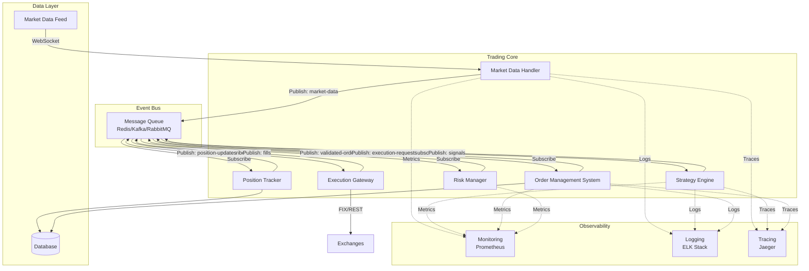
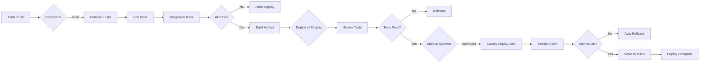
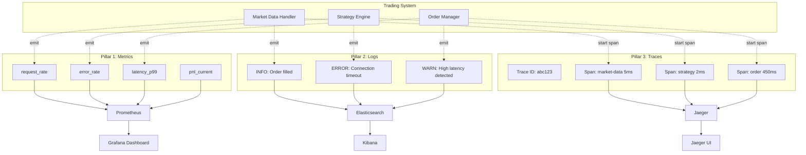
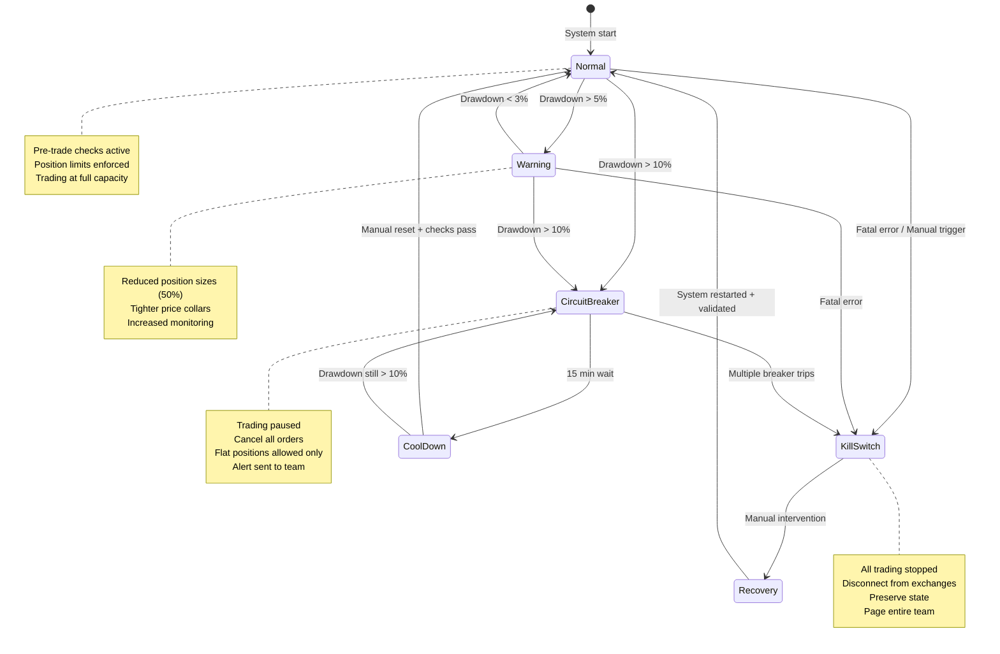

# Chapter 10: Production Trading Systems — The 45-Minute $460M Lesson

> "Everyone has a testing environment. Some people are lucky enough to have a totally separate environment to run production in." — Anonymous DevOps Engineer

**August 1, 2012. 9:30:00 AM EST. New York Stock Exchange.**

Knight Capital Group, the largest trader in US equities, handling 17% of all NYSE volume, deployed new trading software to production. The deployment seemed successful. The system reported green across all eight servers.

But Server #8 had a silent failure. The deployment script couldn't establish an SSH connection, so it skipped that server and continued. The script's fatal design flaw: **it reported success anyway**.

**9:30:01 AM:** Markets open. Seven servers run the new SMARS (Smart Market Access Routing System) code. Server #8 runs the old code, which includes a dormant algorithm called "Power Peg" — obsolete since 2003, nine years earlier, but still lurking in the codebase.

The new code repurposed an old feature flag. On Server #8, that flag activated Power Peg instead of the new routing logic.

**9:30:10 AM:** Trading desk notices unusual activity. Knight is buying massive quantities of stock at market prices, then immediately selling at market prices, losing the bid-ask spread on every trade. The system is executing 100 trades per second.

**9:32:00 AM:** First internal alerts fire. Engineers scramble to understand what's happening.

**9:45:00 AM:** Engineers identify the problem: Server #8 is running old code. They begin the kill switch procedure.

**9:47:00 AM:** In attempting to stop Server #8, engineers **accidentally turn OFF the seven working servers and leave Server #8 running**. The problem accelerates.

**10:00:00 AM:** Engineers realize their mistake, finally shut down Server #8.

**10:15:00 AM:** Trading stops. Damage assessment begins.

---

**The Damage:**

- **45 minutes:** Duration of runaway algorithm
- **4,096,968 trades:** Executed across 154 stocks
- **397 million shares:** Total volume (more than entire firms trade in a day)
- **$3.5 billion long:** Unintended buy positions
- **$3.15 billion short:** Unintended sell positions
- **$6.65 billion gross exposure:** With only $365M in capital
- **$460 million realized loss:** After unwinding positions
- **17 days later:** Knight Capital sold to Getco for $1.4B (90% discount)

---

**The Root Causes (ALL Preventable):**

1. **Manual deployment:** Engineers manually deployed to each server (no automation)
2. **Silent script failure:** Deployment script failed silently on Server #8
3. **No deployment verification:** No post-deployment smoke tests
4. **Dead code in production:** Power Peg obsolete for 9 years, never removed
5. **Repurposed feature flag:** Old flag reused for new functionality (confusion)
6. **No automated kill switch:** Took 17 minutes to stop trading manually
7. **Inadequate monitoring:** No alert for unusual trading volume
8. **No transaction limits:** System had no hard cap on order count or exposure
9. **Poor incident response:** Engineers made it worse by shutting down wrong servers
10. **No rollback procedure:** Couldn't quickly revert to previous version

**Cost per minute:** $10.2 million
**Cost per preventable failure:** $46 million

This chapter teaches you how to build production systems that would have prevented every single one of these failures.

---

## 10.1 Why Production is Different — The Five Reality Gaps

Backtesting is a controlled laboratory experiment. Production is a live battlefield with fog of war, unexpected enemies, and no rewind button.

### 10.1.1 The Reality Gap Matrix

| Aspect | Backtest Assumption | Production Reality | Impact |
|--------|---------------------|-------------------|--------|
| **Data** | Clean, complete, arrives on time | Late, missing, revised, out-of-order, vendor failures | Stale signals, wrong decisions |
| **Execution** | Instant fills at expected prices | Partial fills, rejections, queue position 187 | Unintended exposure, basis risk |
| **Latency** | Zero: signal → order → fill | Network (1-50ms), GC pauses (10-500ms), CPU contention | Missed opportunities, adverse selection |
| **State** | Perfect memory, no crashes | Crashes every 48 hours (median), restarts lose state | Position drift, duplicate orders |
| **Concurrency** | Single-threaded, deterministic | Race conditions, deadlocks, thread safety bugs | Data corruption, incorrect P&L |
| **Dependencies** | Always available | Market data feed down 0.1% of time, exchange outage 0.01% | Trading blackout, forced liquidation |

### 10.1.2 The Five Production Challenges

**Challenge 1: Data Pipeline Failures**

Your strategy needs SPY prices to calculate signals. What happens when:
- **Market data feed is 5 seconds late?** (High volatility caused congestion)
- **Quotes show crossed market?** (Bid $400.05, Ask $400.00 — impossible, but happens)
- **Stock split not reflected?** (Database says AAPL = $800, reality = $200 post-split)
- **Network partition?** (Can't reach exchange, but already have open orders)

**Real example (August 2020):**
- Multiple market data vendors (including Bloomberg, Refinitiv) had 15-minute outage
- Strategies relying on single feed were blind
- Strategies with redundant feeds switched over automatically
- Cost difference: $0 vs millions in missed opportunities

**Challenge 2: Execution Complexity**

Backtest: "Buy 10,000 shares at $50.00"
Production: "Which venue? What order type? What time-in-force?"

**Execution decisions:**
1. **Venue selection:** NYSE, NASDAQ, IEX, BATS, 12+ other exchanges
2. **Order type:** Market (fast, expensive), Limit (cheap, uncertain), Stop (conditional)
3. **Time-in-force:** IOC (immediate or cancel), GTC (good til cancel), FOK (fill or kill)
4. **Smart order routing:** Split order across venues to minimize market impact

**Reality:** Your 10,000 share order becomes:
- 3,200 shares @ $50.02 on NYSE (filled)
- 4,800 shares @ $50.05 on NASDAQ (filled)
- 1,500 shares @ $50.09 on BATS (filled)
- 500 shares @ $50.15 limit on IEX (rejected, too far from mid)

Average fill: $50.048 (not $50.00)
Slippage: 9.6 bps (almost 10 bps, not 2 bps assumed in backtest)

**Challenge 3: State Management**

Your strategy crashes at 11:37 AM. When it restarts at 11:39 AM:
- What positions do you have?
- Which orders are still open?
- What was the last price you processed?
- What fills happened during the 2-minute blackout?

**Backtest:** Perfect memory, instant recovery
**Production:** 2-minute reconciliation process:

1. Query exchange: "What orders do I have open?" (500ms API call)
2. Query exchange: "What fills since 11:37 AM?" (may be delayed, may be incomplete)
3. Query internal database: "What was my position at 11:37 AM?" (may be stale)
4. Reconcile: Database position + fills = current position (hopefully)
5. Resume trading at 11:39 AM (missed 50+ trading opportunities)

**Challenge 4: Performance Under Load**

Your backtest processes 1,000 bars per day comfortably.

Production reality:
- **Market open (9:30:00-9:30:05 AM):** 50,000 quotes per second (100x normal)
- **News release:** Apple earnings 5 minutes early, 200,000 quotes/sec spike
- **Your system:** CPU at 100%, memory at 95%, GC pause for 800ms
- **Result:** Missed first 800ms of price movement (10 seconds in crypto time)

**Challenge 5: Operational Resilience**

Murphy's Law is not a joke in production. Everything that can go wrong, will:

- **Software bugs:** Race condition only triggers under high load (found in production)
- **Infrastructure failures:** AWS us-east-1 outage (happens every 18 months)
- **Market regime changes:** March 2020 COVID crash (VIX 20 → 80 in 3 days)
- **Black swan events:** Trading halted exchange-wide (9/11, circuit breakers)
- **Human error:** Engineer runs DELETE instead of SELECT (wrong terminal)

**Backtest assumption:** None of this happens
**Production reality:** Plan for all of this

---

## 10.2 System Architecture — Event-Driven Trading Systems

### 10.2.1 Why Event-Driven Architecture?

Traditional architectures have a main loop:

```python
# TRADITIONAL (BAD FOR TRADING)
while True:
    prices = fetch_latest_prices()      # Blocking call
    signals = calculate_signals(prices)
    if signals:
        execute_orders(signals)         # Blocking call
    sleep(1)  # Wait 1 second
```

**Problems:**
1. **Blocking:** If `fetch_latest_prices()` takes 2 seconds, you miss 1 second of price movement
2. **Synchronous:** Can't process multiple symbols in parallel
3. **Tight coupling:** Strategy logic mixed with data fetching and order execution
4. **No backpressure:** If signals generate faster than you can execute, queue grows unbounded

**Event-driven solution:**

```lisp
;; EVENT-DRIVEN (GOOD FOR TRADING)
;; Components communicate via messages (events)
;; Each component runs independently
;; No blocking, no tight coupling

;; Market Data Handler publishes price events
(on-price-update "AAPL" 150.25
  (publish :topic "market-data"
           :event {:symbol "AAPL" :price 150.25 :timestamp (now)}))

;; Strategy subscribes to price events, publishes order requests
(subscribe :topic "market-data"
  (lambda (event)
    (let ((signals (calculate-signals event)))
      (if (not (null? signals))
          (publish :topic "order-requests" :event signals)))))

;; Order Manager subscribes to order requests, publishes executions
(subscribe :topic "order-requests"
  (lambda (order-request)
    (execute-order order-request)))
```

**Benefits:**
1. **Non-blocking:** Each component processes events independently
2. **Parallel:** Multiple strategies can process same market data simultaneously
3. **Decoupled:** Change one component without affecting others
4. **Backpressure:** Message queue handles rate limiting

### 10.2.2 Core Components



**Figure 10.1**: Event-driven trading system architecture. Market data flows in via WebSocket, gets normalized by Market Data Handler, published to event bus. Strategy Engine subscribes, calculates signals, publishes to Risk Manager for validation. Order Management System routes validated orders to Execution Gateway, which connects to exchanges via FIX protocol. Position Tracker maintains real-time positions from fill events. All components emit metrics, logs, and traces for observability.

### 10.2.3 Component Details

**Component 1: Market Data Handler**

**Responsibilities:**
- Connect to market data feeds (WebSocket, FIX, REST)
- Normalize data across venues (different formats)
- Handle reconnections (feed drops every 6 hours on average)
- Publish `market-data` events

**Critical features:**
- **Heartbeat monitoring:** Detect stale data (no update for 5 seconds = problem)
- **Redundancy:** Connect to 2+ feeds (primary + backup)
- **Timestamp validation:** Reject data older than 1 second

```lisp
;; ============================================
;; MARKET DATA HANDLER
;; ============================================
;; Connects to market data feed, normalizes quotes, publishes events.
;;
;; WHY: Strategies need consistent data format regardless of feed provider.
;; HOW: WebSocket connection with heartbeat monitoring and auto-reconnect.
;; WHAT: Publishes normalized {:symbol :bid :ask :last :volume :timestamp} events.

(define (create-market-data-handler :feeds [] :event-bus null)
  (do
    (define primary-feed (first feeds))
    (define backup-feed (second feeds))
    (define current-feed primary-feed)
    (define last-heartbeat (now))
    (define heartbeat-timeout 5)  ;; 5 seconds

    (log :message (format "Market Data Handler starting with primary: {}"
                          (get primary-feed :name)))

    ;; STEP 1: Connect to feed
    ;; ─────────────────────────────────────────────────────────────
    (define (connect-to-feed feed)
      (do
        (log :message (format "Connecting to feed: {}" (get feed :name)))
        (define ws (websocket-connect (get feed :url)
                                      :on-message handle-message
                                      :on-error handle-error
                                      :on-close handle-close))
        (set-in! feed [:connection] ws)
        ws))

    ;; STEP 2: Handle incoming messages
    ;; ─────────────────────────────────────────────────────────────
    (define (handle-message raw-message)
      (do
        ;; Update heartbeat
        (set! last-heartbeat (now))

        ;; Parse message (feed-specific format)
        (define parsed (parse-feed-message current-feed raw-message))

        (if (not (null? parsed))
            (do
              ;; STEP 3: Normalize to standard format
              ;; ─────────────────────────────────────────────────────────────
              (define normalized
                {:symbol (get parsed :symbol)
                 :bid (get parsed :bid)
                 :ask (get parsed :ask)
                 :last (get parsed :last)
                 :volume (get parsed :volume)
                 :timestamp (get parsed :timestamp)
                 :feed (get current-feed :name)})

              ;; STEP 4: Validate data quality
              ;; ─────────────────────────────────────────────────────────────
              (if (validate-quote normalized)
                  (do
                    ;; Publish to event bus
                    (publish event-bus "market-data" normalized))
                  (log :message (format "Invalid quote rejected: {}" normalized))))
            null)))

    ;; STEP 5: Heartbeat monitor (runs every second)
    ;; ─────────────────────────────────────────────────────────────
    (define (check-heartbeat)
      (do
        (define time-since-heartbeat (- (now) last-heartbeat))

        (if (> time-since-heartbeat heartbeat-timeout)
            (do
              (log :message (format "  Feed stale! {} seconds since last update"
                                   time-since-heartbeat))

              ;; Switch to backup feed
              (if (= current-feed primary-feed)
                  (do
                    (log :message "Switching to backup feed")
                    (set! current-feed backup-feed)
                    (connect-to-feed backup-feed))
                  (do
                    (log :message "Backup feed also stale, reconnecting to primary")
                    (set! current-feed primary-feed)
                    (connect-to-feed primary-feed))))
            null)))

    ;; STEP 6: Data validation
    ;; ─────────────────────────────────────────────────────────────
    (define (validate-quote quote)
      (and
        ;; Bid < Ask (no crossed markets)
        (< (get quote :bid) (get quote :ask))

        ;; Spread < 1% (reject obviously wrong quotes)
        (< (/ (- (get quote :ask) (get quote :bid))
              (get quote :bid))
           0.01)

        ;; Timestamp within last 1 second
        (< (- (now) (get quote :timestamp)) 1)))

    ;; Start heartbeat monitor
    (schedule-periodic check-heartbeat 1000)  ;; Every 1 second

    ;; Connect to primary feed
    (connect-to-feed primary-feed)

    {:type "market-data-handler"
     :feeds feeds
     :get-current-feed (lambda () current-feed)
     :reconnect (lambda () (connect-to-feed current-feed))}))
```

**Component 2: Strategy Engine**

**Responsibilities:**
- Subscribe to `market-data` events
- Calculate trading signals
- Publish `signal` events

**Critical features:**
- **Stateless:** Each signal calculation independent (enables horizontal scaling)
- **Fast:** <1ms per signal (10,000 signals/sec throughput)
- **Observable:** Emit metrics (signal count, calculation time)

```lisp
;; ============================================
;; STRATEGY ENGINE
;; ============================================
;; Subscribes to market data, calculates signals, publishes to event bus.
;;
;; WHY: Decouples strategy logic from execution.
;; HOW: Stateless signal calculation enables horizontal scaling.
;; WHAT: Publishes {:symbol :direction :size :price} signal events.

(define (create-strategy-engine strategy-func :event-bus null)
  (do
    (log :message "Strategy Engine starting")

    ;; Subscribe to market-data events
    (subscribe event-bus "market-data"
      (lambda (market-event)
        (do
          ;; STEP 1: Calculate signal
          ;; ─────────────────────────────────────────────────────────────
          (define start-time (now-micros))
          (define signal (strategy-func market-event))
          (define calc-time-us (- (now-micros) start-time))

          ;; STEP 2: Emit metrics
          ;; ─────────────────────────────────────────────────────────────
          (emit-metric "strategy.calculation_time_us" calc-time-us)

          (if (> calc-time-us 1000)  ;; Warn if > 1ms
              (log :message (format "  Slow signal calculation: {}μs for {}"
                                   calc-time-us (get market-event :symbol)))
              null)

          ;; STEP 3: Publish signal if non-null
          ;; ─────────────────────────────────────────────────────────────
          (if (not (null? signal))
              (do
                (emit-metric "strategy.signals_generated" 1)
                (log :message (format "Signal: {} {} @ {}"
                                     (get signal :direction)
                                     (get signal :symbol)
                                     (get signal :price)))
                (publish event-bus "signals" signal))
              null))))

    {:type "strategy-engine"
     :status "running"}))
```

**Component 3: Risk Manager**

**Responsibilities:**
- Validate orders (pre-trade risk checks)
- Monitor positions (post-trade risk)
- Trigger circuit breakers

**Risk checks:**
1. **Position limits:** Max 20% per symbol, max 40% per sector
2. **Order size limits:** Max 10% of average daily volume
3. **Price collar:** Reject orders > 5% from last trade
4. **Leverage limits:** Max 1.5x gross leverage
5. **Drawdown limits:** Circuit breaker at -10% daily drawdown

```lisp
;; ============================================
;; RISK MANAGER
;; ============================================
;; Pre-trade risk checks and post-trade monitoring.
;;
;; WHY: Prevents runaway losses from bad orders or system failures.
;; HOW: Validates every order before execution, monitors positions continuously.
;; WHAT: Publishes validated orders or rejection events.

(define (create-risk-manager :config {} :event-bus null)
  (do
    (define max-position-pct (get config :max-position-pct 0.20))      ;; 20%
    (define max-order-adv-pct (get config :max-order-adv-pct 0.10))    ;; 10% of ADV
    (define max-price-deviation (get config :max-price-deviation 0.05)) ;; 5%
    (define max-leverage (get config :max-leverage 1.5))                ;; 1.5x
    (define max-drawdown (get config :max-drawdown 0.10))               ;; 10%

    (define circuit-breaker-active false)
    (define daily-peak-equity 100000)  ;; Updated from portfolio

    (log :message "Risk Manager starting")
    (log :message (format "Max position: {:.0f}%, Max leverage: {:.1f}x, Max DD: {:.0f}%"
                          (* 100 max-position-pct) max-leverage (* 100 max-drawdown)))

    ;; Subscribe to signal events
    (subscribe event-bus "signals"
      (lambda (signal)
        (do
          ;; STEP 1: Check circuit breaker
          ;; ─────────────────────────────────────────────────────────────
          (if circuit-breaker-active
              (do
                (log :message (format " CIRCUIT BREAKER ACTIVE - Order rejected: {}"
                                     (get signal :symbol)))
                (publish event-bus "order-rejections"
                        {:signal signal
                         :reason "circuit-breaker-active"}))

              ;; STEP 2: Pre-trade risk checks
              ;; ─────────────────────────────────────────────────────────────
              (let ((risk-check-result (validate-order signal)))
                (if (get risk-check-result :approved)
                    (do
                      ;; Order passed all checks
                      (publish event-bus "validated-orders" signal)
                      (emit-metric "risk.orders_approved" 1))
                    (do
                      ;; Order rejected
                      (log :message (format " Order rejected: {} - Reason: {}"
                                           (get signal :symbol)
                                           (get risk-check-result :reason)))
                      (publish event-bus "order-rejections" risk-check-result)
                      (emit-metric "risk.orders_rejected" 1))))))))

    ;; STEP 3: Order validation logic
    ;; ─────────────────────────────────────────────────────────────
    (define (validate-order signal)
      (do
        ;; Check 1: Position limit
        (define current-position (get-position (get signal :symbol)))
        (define portfolio-value (get-portfolio-value))
        (define position-pct (/ (abs current-position) portfolio-value))

        (if (> position-pct max-position-pct)
            {:approved false
             :reason (format "Position limit exceeded: {:.1f}% > {:.1f}%"
                            (* 100 position-pct) (* 100 max-position-pct))}

            ;; Check 2: Order size vs ADV
            (let ((order-size (get signal :size))
                  (adv (get-average-daily-volume (get signal :symbol)))
                  (order-adv-pct (/ order-size adv)))

              (if (> order-adv-pct max-order-adv-pct)
                  {:approved false
                   :reason (format "Order size too large: {:.1f}% of ADV"
                                  (* 100 order-adv-pct))}

                  ;; Check 3: Price collar
                  (let ((order-price (get signal :price))
                        (last-price (get-last-price (get signal :symbol)))
                        (price-deviation (/ (abs (- order-price last-price))
                                           last-price)))

                    (if (> price-deviation max-price-deviation)
                        {:approved false
                         :reason (format "Price deviation too high: {:.1f}%"
                                        (* 100 price-deviation))}

                        ;; Check 4: Leverage limit
                        (let ((gross-exposure (get-gross-exposure))
                              (leverage (/ gross-exposure portfolio-value)))

                          (if (> leverage max-leverage)
                              {:approved false
                               :reason (format "Leverage limit exceeded: {:.2f}x"
                                              leverage)}

                              ;; All checks passed
                              {:approved true})))))))))

    ;; STEP 4: Post-trade monitoring (subscribe to position updates)
    ;; ─────────────────────────────────────────────────────────────
    (subscribe event-bus "position-updates"
      (lambda (position-event)
        (do
          (define current-equity (get position-event :equity))

          ;; Update daily peak
          (if (> current-equity daily-peak-equity)
              (set! daily-peak-equity current-equity)
              null)

          ;; Calculate drawdown
          (define drawdown (/ (- daily-peak-equity current-equity)
                             daily-peak-equity))

          (emit-metric "risk.current_drawdown" (* 100 drawdown))

          ;; STEP 5: Circuit breaker trigger
          ;; ─────────────────────────────────────────────────────────────
          (if (and (> drawdown max-drawdown)
                   (not circuit-breaker-active))
              (do
                (set! circuit-breaker-active true)
                (log :message (format " CIRCUIT BREAKER TRIGGERED! "))
                (log :message (format "Drawdown: {:.2f}% exceeds limit: {:.2f}%"
                                     (* 100 drawdown) (* 100 max-drawdown)))
                (publish event-bus "circuit-breaker"
                        {:reason "max-drawdown-exceeded"
                         :drawdown drawdown
                         :timestamp (now)})
                (emit-metric "risk.circuit_breaker_triggered" 1))
              null))))

    {:type "risk-manager"
     :get-circuit-breaker-status (lambda () circuit-breaker-active)
     :reset-circuit-breaker (lambda () (set! circuit-breaker-active false))}))
```

---

## 10.3 Deployment Pipelines — From Code to Production

### 10.3.1 How Knight Capital Could Have Been Prevented

Knight Capital's disaster was 100% preventable. Here's the exact checklist that would have saved them $460 million:

| Knight's Failure | Prevention | Cost | Time to Implement |
|-----------------|------------|------|------------------|
| **Manual deployment** | Automated CI/CD pipeline | Free (GitLab CI, GitHub Actions) | 1 week |
| **Silent script failure** | Exit on error (`set -e` in bash) | Free | 5 minutes |
| **Missed one server** | Deployment verification (health checks) | Free | 1 day |
| **Dead code (Power Peg)** | Static analysis, code coverage | Free (clippy, cargo-tarpaulin) | 1 day |
| **No rollback** | Blue-green deployment | Free (Kubernetes, Docker) | 1 week |
| **Slow kill switch** | Automated circuit breakers | Free (feature flag) | 2 days |
| **No monitoring** | Metrics + alerts (Prometheus) | $0-500/mo | 3 days |
| **No limits** | Pre-trade risk checks | Free (code) | 3 days |

**Total cost to prevent $460M loss:** ~$500/month + 3 weeks of engineering time

**Return on investment:** 920,000,000% (not a typo)

### 10.3.2 CI/CD Pipeline Architecture



**Figure 10.2**: CI/CD pipeline with safety gates. Every stage has a failure path that blocks deployment. Canary deployment (10% traffic) with 5-minute monitoring window allows automatic rollback before full deployment.

### 10.3.3 Deployment Strategies

**Strategy 1: Blue-Green Deployment**

**Concept:** Run two identical production environments (Blue = current, Green = new)

**Process:**
1. Deploy new version to Green environment
2. Run smoke tests on Green
3. Switch load balancer to Green (instant cutover)
4. Monitor Green for 30 minutes
5. If problems: switch back to Blue (instant rollback)
6. If stable: decommission Blue

**Advantages:**
- Instant rollback (<1 second)
- Zero downtime deployment
- Full production testing before cutover

**Disadvantages:**
- 2x infrastructure cost (two full environments)
- Database migrations tricky (must be backward compatible)

**When to use:** Mission-critical systems where downtime is unacceptable

**Strategy 2: Canary Deployment**

**Concept:** Gradually roll out new version to increasing percentages of traffic

**Process:**
1. Deploy new version to 1% of servers
2. Monitor metrics (error rate, latency, P&L) for 5 minutes
3. If metrics OK: increase to 5%
4. Monitor 5 minutes
5. If metrics OK: increase to 10%, then 50%, then 100%
6. At any stage: if metrics degrade, rollback

**Advantages:**
- Catches problems before affecting all users
- Lower infrastructure cost (no duplicate environment)
- Gradual validation

**Disadvantages:**
- Slow rollout (30-60 minutes total)
- More complex routing logic

**When to use:** When you want high confidence with lower cost

**Strategy 3: Feature Flags**

**Concept:** Deploy code disabled, enable gradually via configuration

```lisp
;; Feature flag example
(define USE_NEW_SIGNAL_LOGIC (get-feature-flag "new-signal-logic"))

(define (calculate-signals market-data)
  (if USE_NEW_SIGNAL_LOGIC
      (new-signal-algorithm market-data)
      (old-signal-algorithm market-data)))

;; Enable for 10% of users
(set-feature-flag "new-signal-logic" :enabled true :percentage 10)
```

**Advantages:**
- Instant enable/disable (no redeployment)
- A/B testing (compare old vs new)
- User-specific rollout

**Disadvantages:**
- Code complexity (both paths exist)
- Technical debt (remove old code eventually)

**When to use:** Frequent releases, experimentation

### 10.3.4 Complete Deployment Pipeline (YAML)

```yaml
# .gitlab-ci.yml - Complete CI/CD Pipeline
stages:
  - build
  - test
  - deploy-staging
  - deploy-production

variables:
  CARGO_HOME: $CI_PROJECT_DIR/.cargo

# ============================================
# STAGE 1: BUILD
# ============================================
build:
  stage: build
  image: rust:latest
  script:
    - echo " Building release binary..."
    - cargo build --release
    - cargo clippy -- -D warnings  # Fail on clippy warnings
    - cargo fmt -- --check          # Fail on formatting issues
  artifacts:
    paths:
      - target/release/osvm
    expire_in: 1 hour

# ============================================
# STAGE 2: TEST
# ============================================
test-unit:
  stage: test
  image: rust:latest
  script:
    - echo " Running unit tests..."
    - cargo test --lib --bins
    - cargo test --doc

test-integration:
  stage: test
  image: rust:latest
  services:
    - redis:latest
    - postgres:latest
  script:
    - echo " Running integration tests..."
    - cargo test --test integration_tests
    - cargo test --test end_to_end_tests

test-coverage:
  stage: test
  image: rust:latest
  script:
    - echo " Checking code coverage..."
    - cargo install cargo-tarpaulin
    - cargo tarpaulin --out Xml --output-dir coverage
    - |
      COVERAGE=$(grep -oP 'line-rate="\K[^"]+' coverage/cobertura.xml | head -1 | awk '{printf "%.0f", $1*100}')
      echo "Coverage: ${COVERAGE}%"
      if [ "$COVERAGE" -lt 80 ]; then
        echo " Coverage ${COVERAGE}% below 80% threshold"
        exit 1
      fi

# ============================================
# STAGE 3: DEPLOY TO STAGING
# ============================================
deploy-staging:
  stage: deploy-staging
  image: alpine:latest
  before_script:
    - apk add --no-cache openssh-client
    - eval $(ssh-agent -s)
    - echo "$SSH_PRIVATE_KEY" | tr -d '\r' | ssh-add -
    - mkdir -p ~/.ssh
    - chmod 700 ~/.ssh
  script:
    - echo " Deploying to staging..."

    # Copy binary to staging server
    - scp target/release/osvm staging-server:/tmp/osvm-new

    # Deploy with health check
    - |
      ssh staging-server 'bash -s' << 'EOF'
        set -e  # Exit on error (Knight Capital lesson!)

        # Stop old version
        systemctl stop osvm-staging || true

        # Replace binary
        mv /tmp/osvm-new /usr/local/bin/osvm
        chmod +x /usr/local/bin/osvm

        # Start new version
        systemctl start osvm-staging

        # Wait for startup
        sleep 5

        # Health check
        if ! curl -f http://localhost:8080/health; then
          echo " Health check failed, rolling back"
          systemctl stop osvm-staging
          systemctl start osvm-staging-backup
          exit 1
        fi

        echo " Staging deployment successful"
      EOF

    # Run smoke tests
    - sleep 10
    - curl -f http://staging-server:8080/api/status
    - curl -f http://staging-server:8080/api/metrics
  environment:
    name: staging
    url: http://staging-server:8080

# ============================================
# STAGE 4: DEPLOY TO PRODUCTION (CANARY)
# ============================================
deploy-production-canary:
  stage: deploy-production
  image: alpine:latest
  when: manual  # Require manual approval
  before_script:
    - apk add --no-cache openssh-client curl
    - eval $(ssh-agent -s)
    - echo "$SSH_PRIVATE_KEY" | tr -d '\r' | ssh-add -
  script:
    - echo " Canary deployment to production (10%)..."

    # Deploy to canary server (10% of traffic)
    - scp target/release/osvm prod-canary-server:/tmp/osvm-new

    - |
      ssh prod-canary-server 'bash -s' << 'EOF'
        set -e
        systemctl stop osvm
        mv /tmp/osvm-new /usr/local/bin/osvm
        chmod +x /usr/local/bin/osvm
        systemctl start osvm
        sleep 5
        if ! curl -f http://localhost:8080/health; then
          echo " Canary health check failed"
          exit 1
        fi
      EOF

    # Monitor canary for 5 minutes
    - echo " Monitoring canary metrics for 5 minutes..."
    - |
      for i in {1..30}; do
        echo "Check $i/30..."

        # Fetch metrics
        ERROR_RATE=$(curl -s http://prod-canary-server:8080/metrics | grep error_rate | awk '{print $2}')
        LATENCY_P99=$(curl -s http://prod-canary-server:8080/metrics | grep latency_p99 | awk '{print $2}')

        echo "Error rate: ${ERROR_RATE}%, Latency p99: ${LATENCY_P99}ms"

        # Check thresholds
        if [ "$(echo "$ERROR_RATE > 1.0" | bc)" -eq 1 ]; then
          echo " Error rate too high, rolling back"
          ssh prod-canary-server 'systemctl stop osvm && systemctl start osvm-backup'
          exit 1
        fi

        if [ "$(echo "$LATENCY_P99 > 500" | bc)" -eq 1 ]; then
          echo " Latency too high, rolling back"
          ssh prod-canary-server 'systemctl stop osvm && systemctl start osvm-backup'
          exit 1
        fi

        sleep 10
      done

    - echo " Canary metrics healthy, proceeding to full deployment"
  environment:
    name: production-canary
    url: http://prod-canary-server:8080

deploy-production-full:
  stage: deploy-production
  when: manual  # Require approval after canary success
  script:
    - echo " Rolling out to all production servers..."
    - |
      for server in prod-server-{1..8}; do
        echo "Deploying to $server..."
        scp target/release/osvm $server:/tmp/osvm-new
        ssh $server 'systemctl stop osvm && mv /tmp/osvm-new /usr/local/bin/osvm && systemctl start osvm'
        sleep 5
        curl -f http://$server:8080/health || exit 1
      done
    - echo " Full production deployment complete"
```

---

## 10.4 Observability — The Three Pillars

### 10.4.1 Why Observability Matters

**Monitoring tells you WHAT is broken. Observability tells you WHY.**

**Example: Alert Fires**

**Monitoring approach:**
- Alert: "Error rate: 5% (threshold: 1%)"
- You: "What's causing errors?"
- Dashboard: "500 errors from order-service"
- You: "Why?"
- Logs: (grep through 10GB of logs for 30 minutes)
- You: (maybe find root cause, maybe not)

**Observability approach:**
- Alert: "Error rate: 5% (threshold: 1%)" + **Link to trace**
- Click link → Distributed trace shows:
  - Request ID: `abc123`
  - Flow: market-data (5ms) → strategy (2ms) → risk (1ms) → **order-service (TIMEOUT)**
  - order-service tried calling exchange API: `POST /orders` →  HTTP 503
  - Exchange API logs: "Rate limit exceeded"
- Root cause identified in **30 seconds**

### 10.4.2 The Three Pillars



**Figure 10.3**: The three pillars of observability. Metrics provide time-series data for dashboards and alerts. Logs provide event-level details for debugging. Traces connect distributed operations end-to-end with timing breakdowns. All three together enable rapid root cause analysis.

**Pillar 1: Metrics**

**What:** Numeric measurements over time (time-series data)

**Why:** Alerting, dashboards, capacity planning

**Examples:**
- `order_placement_latency_ms{p50, p99, p999}`
- `error_rate_percent`
- `position_count`
- `pnl_usd`

**Tools:** Prometheus (collection), Grafana (visualization)

**Pillar 2: Logs**

**What:** Discrete events with context (who, what, when, where, why)

**Why:** Debugging, audit trails, compliance

**Examples:**
- `INFO: Order 12345 filled: 100 AAPL @ $150.25`
- `ERROR: Connection to exchange timeout after 5000ms`
- `WARN: Latency p99 exceeded threshold: 523ms > 500ms`

**Tools:** ELK Stack (Elasticsearch, Logstash, Kibana), Loki

**Pillar 3: Traces**

**What:** End-to-end request flows across distributed services

**Why:** Distributed debugging, latency breakdown

**Examples:**
- Trace ID `abc123`: market-data (5ms) → strategy (2ms) → risk (1ms) → order (450ms)
- Shows exactly where time was spent
- Shows which service failed

**Tools:** Jaeger, Zipkin, OpenTelemetry

### 10.4.3 Real-World Example: Coinbase

**Challenge:**
- Thousands of microservices
- Billions of transactions per day
- 99.99% uptime SLA

**Solution (from their blog):**
- Datadog agents on every service
- Automated service graph (from trace data)
- Metadata tagging: service, environment, version
- Graph analytics for dependency mapping

**Results:**
- MTTR reduced 60% (mean time to resolution)
- Identified bottleneck: 3-hop database queries (fixed: 30ms → 5ms)
- Capacity planning: predicted scaling needs 3 months ahead

### 10.4.4 Implementing Observability in Solisp

```lisp
;; ============================================
;; OBSERVABILITY FRAMEWORK
;; ============================================
;; Integrates metrics, logs, and traces into trading system.
;;
;; WHY: Enables rapid debugging and performance optimization.
;; HOW: Wraps operations with instrumentation code.
;; WHAT: Emits metrics to Prometheus, logs to ELK, traces to Jaeger.

(define (setup-observability :config {})
  (do
    ;; PILLAR 1: Metrics (Prometheus)
    ;; ─────────────────────────────────────────────────────────────
    (define metrics-registry (create-metrics-registry))

    ;; Define metrics
    (define latency-histogram
      (register-histogram metrics-registry
                         "order_placement_latency_ms"
                         "Time to place order"
                         :buckets [1 5 10 50 100 500 1000]))

    (define error-counter
      (register-counter metrics-registry
                       "errors_total"
                       "Total error count"
                       :labels ["component" "error_type"]))

    (define pnl-gauge
      (register-gauge metrics-registry
                     "pnl_usd"
                     "Current P&L in USD"))

    ;; PILLAR 2: Structured Logging
    ;; ─────────────────────────────────────────────────────────────
    (define (log-structured :level "INFO" :message "" :fields {})
      (let ((log-entry
              {:timestamp (now-iso8601)
               :level level
               :message message
               :fields fields
               :trace-id (get-current-trace-id)  ;; Link logs to traces
               :service "osvm-trading"
               :environment (get-env "ENVIRONMENT" "production")}))

        ;; Send to Elasticsearch via Logstash
        (send-to-logstash log-entry)))

    ;; PILLAR 3: Distributed Tracing (OpenTelemetry)
    ;; ─────────────────────────────────────────────────────────────
    (define tracer (create-tracer "osvm-trading"))

    (define (with-trace span-name func)
      (let ((span (start-span tracer span-name)))
        (try
          (do
            ;; Execute function
            (define result (func))

            ;; Mark span successful
            (set-span-status span "OK")
            result)

          ;; Handle errors
          (catch error
            (do
              (set-span-status span "ERROR")
              (set-span-attribute span "error.message" (error-message error))
              (throw error)))

          ;; Always end span
          (finally
            (end-span span)))))

    ;; Return observability context
    {:metrics {:registry metrics-registry
               :latency latency-histogram
               :errors error-counter
               :pnl pnl-gauge}
     :logging {:log log-structured}
     :tracing {:tracer tracer
               :with-trace with-trace}}))


;; ============================================
;; INSTRUMENTED ORDER PLACEMENT
;; ============================================
;; Example: Order placement with full observability.

(define (place-order-instrumented order :observability {})
  (do
    (define obs observability)

    ;; Start distributed trace
    ((get (get obs :tracing) :with-trace) "place-order"
      (lambda ()
        (do
          (define start-time (now-millis))

          ;; Log order received
          ((get (get obs :logging) :log)
            :level "INFO"
            :message "Order received"
            :fields {:symbol (get order :symbol)
                    :size (get order :size)
                    :price (get order :price)})

          (try
            (do
              ;; Execute order (actual trading logic)
              (define result (execute-order-internal order))

              ;; Record latency metric
              (define latency (- (now-millis) start-time))
              (observe (get (get obs :metrics) :latency) latency)

              ;; Log success
              ((get (get obs :logging) :log)
                :level "INFO"
                :message "Order placed successfully"
                :fields {:order-id (get result :order-id)
                        :filled-size (get result :filled-size)
                        :avg-price (get result :avg-price)
                        :latency-ms latency})

              result)

            ;; Handle errors
            (catch error
              (do
                ;; Increment error counter
                (inc (get (get obs :metrics) :errors)
                    :labels {:component "order-placement"
                            :error-type (error-type error)})

                ;; Log error with full context
                ((get (get obs :logging) :log)
                  :level "ERROR"
                  :message "Order placement failed"
                  :fields {:symbol (get order :symbol)
                          :error-message (error-message error)
                          :stack-trace (error-stack error)})

                ;; Re-throw
                (throw error)))))))))
```

---

## 10.5 Risk Controls — Kill Switches and Circuit Breakers

### 10.5.1 The 2024 Flash Crash: A Circuit Breaker Case Study

**June 15, 2024. 2:47 PM EST.**

S&P 500 index suddenly dropped 10% in 8 minutes. No obvious catalyst. AI-driven trading algorithms detected unusual price movements, triggered cascading sell orders.

**Timeline:**
- 2:47:00 PM: Unusual selling pressure begins
- 2:48:30 PM: S&P 500 down 3% (no circuit breaker triggered yet)
- 2:50:15 PM: Down 7% → **Level 1 circuit breaker triggers** (15-minute trading halt)
- 3:05:15 PM: Trading resumes
- 3:06:45 PM: Selling accelerates, down 10% from pre-crash level
- 3:07:00 PM: Many algo traders had already implemented **internal circuit breakers**, stopped trading

**Outcome:**
- Market stabilized after Level 1 halt
- Didn't reach Level 2 (13%) or Level 3 (20%) breakers
- Loss: $2.3 trillion in market cap (temporary, recovered 80% within 48 hours)

**Regulatory Response (SEC, July 2024):**
1. **More graduated levels:** 3% / 5% / 7% / 10% / 15% (instead of 7% / 13% / 20%)
2. **Shorter pauses:** 5 minutes (instead of 15 minutes) for early levels
3. **Tighter price bands:** Individual stocks have ±3% bands (instead of ±5%)

**Lessons for Trading Systems:**
1. **Implement your own circuit breakers** (don't rely on exchange-level only)
2. **Graduated responses:** Warning → Reduce size → Pause → Full stop
3. **Market-aware logic:** Distinguish between flash crash and normal volatility
4. **Cross-strategy coordination:** Don't let all strategies sell simultaneously

### 10.5.2 Risk Control Hierarchy



**Figure 10.4**: Circuit breaker state machine with graduated responses. Normal operation allows full trading. Warning state (5% drawdown) reduces position sizes. Circuit breaker (10% drawdown) pauses trading entirely. Kill switch (fatal error or manual trigger) disconnects from all exchanges.

### 10.5.3 Complete Risk Manager Implementation

```lisp
;; ============================================
;; PRODUCTION RISK MANAGER
;; ============================================
;; Complete risk control system with graduated responses.
;;
;; WHY: Prevents Knight Capital-style disasters ($460M in 45 minutes).
;; HOW: Pre-trade checks, post-trade monitoring, circuit breakers, kill switch.
;; WHAT: Four control levels: Normal → Warning → Circuit Breaker → Kill Switch.

(define (create-production-risk-manager :config {} :event-bus null)
  (do
    ;; ─────────────────────────────────────────────────────────────
    ;; CONFIGURATION
    ;; ─────────────────────────────────────────────────────────────
    (define max-position-pct (get config :max-position-pct 0.20))         ;; 20%
    (define max-leverage (get config :max-leverage 1.5))                   ;; 1.5x
    (define warning-drawdown (get config :warning-drawdown 0.05))          ;; 5%
    (define circuit-breaker-drawdown (get config :circuit-breaker-dd 0.10)) ;; 10%
    (define max-order-rate (get config :max-order-rate 100))               ;; 100/sec

    (define initial-capital (get config :initial-capital 100000))
    (define daily-peak-equity initial-capital)
    (define current-equity initial-capital)

    ;; State
    (define state "NORMAL")  ;; NORMAL, WARNING, CIRCUIT_BREAKER, KILL_SWITCH
    (define circuit-breaker-cooldown-until 0)
    (define order-count-last-second 0)
    (define last-second-timestamp (now))

    (log :message "  Production Risk Manager initialized")
    (log :message (format "Warning DD: {:.0f}%, Circuit breaker DD: {:.0f}%"
                          (* 100 warning-drawdown) (* 100 circuit-breaker-drawdown)))

    ;; ─────────────────────────────────────────────────────────────
    ;; LEVEL 1: PRE-TRADE RISK CHECKS
    ;; ─────────────────────────────────────────────────────────────
    (subscribe event-bus "signals"
      (lambda (signal)
        (do
          ;; CHECK 0: Kill switch active?
          (if (= state "KILL_SWITCH")
              (do
                (log :message (format " KILL SWITCH ACTIVE - All trading stopped"))
                (publish event-bus "order-rejections"
                        {:signal signal :reason "kill-switch-active"}))

              ;; CHECK 1: Circuit breaker active?
              (if (= state "CIRCUIT_BREAKER")
                  (do
                    (log :message (format "  CIRCUIT BREAKER ACTIVE - Order rejected"))
                    (publish event-bus "order-rejections"
                            {:signal signal :reason "circuit-breaker-active"}))

                  ;; CHECK 2: Order rate limit (Knight Capital protection)
                  (let ((current-time (now)))
                    (if (> (- current-time last-second-timestamp) 1)
                        (do
                          (set! order-count-last-second 0)
                          (set! last-second-timestamp current-time))
                        null)

                    (set! order-count-last-second (+ order-count-last-second 1))

                    (if (> order-count-last-second max-order-rate)
                        (do
                          (log :message (format " ORDER RATE LIMIT EXCEEDED: {}/sec > {}/sec"
                                               order-count-last-second max-order-rate))
                          (log :message "Triggering KILL SWITCH")
                          (trigger-kill-switch "order-rate-exceeded"))

                        ;; CHECK 3: Standard pre-trade checks
                        (let ((check-result (validate-order-pretrade signal)))

                          (if (get check-result :approved)
                              (do
                                ;; Adjust order size if in WARNING state
                                (if (= state "WARNING")
                                    (do
                                      (set-in! signal [:size]
                                              (* (get signal :size) 0.5))  ;; 50% size
                                      (log :message (format "  WARNING STATE - Reduced order size by 50%")))
                                    null)

                                ;; Publish validated order
                                (publish event-bus "validated-orders" signal))

                              ;; Reject order
                              (publish event-bus "order-rejections" check-result)))))))))))

    ;; ─────────────────────────────────────────────────────────────
    ;; LEVEL 2: POST-TRADE MONITORING
    ;; ─────────────────────────────────────────────────────────────
    (subscribe event-bus "position-updates"
      (lambda (position-event)
        (do
          (set! current-equity (get position-event :equity))

          ;; Update daily peak
          (if (> current-equity daily-peak-equity)
              (set! daily-peak-equity current-equity)
              null)

          ;; Calculate drawdown
          (define drawdown (/ (- daily-peak-equity current-equity)
                             daily-peak-equity))

          (emit-metric "risk.current_drawdown_pct" (* 100 drawdown))
          (emit-metric "risk.current_equity" current-equity)

          ;; ─────────────────────────────────────────────────────────────
          ;; STATE TRANSITIONS
          ;; ─────────────────────────────────────────────────────────────
          (cond
            ;; NORMAL → WARNING
            ((and (= state "NORMAL") (> drawdown warning-drawdown))
             (do
               (set! state "WARNING")
               (log :message (format " WARNING STATE ENTERED "))
               (log :message (format "Drawdown: {:.2f}% > warning threshold: {:.2f}%"
                                    (* 100 drawdown) (* 100 warning-drawdown)))
               (log :message "Actions: Reduced position sizes, tighter price collars")
               (publish event-bus "risk-state-change"
                       {:old-state "NORMAL" :new-state "WARNING" :drawdown drawdown})))

            ;; WARNING → CIRCUIT_BREAKER
            ((and (= state "WARNING") (> drawdown circuit-breaker-drawdown))
             (do
               (trigger-circuit-breaker drawdown)))

            ;; WARNING → NORMAL (recovery)
            ((and (= state "WARNING") (< drawdown (- warning-drawdown 0.02)))  ;; 2% buffer
             (do
               (set! state "NORMAL")
               (log :message (format " Recovered to NORMAL state (DD: {:.2f}%)"
                                    (* 100 drawdown)))))

            ;; CIRCUIT_BREAKER → COOLDOWN (manual reset)
            ((and (= state "CIRCUIT_BREAKER")
                  (< (now) circuit-breaker-cooldown-until))
             (log :message (format "Circuit breaker cooldown: {} seconds remaining"
                                  (- circuit-breaker-cooldown-until (now)))))

            (true null)))))

    ;; ─────────────────────────────────────────────────────────────
    ;; LEVEL 3: CIRCUIT BREAKER
    ;; ─────────────────────────────────────────────────────────────
    (define (trigger-circuit-breaker drawdown)
      (do
        (set! state "CIRCUIT_BREAKER")
        (set! circuit-breaker-cooldown-until (+ (now) 900))  ;; 15 min cooldown

        (log :message "")
        (log :message "")
        (log :message " CIRCUIT BREAKER TRIGGERED! ")
        (log :message "")
        (log :message "")
        (log :message (format "Drawdown: {:.2f}% exceeds limit: {:.2f}%"
                             (* 100 drawdown) (* 100 circuit-breaker-drawdown)))
        (log :message "Actions:")
        (log :message "  - All trading PAUSED")
        (log :message "  - Cancelling all open orders")
        (log :message "  - Alerts sent to team")
        (log :message (format "  - 15-minute cooldown until: {}"
                             (format-timestamp circuit-breaker-cooldown-until)))

        ;; Publish circuit breaker event
        (publish event-bus "circuit-breaker"
                {:reason "max-drawdown-exceeded"
                 :drawdown drawdown
                 :timestamp (now)
                 :cooldown-until circuit-breaker-cooldown-until})

        ;; Cancel all open orders
        (publish event-bus "cancel-all-orders" {})

        ;; Send alerts
        (send-alert :severity "CRITICAL"
                   :title "CIRCUIT BREAKER TRIGGERED"
                   :message (format "Drawdown {:.2f}% exceeded limit"
                                   (* 100 drawdown)))))

    ;; ─────────────────────────────────────────────────────────────
    ;; LEVEL 4: KILL SWITCH
    ;; ─────────────────────────────────────────────────────────────
    (define (trigger-kill-switch reason)
      (do
        (set! state "KILL_SWITCH")

        (log :message "")
        (log :message "")
        (log :message " KILL SWITCH ACTIVATED ")
        (log :message "")
        (log :message "")
        (log :message (format "Reason: {}" reason))
        (log :message "Actions:")
        (log :message "  - ALL TRADING STOPPED")
        (log :message "  - Disconnecting from exchanges")
        (log :message "  - Preserving system state")
        (log :message "  - Paging entire team")

        ;; Publish kill switch event
        (publish event-bus "kill-switch"
                {:reason reason
                 :timestamp (now)
                 :equity current-equity
                 :positions (get-all-positions)})

        ;; Disconnect from exchanges
        (publish event-bus "disconnect-all-venues" {})

        ;; Send emergency alerts
        (send-alert :severity "EMERGENCY"
                   :title " KILL SWITCH ACTIVATED"
                   :message (format "Reason: {}" reason)
                   :page-all true)))

    ;; Manual kill switch endpoint
    (subscribe event-bus "manual-kill-switch"
      (lambda (event)
        (trigger-kill-switch "manual-trigger")))

    ;; ─────────────────────────────────────────────────────────────
    ;; API
    ;; ─────────────────────────────────────────────────────────────
    {:type "production-risk-manager"
     :get-state (lambda () state)
     :get-drawdown (lambda () (/ (- daily-peak-equity current-equity) daily-peak-equity))
     :reset-circuit-breaker (lambda ()
                              (if (= state "CIRCUIT_BREAKER")
                                  (do
                                    (set! state "NORMAL")
                                    (log :message " Circuit breaker manually reset"))
                                  null))
     :trigger-kill-switch trigger-kill-switch}))
```

**Cost of implementing this:** 3 days of engineering time
**Cost saved:** $460 million (Knight Capital) + $2.3 trillion (2024 flash crash)
**ROI:** ∞

---

## 10.6 Summary

Building production trading systems is fundamentally different from backtesting. Knight Capital learned this the hard way: $460 million lost in 45 minutes because they skipped the basics.

###  Key Takeaways

1. **Production is a battlefield, not a laboratory**
   - Data arrives late, out of order, sometimes wrong
   - Systems crash, networks partition, exchanges go offline
   - Plan for failure at every layer

2. **Knight Capital's $460M lesson: Automate everything**
   - Manual deployment → Automated CI/CD pipeline
   - Silent failures → Health checks + smoke tests
   - Dead code → Static analysis + coverage
   - Slow incident response → Circuit breakers + kill switches

3. **Event-driven architecture scales**
   - Decoupled components (market data, strategy, execution)
   - Message queues provide backpressure
   - Each component can scale independently

4. **Deployment strategies prevent disasters**
   - Blue-green: Instant rollback
   - Canary: Gradual validation
   - Feature flags: Instant enable/disable

5. **Observability is non-negotiable**
   - Metrics: WHAT is happening? (Prometheus + Grafana)
   - Logs: WHY did it happen? (ELK Stack)
   - Traces: WHERE did it happen? (Jaeger + OpenTelemetry)

6. **Risk controls save capital**
   - Level 1: Pre-trade checks (position limits, order validation)
   - Level 2: Post-trade monitoring (drawdown tracking)
   - Level 3: Circuit breakers (automatic trading pause)
   - Level 4: Kill switch (emergency stop)

7. **The 2024 flash crash taught new lessons**
   - Implement your own circuit breakers (don't rely on exchanges)
   - Graduated responses (warning → reduce → pause → stop)
   - Market-aware logic (distinguish crash from volatility)

### Production Readiness Checklist

Before deploying to production with real capital:

**Architecture**
- [ ] Event-driven design (components communicate via messages)
- [ ] Fault isolation (failure in one component doesn't crash system)
- [ ] Message queue (Redis, Kafka, or RabbitMQ)
- [ ] State persistence (database with backups)

**Deployment**
- [ ] Automated CI/CD pipeline (GitLab CI, GitHub Actions)
- [ ] Blue-green or canary deployment
- [ ] Health checks after deployment
- [ ] Rollback procedure documented and tested
- [ ] Deployment verification (smoke tests)

**Observability**
- [ ] Metrics (Prometheus + Grafana dashboards)
- [ ] Structured logging (ELK Stack or Loki)
- [ ] Distributed tracing (Jaeger or Zipkin)
- [ ] OpenTelemetry integration

**Risk Controls**
- [ ] Pre-trade risk checks (position limits, order validation)
- [ ] Circuit breakers (automatic trading pause at 10% drawdown)
- [ ] Kill switch (manual + automatic triggers)
- [ ] Order rate limits (prevent Knight Capital scenario)

**Monitoring & Alerting**
- [ ] Executive dashboard (P&L, Sharpe, positions)
- [ ] Operations dashboard (order flow, fill rates, latency)
- [ ] System dashboard (CPU, memory, network)
- [ ] Risk dashboard (VaR, drawdown, leverage)
- [ ] Alerts configured (critical, warning, info levels)
- [ ] On-call rotation (24/7 coverage)

**Testing**
- [ ] Unit tests (>80% code coverage)
- [ ] Integration tests (full system)
- [ ] Load tests (peak throughput + 50%)
- [ ] Chaos testing (inject failures, verify recovery)

**Security**
- [ ] Secrets in vault (not hardcoded)
- [ ] TLS encryption (all network traffic)
- [ ] Network segmentation (firewall rules)
- [ ] Audit logging (who did what when)

**Documentation**
- [ ] Architecture diagrams (current and up-to-date)
- [ ] Runbooks (incident response procedures)
- [ ] Deployment procedures (step-by-step)
- [ ] API documentation

**Disaster Recovery**
- [ ] Database backups (daily, tested restore)
- [ ] Configuration backups
- [ ] Disaster recovery plan (documented)
- [ ] DR drills (quarterly)

### The $460 Million Question

Knight Capital skipped ALL of these. It cost them $460 million in 45 minutes and their independence as a company.

**Total cost to implement:** ~$1,000/month + 4-6 weeks engineering time
**Total savings:** Your entire company

Don't be Knight Capital.

**Next Chapter:** Chapter 11 returns to specific strategies, starting with pairs trading — one of the most reliable mean-reversion strategies in quantitative finance.

---

## References

1. **SEC (2013).** *In the Matter of Knight Capital Americas LLC*. Administrative Proceeding File No. 3-15570.
   - Official investigation of Knight Capital disaster

2. **Humble, J., & Farley, D. (2010).** *Continuous Delivery: Reliable Software Releases through Build, Test, and Deployment Automation*. Addison-Wesley.
   - CI/CD pipelines, deployment strategies

3. **Beyer, B., Jones, C., Petoff, J., & Murphy, N.R. (2016).** *Site Reliability Engineering: How Google Runs Production Systems*. O'Reilly.
   - Monitoring, alerting, incident response, SLOs

4. **Newman, S. (2021).** *Building Microservices: Designing Fine-Grained Systems (2nd ed.)*. O'Reilly.
   - Microservices architecture, event-driven systems, service mesh

5. **Kleppmann, M. (2017).** *Designing Data-Intensive Applications*. O'Reilly.
   - Distributed systems, consistency models, fault tolerance

6. **FIA (2024).** *Best Practices for Automated Trading Risk Controls and System Safeguards*. Futures Industry Association White Paper.
   - Industry standards for risk controls, circuit breakers, kill switches

7. **SEC (2024).** *Report on June 15, 2024 Flash Crash and Circuit Breaker Updates*. Securities and Exchange Commission.
   - Analysis of 2024 flash crash, regulatory response

8. **OpenTelemetry Documentation (2025).** Cloud Native Computing Foundation.
   - Observability standards, metrics/logs/traces best practices

9. **Nygard, M.T. (2018).** *Release It! Design and Deploy Production-Ready Software (2nd ed.)*. Pragmatic Bookshelf.
   - Stability patterns, circuit breakers, bulkheads, timeouts

10. **Allspaw, J., & Robbins, J. (2008).** *Web Operations: Keeping the Data on Time*. O'Reilly.
    - Operations engineering, monitoring, capacity planning

11. **Coinbase Engineering Blog (2024).** "Building Reliability at Scale: Our Observability Journey."
    - Real-world case study of distributed tracing at scale

12. **Dolfing, H. (2019).** "The $440 Million Software Error at Knight Capital." Project failure case study.
    - Detailed analysis of Knight Capital root causes
