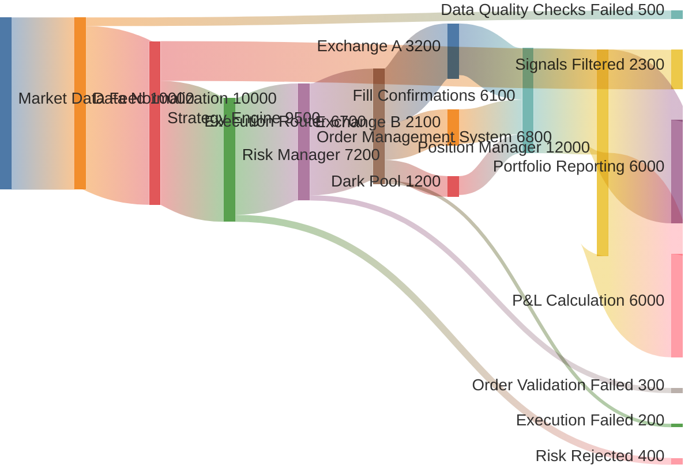
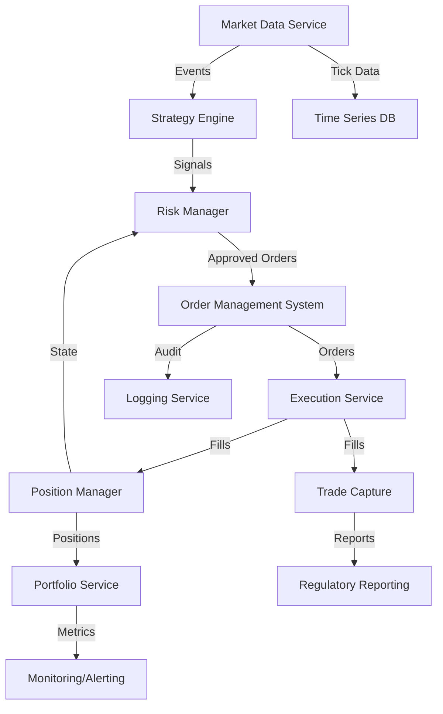
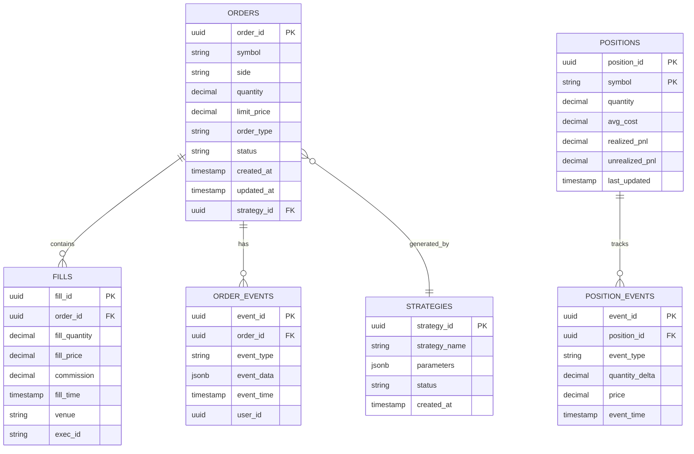
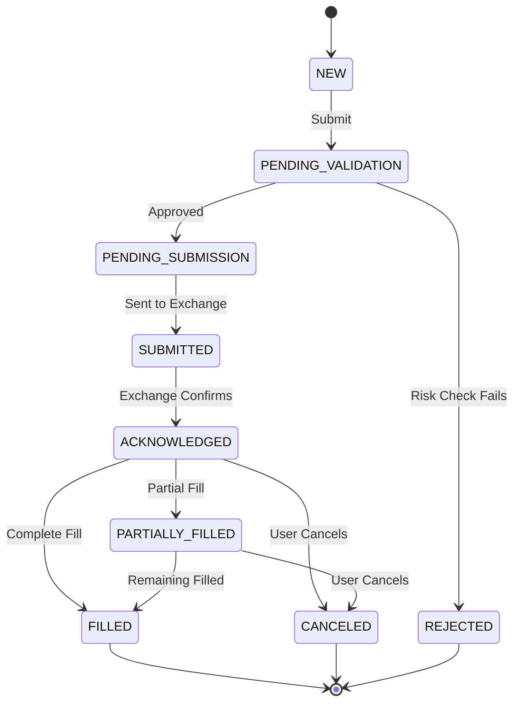
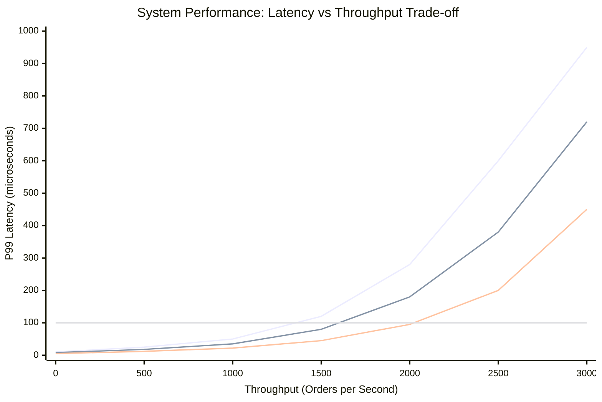
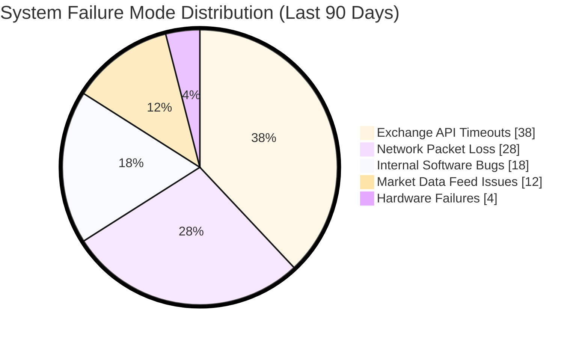
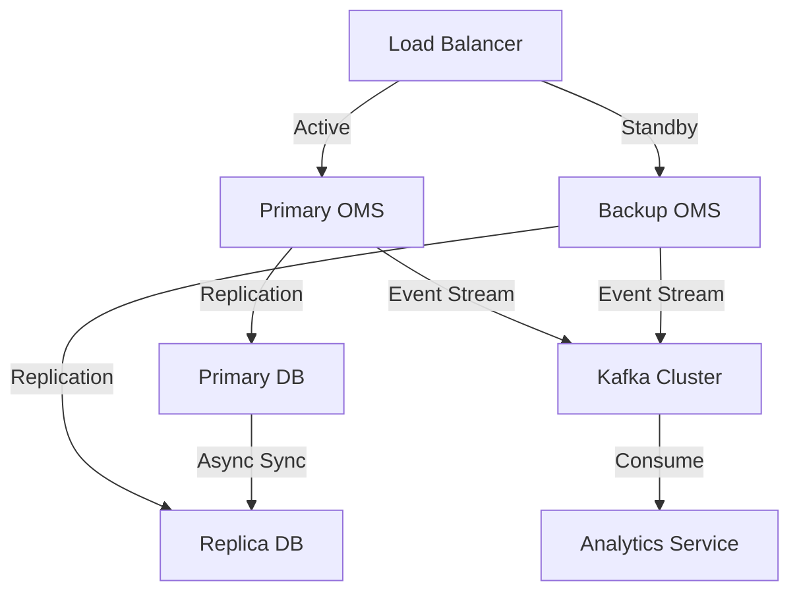

# Chapter 10: Production Trading Systems

Building a production trading system transforms backtested strategies into live, automated operations. This chapter covers system architecture, order management, risk controls, monitoring, disaster recovery, and regulatory compliance required for professional-grade algorithmic trading infrastructure.

---

## 10.1 System Architecture

### 10.1.1 Architectural Principles

**Key Requirements**:
1. **Low Latency**: Minimize time from signal to order execution
2. **High Availability**: 99.99% uptime (< 1 hour downtime/year)
3. **Fault Tolerance**: Graceful degradation, no single point of failure
4. **Scalability**: Handle growing data volumes and strategies
5. **Auditability**: Complete audit trail for compliance
6. **Modularity**: Components can be updated independently

---

### 10.1.2 Microservices Architecture



**Figure 10.2**: Production trading system data flow represented as Sankey diagram. Width represents message/event volume per second. 500 messages (5%) fail data quality checks. Risk manager rejects 400 orders (6%). Execution succeeds 97% of the time. Multiple exchange routes provide redundancy and best execution. This visualization helps identify bottlenecks (Strategy Engine processing capacity) and failure points (risk rejection rate may be too high, causing missed opportunities).



**Component Responsibilities**:

| Service | Function | Technology |
|---------|----------|------------|
| **Market Data** | Ingest, normalize, distribute quotes/trades | ZeroMQ, Kafka |
| **Strategy Engine** | Generate trading signals | Python, Rust |
| **Risk Manager** | Pre-trade risk checks, limits | In-memory DB (Redis) |
| **OMS** | Order lifecycle management | PostgreSQL, event store |
| **Execution** | Route orders, handle fills | FIX protocol, REST APIs |
| **Position Manager** | Real-time position tracking | Redis, InfluxDB |
| **Logging** | Centralized audit trail | Elasticsearch, S3 |
| **Monitoring** | Health checks, alerting | Prometheus, Grafana |

---

### 10.1.3 Event Sourcing and CQRS

 **Event Sourcing**: Store all state changes as immutable events.

**Benefits**:
- Complete audit trail
- Replay events for debugging
- Rebuild state from event log
- Time travel (view historical states)

**Command Query Responsibility Segregation (CQRS)**:
- **Write Model**: Handle commands (place order, cancel order)
- **Read Model**: Optimized queries (current positions, P&L)



**Figure 10.1**: Entity-relationship diagram for production trading system database schema. Event sourcing is implemented through ORDER_EVENTS and POSITION_EVENTS tables, providing complete audit trail. The schema supports CQRS pattern: write path (events) and optimized read path (materialized views from ORDERS, FILLS, POSITIONS). Foreign key relationships ensure referential integrity while JSONB fields allow flexible parameter storage for diverse strategy types.

```lisp
;; Event Sourcing Example
(define (create-event-store)
  {:events []
   :state {}})

;; Append-only event log
(define (append-event store event)
  (do
    (push! (get store :events) event)
    (apply-event! store event)
    store))

;; Event types
(define (create-order-placed-event order-id symbol quantity price timestamp)
  {:type "ORDER_PLACED"
   :event-id (uuid)
   :timestamp timestamp
   :data {:order-id order-id
          :symbol symbol
          :quantity quantity
          :price price}})

(define (create-order-filled-event order-id fill-price fill-quantity timestamp)
  {:type "ORDER_FILLED"
   :event-id (uuid)
   :timestamp timestamp
   :data {:order-id order-id
          :fill-price fill-price
          :fill-quantity fill-quantity}})

;; Apply event to state
(define (apply-event! store event)
  (let ((event-type (get event :type))
        (data (get event :data)))

    (cond
      ((= event-type "ORDER_PLACED")
       (set-in! store [:state :orders (get data :order-id)]
                {:status "PENDING"
                 :symbol (get data :symbol)
                 :quantity (get data :quantity)
                 :price (get data :price)}))

      ((= event-type "ORDER_FILLED")
       (let ((order-id (get data :order-id)))
         (set-in! store [:state :orders order-id :status] "FILLED")
         (set-in! store [:state :orders order-id :fill-price] (get data :fill-price))
         (set-in! store [:state :orders order-id :fill-quantity] (get data :fill-quantity)))))))

;; Rebuild state from events
(define (rebuild-state events)
  (define store (create-event-store))

  (for (event events)
    (apply-event! store event))

  (get store :state))
```

---

### 10.1.4 Low-Latency Design

 **Latency Optimization Techniques**:

1. **In-Memory Data Structures**:
   - Use Redis for hot data (prices, positions)
   - Lock-free data structures (ring buffers)

2. **Zero-Copy Messaging**:
   - Shared memory between processes
   - Memory-mapped files for IPC

3. **CPU Pinning**:
   - Bind critical threads to dedicated CPU cores
   - Disable CPU frequency scaling

4. **Network Optimization**:
   - Kernel bypass (DPDK, Solarflare)
   - TCP tuning (Nagle disabled, socket buffers)

5. **Code Optimization**:
   - Profile with perf/VTune
   - Avoid heap allocations in hot paths

```lisp
;; Lock-Free Ring Buffer (Simplified)
(define (create-ring-buffer capacity)
  {:buffer (make-array capacity)
   :head 0
   :tail 0
   :capacity capacity})

(define (ring-buffer-push! rb item)
  (do
    (define next-head (mod (+ (get rb :head) 1) (get rb :capacity)))

    (if (= next-head (get rb :tail))
        (error "Ring buffer full")
        (do
          (set-at! (get rb :buffer) (get rb :head) item)
          (set-in! rb [:head] next-head)
          true))))

(define (ring-buffer-pop! rb)
  (if (= (get rb :head) (get rb :tail))
      null  ;; Empty
      (let ((item (get (get rb :buffer) (get rb :tail))))
        (set-in! rb [:tail] (mod (+ (get rb :tail) 1) (get rb :capacity)))
        item)))
```

---

## 10.2 Order Management System (OMS)

### 10.2.1 Order Lifecycle



---

### 10.2.2 OMS Core Implementation

```lisp
;; Order Management System
(define (create-oms)
  {:orders {}           ;; order-id → order
   :order-index {}      ;; Various indices for fast lookup
   :event-store (create-event-store)
   :risk-manager (create-risk-manager)
   :execution-service (create-execution-service)})

;; Order Entity
(define (create-order symbol side quantity :order-type "MARKET" :limit-price null :stop-price null)
  {:order-id (uuid)
   :symbol symbol
   :side side           ;; "BUY" or "SELL"
   :quantity quantity
   :order-type order-type
   :limit-price limit-price
   :stop-price stop-price
   :status "NEW"
   :filled-quantity 0
   :avg-fill-price null
   :created-at (now)
   :updated-at (now)
   :fills []
   :messages []})

;; Submit Order
(define (submit-order oms order)
  (do
    (log :message (format "Submitting order: {}" (get order :order-id)))

    ;; 1. Risk validation
    (define risk-result (validate-order (get oms :risk-manager) order))

    (if (not (get risk-result :approved))
        (do
          (log :message (format "Order rejected: {}" (get risk-result :reason)))
          (set-in! order [:status] "REJECTED")
          (set-in! order [:rejection-reason] (get risk-result :reason))

          ;; Record event
          (append-event (get oms :event-store)
                        (create-order-rejected-event (get order :order-id)
                                                     (get risk-result :reason)
                                                     (now)))
          order)

        ;; 2. Order approved, submit to execution
        (do
          (set-in! order [:status] "PENDING_SUBMISSION")

          (append-event (get oms :event-store)
                        (create-order-placed-event (get order :order-id)
                                                   (get order :symbol)
                                                   (get order :quantity)
                                                   (get order :limit-price)
                                                   (now)))

          ;; Store order
          (set-in! oms [:orders (get order :order-id)] order)

          ;; Send to execution service
          (send-to-exchange (get oms :execution-service) order)

          order))))

;; Handle Fill Event
(define (handle-fill oms order-id fill)
  (do
    (define order (get (get oms :orders) order-id))

    (if (null? order)
        (error (format "Order not found: {}" order-id))

        (let ((fill-quantity (get fill :quantity))
              (fill-price (get fill :price))
              (fill-timestamp (get fill :timestamp))

              (total-filled (+ (get order :filled-quantity) fill-quantity))
              (remaining (- (get order :quantity) total-filled)))

          ;; Update order
          (push! (get order :fills) fill)
          (set-in! order [:filled-quantity] total-filled)
          (set-in! order [:updated-at] fill-timestamp)

          ;; Calculate average fill price
          (define avg-price
            (/ (+ (* (get order :avg-fill-price 0) (get order :filled-quantity))
                  (* fill-price fill-quantity))
               total-filled))
          (set-in! order [:avg-fill-price] avg-price)

          ;; Update status
          (if (<= remaining 0)
              (set-in! order [:status] "FILLED")
              (set-in! order [:status] "PARTIALLY_FILLED"))

          ;; Record event
          (append-event (get oms :event-store)
                        (create-order-filled-event order-id fill-price fill-quantity fill-timestamp))

          (log :message (format "Order {} filled: {} @ {}" order-id fill-quantity fill-price))

          order))))

;; Cancel Order
(define (cancel-order oms order-id)
  (do
    (define order (get (get oms :orders) order-id))

    (if (null? order)
        (error (format "Order not found: {}" order-id))

        (if (contains? ["FILLED" "CANCELED" "REJECTED"] (get order :status))
            (error (format "Cannot cancel order in status: {}" (get order :status)))

            (do
              ;; Send cancel request to exchange
              (send-cancel-request (get oms :execution-service) order-id)

              ;; Update status
              (set-in! order [:status] "PENDING_CANCEL")
              (set-in! order [:updated-at] (now))

              ;; Record event
              (append-event (get oms :event-store)
                            (create-order-canceled-event order-id (now)))

              order)))))
```

---

### 10.2.3 Smart Order Routing

**Goal**: Achieve best execution across multiple venues.

**Routing Strategies**:
1. **Price Priority**: Route to venue with best price
2. **Liquidity Seeking**: Split across venues with depth
3. **VWAP/TWAP**: Time-weighted execution
4. **Dark Pool First**: Minimize market impact

```lisp
;; Smart Order Router
(define (route-order order venues)
  (do
    (define symbol (get order :symbol))
    (define quantity (get order :quantity))

    ;; Get quotes from all venues
    (define quotes
      (map (lambda (venue)
             {:venue venue
              :bid (get-bid venue symbol)
              :ask (get-ask venue symbol)
              :bid-size (get-bid-size venue symbol)
              :ask-size (get-ask-size venue symbol)})
           venues))

    ;; Determine routing based on order side
    (if (= (get order :side) "BUY")
        ;; Buy order: find best ask
        (let ((sorted-quotes (sort quotes :by "ask" :ascending true))
              (routing-plan (allocate-quantity quantity sorted-quotes "ask-size")))

          routing-plan)

        ;; Sell order: find best bid
        (let ((sorted-quotes (sort quotes :by "bid" :descending true))
              (routing-plan (allocate-quantity quantity sorted-quotes "bid-size")))

          routing-plan))))

;; Allocate quantity across venues
(define (allocate-quantity total-quantity quotes size-key)
  (define allocations [])
  (define remaining total-quantity)

  (for (quote quotes)
    (if (<= remaining 0)
        null  ;; Done
        (let ((available (get quote size-key))
              (alloc-qty (min remaining available)))

          (if (> alloc-qty 0)
              (push! allocations
                     {:venue (get quote :venue)
                      :quantity alloc-qty}))

          (set! remaining (- remaining alloc-qty)))))

  allocations)
```

---

### 10.2.4 Execution Algorithms

#### VWAP (Volume-Weighted Average Price)

**Goal**: Match market's volume distribution.

```lisp
;; VWAP Execution Algorithm
(define (vwap-execution order historical-volume :num-slices 10)
  (do
    (define total-quantity (get order :quantity))
    (define total-hist-volume (sum historical-volume))

    ;; Calculate target quantity per slice based on historical volume profile
    (define slice-quantities
      (for (volume historical-volume)
        (* total-quantity (/ volume total-hist-volume))))

    ;; Schedule orders
    (define schedule [])
    (define current-time (now))
    (define time-interval (/ (* 60 60 6.5) num-slices))  ; 6.5 hours / slices

    (for (i (range 0 num-slices))
      (push! schedule
             {:time (+ current-time (* i time-interval))
              :quantity (get slice-quantities i)}))

    schedule))
```

#### TWAP (Time-Weighted Average Price)

**Goal**: Execute evenly over time.

```lisp
;; TWAP Execution Algorithm
(define (twap-execution order :duration-seconds 3600 :num-slices 10)
  (do
    (define total-quantity (get order :quantity))
    (define slice-quantity (/ total-quantity num-slices))
    (define time-interval (/ duration-seconds num-slices))

    (define schedule [])
    (define current-time (now))

    (for (i (range 0 num-slices))
      (push! schedule
             {:time (+ current-time (* i time-interval))
              :quantity slice-quantity}))

    schedule))
```

#### Implementation Shortfall

**Goal**: Minimize cost relative to decision price.

```lisp
;; Implementation Shortfall Algorithm
(define (implementation-shortfall order market-data :risk-aversion 0.5)
  (do
    (define decision-price (get order :decision-price))
    (define quantity (get order :quantity))

    ;; Almgren-Chriss optimal execution
    (define volatility (get market-data :volatility))
    (define daily-volume (get market-data :average-daily-volume))
    (define participation-rate (/ quantity daily-volume))

    ;; Calculate urgency (higher risk-aversion → faster execution)
    (define tau (* risk-aversion (sqrt (/ volatility participation-rate))))

    ;; Generate exponential decay schedule
    (define num-slices 20)
    (define schedule [])

    (for (i (range 0 num-slices))
      (let ((decay-factor (exp (- (/ i num-slices) tau)))
            (slice-qty (* quantity decay-factor (/ 1 num-slices))))

        (push! schedule
               {:time (+ (now) (* i 180))  ; 3-minute intervals
                :quantity slice-qty})))

    schedule))
```

---

## 10.3 Risk Management

### 10.3.1 Pre-Trade Risk Checks

 **Kill Switch**: Reject orders if limits breached.

```lisp
;; Pre-Trade Risk Manager
(define (create-risk-manager)
  {:limits {:max-order-size 10000
            :max-position-size 50000
            :max-portfolio-value 1000000
            :max-single-stock-exposure 0.1  ; 10% of portfolio
            :max-sector-exposure 0.3
            :max-daily-loss -10000
            :max-drawdown -0.15}

   :current-state {:positions {}
                   :portfolio-value 1000000
                   :daily-pnl 0
                   :peak-value 1000000}})

;; Validate Order
(define (validate-order risk-manager order)
  (do
    (define checks [
      (check-order-size risk-manager order)
      (check-position-limit risk-manager order)
      (check-concentration-limit risk-manager order)
      (check-loss-limit risk-manager order)
    ])

    ;; If any check fails, reject
    (define failed-checks (filter checks (lambda (c) (not (get c :passed)))))

    (if (> (length failed-checks) 0)
        {:approved false
         :reason (get (get failed-checks 0) :reason)
         :failed-checks failed-checks}
        {:approved true})))

;; Individual Risk Checks
(define (check-order-size risk-manager order)
  (define max-size (get (get risk-manager :limits) :max-order-size))
  (define order-size (abs (get order :quantity)))

  (if (<= order-size max-size)
      {:check "order-size" :passed true}
      {:check "order-size"
       :passed false
       :reason (format "Order size {} exceeds limit {}" order-size max-size)}))

(define (check-position-limit risk-manager order)
  (define symbol (get order :symbol))
  (define current-pos (get-or (get (get risk-manager :current-state) :positions) symbol 0))
  (define new-pos (+ current-pos (get order :quantity)))
  (define max-pos (get (get risk-manager :limits) :max-position-size))

  (if (<= (abs new-pos) max-pos)
      {:check "position-limit" :passed true}
      {:check "position-limit"
       :passed false
       :reason (format "New position {} would exceed limit {}" new-pos max-pos)}))

(define (check-concentration-limit risk-manager order)
  (define symbol (get order :symbol))
  (define portfolio-value (get (get risk-manager :current-state) :portfolio-value))
  (define order-value (* (abs (get order :quantity)) (get order :price 100)))  ; Estimate
  (define max-concentration (get (get risk-manager :limits) :max-single-stock-exposure))

  (define concentration (/ order-value portfolio-value))

  (if (<= concentration max-concentration)
      {:check "concentration" :passed true}
      {:check "concentration"
       :passed false
       :reason (format "Order concentration {:.1f}% exceeds {:.1f}%"
                       (* 100 concentration)
                       (* 100 max-concentration))}))

(define (check-loss-limit risk-manager order)
  (define daily-pnl (get (get risk-manager :current-state) :daily-pnl))
  (define max-loss (get (get risk-manager :limits) :max-daily-loss))

  (if (>= daily-pnl max-loss)
      {:check "loss-limit" :passed true}
      {:check "loss-limit"
       :passed false
       :reason (format "Daily loss ${:.2f} exceeds limit ${:.2f}"
                       daily-pnl max-loss)}))
```

---

### 10.3.2 Position Management

```lisp
;; Real-Time Position Tracker
(define (create-position-manager)
  {:positions {}       ;; symbol → {quantity, avg-cost, realized-pnl, unrealized-pnl}
   :cash 1000000
   :total-equity 1000000
   :trades []})

;; Update Position from Fill
(define (update-position pm symbol fill)
  (do
    (define quantity (get fill :quantity))
    (define price (get fill :price))
    (define commission (get fill :commission))

    ;; Get current position or create new
    (define position (get-or (get pm :positions) symbol
                             {:quantity 0 :avg-cost 0 :realized-pnl 0 :unrealized-pnl 0}))

    (define current-qty (get position :quantity))
    (define current-avg-cost (get position :avg-cost))

    ;; Calculate new position
    (define new-qty (+ current-qty quantity))

    ;; Update average cost (only if increasing position)
    (define new-avg-cost
      (if (and (> new-qty 0) (> quantity 0))
          (/ (+ (* current-qty current-avg-cost) (* quantity price))
             new-qty)
          (if (and (< new-qty 0) (< quantity 0))
              (/ (+ (* current-qty current-avg-cost) (* quantity price))
                 new-qty)
              current-avg-cost)))

    ;; Calculate realized P&L (if closing/reversing position)
    (define realized-pnl
      (if (or (and (> current-qty 0) (< quantity 0))
              (and (< current-qty 0) (> quantity 0)))
          ;; Closing trade
          (let ((closed-qty (min (abs current-qty) (abs quantity))))
            (* closed-qty (- price current-avg-cost)))
          0))

    ;; Update position
    (set-in! position [:quantity] new-qty)
    (set-in! position [:avg-cost] new-avg-cost)
    (set-in! position [:realized-pnl]
             (+ (get position :realized-pnl) realized-pnl))

    (set-in! pm [:positions symbol] position)

    ;; Update cash
    (set-in! pm [:cash]
             (- (get pm :cash) (* quantity price) commission))

    ;; Record trade
    (push! (get pm :trades)
           {:timestamp (get fill :timestamp)
            :symbol symbol
            :quantity quantity
            :price price
            :commission commission
            :realized-pnl realized-pnl})

    pm))

;; Calculate Unrealized P&L
(define (calculate-unrealized-pnl pm current-prices)
  (define total-unrealized 0)

  (for (symbol (keys (get pm :positions)))
    (let ((position (get (get pm :positions) symbol))
          (current-price (get current-prices symbol))
          (unrealized (* (get position :quantity)
                         (- current-price (get position :avg-cost)))))

      (set-in! position [:unrealized-pnl] unrealized)
      (set! total-unrealized (+ total-unrealized unrealized))))

  ;; Update total equity
  (set-in! pm [:total-equity] (+ (get pm :cash) total-unrealized))

  total-unrealized)
```

---

### 10.3.3 Value at Risk (VaR) Monitoring

```lisp
;; Real-Time VaR Calculation
(define (calculate-portfolio-var positions returns-history :confidence 0.95)
  (do
    ;; Historical simulation method
    (define portfolio-returns
      (for (i (range 0 (length (get returns-history (first (keys returns-history))))))
        (sum (for (symbol (keys positions))
               (let ((weight (get positions symbol))
                     (ret (get (get returns-history symbol) i)))
                 (* weight ret))))))

    ;; Sort returns
    (define sorted-returns (sort portfolio-returns))

    ;; VaR is the (1-confidence) quantile
    (define var-index (floor (* (- 1 confidence) (length sorted-returns))))
    (define var (get sorted-returns var-index))

    ;; Conditional VaR (CVaR / Expected Shortfall)
    (define tail-returns (slice sorted-returns 0 var-index))
    (define cvar (mean tail-returns))

    {:var var
     :cvar cvar
     :confidence confidence}))
```

---

## 10.4 Monitoring and Alerting

### 10.4.1 Key Metrics



**Figure 10.3**: Latency vs throughput performance curves for different system configurations. Baseline configuration hits 100μs SLA limit at 1,500 orders/sec. Lock-free data structures extend capacity to 2,200 orders/sec. Kernel bypass (DPDK) achieves 2,800 orders/sec before breaching SLA. This chart guides infrastructure decisions: for < 1,500 ops, baseline suffices; beyond 2,000 ops requires kernel bypass investment. Real production systems plot these curves under load testing to set capacity limits.



**Figure 10.4**: Root cause analysis of production system failures over 90 days. Exchange API issues (38%) dominate, requiring circuit breakers and failover logic. Network problems (28%) necessitate redundant connections. Internal bugs (18%) despite testing emphasize need for comprehensive monitoring. Data feed issues (12%) require backup providers. Hardware failures (4%) are rare due to cloud redundancy. This distribution informs where to invest reliability engineering effort: API resilience and network redundancy yield highest ROI.

 **Performance Metrics**:

| Category | Metric | Target | Alert Threshold |
|----------|--------|--------|----------------|
| **Latency** | Order-to-fill time | < 50ms | > 100ms |
| **Execution** | Fill rate | > 95% | < 90% |
| **Slippage** | Avg slippage | < 5 bps | > 10 bps |
| **P&L** | Daily P&L | Positive | < -$10k |
| **Risk** | VaR utilization | < 80% | > 90% |
| **System** | CPU usage | < 70% | > 90% |
| **System** | Memory usage | < 80% | > 95% |

---

### 10.4.2 Monitoring Implementation

```lisp
;; Metrics Collector
(define (create-metrics-collector)
  {:metrics {}
   :alerts []
   :thresholds {:latency-ms 100
                :fill-rate 0.9
                :slippage-bps 10
                :daily-loss -10000
                :cpu-usage 0.9
                :memory-usage 0.95}})

;; Record Metric
(define (record-metric collector metric-name value :tags {})
  (do
    (define timestamp (now))
    (define metric {:name metric-name
                    :value value
                    :timestamp timestamp
                    :tags tags})

    ;; Store metric (in practice, send to time-series DB)
    (if (not (contains? (get collector :metrics) metric-name))
        (set-in! collector [:metrics metric-name] []))

    (push! (get (get collector :metrics) metric-name) metric)

    ;; Check thresholds
    (check-threshold collector metric-name value)

    metric))

;; Threshold Monitoring
(define (check-threshold collector metric-name value)
  (define thresholds (get collector :thresholds))

  (cond
    ;; Latency check
    ((and (= metric-name "latency-ms") (> value (get thresholds :latency-ms)))
     (trigger-alert collector "HIGH_LATENCY"
                    (format "Latency {}ms exceeds threshold" value)
                    "WARNING"))

    ;; Fill rate check
    ((and (= metric-name "fill-rate") (< value (get thresholds :fill-rate)))
     (trigger-alert collector "LOW_FILL_RATE"
                    (format "Fill rate {:.1f}% below threshold" (* 100 value))
                    "WARNING"))

    ;; Daily loss check
    ((and (= metric-name "daily-pnl") (< value (get thresholds :daily-loss)))
     (trigger-alert collector "DAILY_LOSS_LIMIT"
                    (format "Daily loss ${:.2f} exceeds limit" value)
                    "CRITICAL"))))

;; Alert System
(define (trigger-alert collector alert-type message severity)
  (do
    (define alert {:type alert-type
                   :message message
                   :severity severity
                   :timestamp (now)})

    (push! (get collector :alerts) alert)

    ;; Send notification (email, SMS, Slack)
    (send-notification alert)

    (log :message (format "[{}] {}" severity message))

    alert))
```

---

### 10.4.3 Health Checks

```lisp
;; System Health Monitor
(define (check-system-health services)
  (do
    (define health-status {})

    (for (service services)
      (let ((service-name (get service :name))
            (health (check-service-health service)))

        (set-in! health-status service-name health)))

    ;; Overall system health
    (define all-healthy
      (all? (values health-status) (lambda (h) (get h :healthy))))

    {:overall-health (if all-healthy "HEALTHY" "DEGRADED")
     :services health-status
     :timestamp (now)}))

(define (check-service-health service)
  (do
    (define checks [
      (check-connectivity service)
      (check-latency service)
      (check-error-rate service)
    ])

    (define failed-checks (filter checks (lambda (c) (not (get c :passed)))))

    {:healthy (= (length failed-checks) 0)
     :checks checks
     :failed-checks failed-checks}))
```

---

## 10.5 Disaster Recovery

### 10.5.1 Fault Tolerance Architecture

 **No Single Point of Failure**:



**Key Strategies**:
1. **Active-Passive Failover**: Hot standby takes over instantly
2. **Database Replication**: Synchronous replication to replica
3. **Event Streaming**: Kafka ensures no message loss
4. **Distributed State**: Use distributed cache (Redis Cluster)

---

### 10.5.2 Failover Implementation

```lisp
;; Heartbeat and Failover
(define (start-heartbeat primary-service backup-service :interval 5000)
  (do
    (define (send-heartbeat)
      (do
        (if (is-healthy? primary-service)
            (do
              (update-heartbeat primary-service (now))
              (set-in! backup-service [:mode] "STANDBY"))
            (do
              ;; Primary unhealthy, activate backup
              (log :message "PRIMARY FAILURE DETECTED - ACTIVATING BACKUP")
              (activate-backup backup-service)
              (send-notification {:type "FAILOVER"
                                  :message "Backup system activated"
                                  :severity "CRITICAL"})))))

    ;; Schedule periodic heartbeat
    (schedule-periodic send-heartbeat interval)))

(define (activate-backup backup-service)
  (do
    (set-in! backup-service [:mode] "ACTIVE")

    ;; Promote backup database to primary
    (promote-database (get backup-service :database))

    ;; Start accepting traffic
    (enable-traffic backup-service)

    (log :message "BACKUP SYSTEM NOW ACTIVE")))
```

---

### 10.5.3 Backup and Recovery

```lisp
;; Automated Backup System
(define (create-backup-manager)
  {:backup-schedule "0 2 * * *"  ; Daily at 2 AM
   :retention-days 30
   :backup-location "/backups/"
   :backup-types ["full" "incremental"]})

(define (perform-backup backup-manager components)
  (do
    (define timestamp (now))
    (define backup-id (format "backup-{}" timestamp))

    (log :message (format "Starting backup: {}" backup-id))

    ;; Backup database
    (backup-database (get components :database) backup-id)

    ;; Backup event store
    (backup-event-store (get components :event-store) backup-id)

    ;; Backup configuration
    (backup-config (get components :config) backup-id)

    ;; Upload to offsite storage (S3, etc.)
    (upload-backup backup-id (get backup-manager :backup-location))

    (log :message (format "Backup completed: {}" backup-id))

    {:backup-id backup-id
     :timestamp timestamp
     :status "SUCCESS"}))

;; Recovery Procedure
(define (recover-from-backup backup-id)
  (do
    (log :message (format "Starting recovery from backup: {}" backup-id))

    ;; 1. Stop all services
    (stop-all-services)

    ;; 2. Restore database
    (restore-database backup-id)

    ;; 3. Restore event store
    (restore-event-store backup-id)

    ;; 4. Rebuild state from events
    (rebuild-state-from-events)

    ;; 5. Restart services
    (start-all-services)

    (log :message "Recovery completed")

    {:status "SUCCESS"
     :backup-id backup-id}))
```

---

### 10.5.4 Circuit Breaker Pattern

 **Prevent cascade failures**:

```lisp
;; Circuit Breaker
(define (create-circuit-breaker :failure-threshold 5 :timeout 60000 :reset-timeout 300000)
  {:state "CLOSED"        ;; CLOSED, OPEN, HALF_OPEN
   :failure-count 0
   :failure-threshold failure-threshold
   :timeout timeout
   :reset-timeout reset-timeout
   :last-failure-time null})

(define (execute-with-circuit-breaker cb fn)
  (cond
    ;; CLOSED: Normal operation
    ((= (get cb :state) "CLOSED")
     (try
       (let ((result (fn)))
         (set-in! cb [:failure-count] 0)
         result)
       (catch (error)
         (set-in! cb [:failure-count] (+ (get cb :failure-count) 1))
         (set-in! cb [:last-failure-time] (now))

         (if (>= (get cb :failure-count) (get cb :failure-threshold))
             (do
               (set-in! cb [:state] "OPEN")
               (log :message "CIRCUIT BREAKER OPENED")))

         (throw error))))

    ;; OPEN: Reject immediately
    ((= (get cb :state) "OPEN")
     (let ((time-since-failure (- (now) (get cb :last-failure-time))))

       (if (>= time-since-failure (get cb :reset-timeout))
           (do
             (set-in! cb [:state] "HALF_OPEN")
             (log :message "CIRCUIT BREAKER HALF-OPEN - TESTING"))
           (throw (error "Circuit breaker OPEN")))))

    ;; HALF_OPEN: Test with one request
    ((= (get cb :state) "HALF_OPEN")
     (try
       (let ((result (fn)))
         (set-in! cb [:state] "CLOSED")
         (set-in! cb [:failure-count] 0)
         (log :message "CIRCUIT BREAKER CLOSED - RECOVERED")
         result)
       (catch (error)
         (set-in! cb [:state] "OPEN")
         (set-in! cb [:last-failure-time] (now))
         (log :message "CIRCUIT BREAKER RE-OPENED")
         (throw error))))))
```

---

## 10.6 Regulatory Compliance

### 10.6.1 Audit Trail Requirements

 **Regulatory Requirements** (MiFID II, SEC, FINRA):
- **Order Tracking**: Complete order lifecycle from inception to fill
- **Clock Synchronization**: NTP within 1ms for HFT
- **Data Retention**: 7 years for trade records
- **Best Execution**: Demonstrate price improvement efforts
- **Risk Controls**: Document pre-trade risk checks

---

### 10.6.2 Trade Reporting

```lisp
;; Regulatory Trade Report
(define (generate-trade-report trade)
  {:report-id (uuid)
   :timestamp (now)
   :trade-date (get trade :timestamp)
   :symbol (get trade :symbol)
   :side (get trade :side)
   :quantity (get trade :quantity)
   :price (get trade :price)
   :venue (get trade :venue)
   :order-id (get trade :order-id)
   :client-id (get trade :client-id)
   :trader-id (get trade :trader-id)
   :strategy-id (get trade :strategy-id)
   :execution-algo (get trade :execution-algo)
   :commission (get trade :commission)
   :regulatory-flags (check-regulatory-flags trade)})

;; Market Manipulation Detection
(define (check-regulatory-flags trade)
  (define flags [])

  ;; Wash trading detection
  (if (is-wash-trade? trade)
      (push! flags "POSSIBLE_WASH_TRADE"))

  ;; Layering/spoofing detection
  (if (is-layering? trade)
      (push! flags "POSSIBLE_LAYERING"))

  ;; Front-running detection
  (if (is-front-running? trade)
      (push! flags "POSSIBLE_FRONT_RUNNING"))

  flags)
```

---

### 10.6.3 Best Execution Analysis

```lisp
;; Best Execution Report
(define (analyze-best-execution fills decision-price)
  (do
    (define avg-fill-price (mean (map (lambda (f) (get f :price)) fills)))
    (define total-quantity (sum (map (lambda (f) (get f :quantity)) fills)))

    ;; Implementation shortfall
    (define shortfall (- avg-fill-price decision-price))
    (define shortfall-bps (* 10000 (/ shortfall decision-price)))

    ;; Compare to market VWAP
    (define market-vwap (get-market-vwap (get (first fills) :symbol)
                                         (get (first fills) :timestamp)
                                         (get (last fills) :timestamp)))

    (define vs-vwap (- avg-fill-price market-vwap))
    (define vs-vwap-bps (* 10000 (/ vs-vwap market-vwap)))

    {:avg-fill-price avg-fill-price
     :decision-price decision-price
     :implementation-shortfall-bps shortfall-bps
     :market-vwap market-vwap
     :vs-vwap-bps vs-vwap-bps
     :total-quantity total-quantity
     :num-fills (length fills)
     :execution-quality (if (< (abs vs-vwap-bps) 5) "GOOD" "POOR")}))
```

---

## 10.7 Complete Production System

### 10.7.1 End-to-End Example

```lisp
;; Production Trading System
(define (start-trading-system config)
  (do
    (log :message "========================================")
    (log :message "PRODUCTION TRADING SYSTEM STARTING")
    (log :message "========================================")

    ;; Initialize components
    (define market-data (create-market-data-service config))
    (define strategy (create-strategy-engine config))
    (define risk-manager (create-risk-manager))
    (define oms (create-oms))
    (define position-manager (create-position-manager))
    (define metrics-collector (create-metrics-collector))
    (define circuit-breaker (create-circuit-breaker))

    ;; Start services
    (start-service market-data)
    (start-service strategy)

    ;; Health monitoring
    (start-heartbeat oms backup-oms :interval 5000)

    ;; Main trading loop
    (define running true)

    (while running
      (try
        (execute-with-circuit-breaker circuit-breaker
          (lambda ()
            (do
              ;; 1. Receive market data
              (define market-event (get-next-market-event market-data))

              (if (not (null? market-event))
                  (do
                    ;; 2. Update positions with latest prices
                    (calculate-unrealized-pnl position-manager
                                              (get market-event :prices))

                    ;; 3. Generate signals
                    (define signals (generate-signals strategy market-event))

                    ;; 4. Process each signal
                    (for (signal signals)
                      (let ((order (signal-to-order signal position-manager))

                            ;; 5. Pre-trade risk check
                            (risk-check (validate-order risk-manager order)))

                        (if (get risk-check :approved)
                            (do
                              ;; 6. Submit order
                              (define submitted-order (submit-order oms order))

                              ;; 7. Record metrics
                              (record-metric metrics-collector "orders-submitted" 1))

                            (do
                              (log :message (format "Order rejected: {}"
                                                    (get risk-check :reason)))
                              (record-metric metrics-collector "orders-rejected" 1)))))

                    ;; 8. Process fills
                    (define fills (get-pending-fills oms))
                    (for (fill fills)
                      (do
                        (update-position position-manager
                                        (get fill :symbol)
                                        fill)
                        (record-metric metrics-collector "fills" 1)))

                    ;; 9. Update metrics
                    (record-metric metrics-collector "daily-pnl"
                                  (get (get position-manager :current-state) :daily-pnl))

                    ;; 10. Health check
                    (if (= (mod (now) 60000) 0)  ; Every minute
                        (let ((health (check-system-health [market-data strategy oms])))
                          (if (not (= (get health :overall-health) "HEALTHY"))
                              (trigger-alert metrics-collector "SYSTEM_DEGRADED"
                                           "System health check failed"
                                           "WARNING"))))))))))

        (catch (error)
          (log :message (format "Trading loop error: {}" error))
          (trigger-alert metrics-collector "SYSTEM_ERROR"
                        (format "Error in trading loop: {}" error)
                        "CRITICAL"))))

    (log :message "Trading system stopped")))
```

---

## 10.8 Summary

Production trading systems require rigorous engineering:

1. **Microservices architecture** enables scalability and fault isolation
2. **Event sourcing** provides complete audit trail
3. **OMS** manages order lifecycle with smart routing
4. **Pre-trade risk** prevents catastrophic losses
5. **Monitoring** detects issues before they escalate
6. **Disaster recovery** ensures business continuity
7. **Compliance** meets regulatory requirements

 **Key Takeaways**:
- Design for failure (circuit breakers, failover, redundancy)
- Monitor everything (latency, fill rates, P&L, system health)
- Test disaster recovery procedures regularly
- Maintain complete audit trail for compliance
- Implement kill switches and hard limits

**This concludes Part I (Foundations)**. Part II covers advanced strategies: market making, statistical arbitrage, options pricing, and machine learning.

---

## References

1. Narang, R.K. (2013). *Inside the Black Box* (2nd ed.). Wiley.
2. Kissell, R. (2013). *The Science of Algorithmic Trading and Portfolio Management*. Academic Press.
3. Almgren, R., & Chriss, N. (2001). Optimal execution of portfolio transactions. *Journal of Risk*, 3, 5-40.
4. Fowler, M. (2014). *Microservices*. martinfowler.com.
5. Vernon, V. (2013). *Implementing Domain-Driven Design*. Addison-Wesley.
6. Nygard, M.T. (2018). *Release It!* (2nd ed.). Pragmatic Bookshelf.
7. European Securities and Markets Authority (2016). *MiFID II / MiFIR*. ESMA.
