# Chapter 12: Options Pricing and the Volatility Surface

## 💥 The $550 Million Day: When LTCM's "Free Money" Evaporated

**August 21, 1998**. Long-Term Capital Management, the hedge fund run by Nobel laureates and Wall Street legends, lost **$550 million in a single trading day**—15% of their entire $3.6 billion fund. Not from a rogue trader. Not from a fat-finger error. From a strategy that had generated steady profits for years: **selling volatility**.

LTCM had sold billions of dollars of S&P 500 options volatility, essentially acting as an insurance company. Collect premiums month after month. Works great... until the disaster you insured against actually happens.

**The Setup (1996-1997):**
- S&P 500 implied volatility: 12-15% (calm markets)
- LTCM strategy: Sell long-term options (short vega)
- Monthly P&L: +$50-80M from premium decay (theta)
- Leverage: 27x on-balance sheet, **250x** including derivatives
- **The pitch:** "Picking up pennies, but we're really good at it"

**The Catalyst (August 17, 1998):**
Russia defaulted on its debt. Financial contagion spread. Volatility spiked.

**The Spike:**
- S&P 500 implied vol: 15% → 45% in two weeks
- LTCM's short vega position: -$5 billion vega exposure
- Loss calculation: **-$5B vega × +30 vol points = -$150B ... oh wait, that's not how it works**
- Actual mechanism: As vol spiked, option values exploded, margin calls hit, forced liquidation

**August 1998 Timeline:**


**Figure 12.0**: LTCM's August 1998 volatility disaster. The fund lost 44% of its value in a single month, driven primarily by short volatility positions. The $550M single-day loss (Aug 21) represented 15% of the fund—a testament to the catastrophic tail risk of selling options.

**What Went Wrong:**

| Factor | Impact |
|--------|--------|
| **Short vega exposure** | -$5B vega × +30 vol points = billions in mark-to-market losses |
| **Leverage (250x)** | Tiny move in underlying → wipeout in equity |
| **Correlation breakdown** | "Diversified" positions all moved together (Chapter 11 lesson) |
| **Liquidity evaporation** | Couldn't exit positions without moving markets further |
| **Hubris** | Nobel Prize winners thought they'd conquered risk |

**The Lesson:**

> **⚠️ Selling Volatility = Selling Insurance**
>
> It works 95% of the time (collect premiums, theta decay, steady profits). But 5% of the time, **the house burns down and you're on the hook**.
>
> - **Upside:** Limited to premiums collected (theta)
> - **Downside:** Potentially unlimited (vega × vol spike)
> - **Probability:** Seems safe (95% win rate)
> - **Math:** Negative expectancy if you don't survive the 5%

LTCM had two Nobel Prize winners (Myron Scholes, Robert Merton), a former Fed vice-chairman (David Mullins), and legendary bond trader John Meriwether. They **literally wrote the equations** for options pricing.

And they still blew up.

**Why This Matters for Chapter 12:**

Understanding options isn't just about pricing formulas and Greeks. It's about recognizing that:
1. **Vega risk is tail risk** (convex, explosive in crises)
2. **Gamma near expiration** can kill you (GameStop 2021 showed this)
3. **Volatility surfaces encode fear** (post-1987, deep puts expensive)
4. **Black-Scholes is a language, not truth** (use it, don't believe it)

This chapter will teach you how to price options, calculate Greeks, and build trading strategies. But more importantly, it will show you how to **not become the next LTCM**—how to trade volatility profitably while surviving the inevitable tail events.

The math is beautiful. The profits can be substantial. The risk is catastrophic if you don't respect it.

Let's dive in.

---

## Introduction

The Black-Scholes-Merton options pricing model, published independently by Fischer Black, Myron Scholes (1973), and Robert Merton (1973), revolutionized financial markets and earned its creators the 1997 Nobel Prize in Economics. Their breakthrough was showing that options could be priced without knowing the expected return of the underlying asset—a profound insight that options are purely hedgeable instruments whose value derives from volatility, not directional movement.

However, the model's simplifying assumptions—constant volatility, continuous trading, no transaction costs, log-normal returns—quickly proved inadequate for real markets. The 1987 stock market crash revealed systematic mispricing, with deep out-of-the-money puts trading far above Black-Scholes predictions. This gave birth to the *volatility smile*: the empirical observation that implied volatility varies with strike price and expiration, forming characteristic patterns that encode market fears, leverage effects, and supply-demand dynamics.

This chapter develops options pricing theory from first principles, implements the Black-Scholes formula in OVSM, explores the volatility surface structure, and builds practical trading strategies that exploit mispricing in options markets.

> **💡 Key Concept**
> The Black-Scholes model assumes constant volatility σ, yet empirical markets reveal σ(K,T)—a volatility *surface* that varies with both strike price K and time to expiration T. Understanding this surface is the key to modern options trading.

### Chapter Roadmap

1. **Theoretical foundations**: No-arbitrage pricing, risk-neutral valuation, and the Black-Scholes PDE
2. **Greeks and sensitivity analysis**: Delta, gamma, vega, theta, rho and their trading applications
3. **Implied volatility**: Newton-Raphson inversion and volatility surface construction
4. **Volatility patterns**: Smile, skew, term structure, and their economic interpretations
5. **OVSM implementation**: Complete pricing engine with Greeks calculation
6. **Trading strategies**: Volatility arbitrage, dispersion trading, and gamma scalping
7. **Advanced models**: Stochastic volatility (Heston), jump-diffusion, and local volatility

---

## 12.1 Historical Context: From Bachelier to Black-Scholes

### 12.1.1 Early Attempts at Options Valuation


Options have existed since ancient times—Aristotle describes Thales profiting from olive press options in 600 BCE. But rigorous pricing remained elusive until the 20th century.

> **📊 Empirical Result**
> Louis Bachelier's 1900 dissertation *Théorie de la Spéculation* proposed the first mathematical model, using Brownian motion **five years before Einstein**. However, his work was largely forgotten for decades because it modeled prices in arithmetic terms, allowing negative values.

The breakthrough came from recognizing three key insights:

| Insight | Description |
|---------|-------------|
| **Options are derivatives** | Their value depends solely on the underlying asset |
| **Replication is possible** | A hedged portfolio of stock and bonds can replicate option payoffs |
| **Arbitrage enforces uniqueness** | If replication works, no-arbitrage determines a unique option value |

### 12.1.2 The Black-Scholes Revolution (1973)

Black and Scholes made three key innovations that transformed options pricing:

**Innovation 1: Geometric Brownian Motion**

They modeled stock prices to ensure positive values and capture empirical properties:

$$dS_t = \mu S_t dt + \sigma S_t dW_t$$

> **💻 Implementation Note**
> Geometric Brownian motion ensures $S_t > 0$ for all $t$, unlike Bachelier's arithmetic model. This captures the empirical property that *returns* (not prices) are normally distributed.

**Innovation 2: Dynamic Delta Hedging**

By continuously rebalancing a portfolio of stock and option, they showed volatility risk could be eliminated:

$$\Pi_t = V_t - \Delta_t S_t$$

where $\Delta_t = \frac{\partial V}{\partial S}$ is chosen to make the portfolio instantaneously riskless.

**Innovation 3: Risk-Neutral Valuation**

```mermaid
graph TD
    A[Real-World Measure P] -->|Girsanov Theorem| B[Risk-Neutral Measure Q]
    B --> C[All Assets Grow at Risk-Free Rate]
    C --> D[Option Price = Discounted Expected Payoff]
    D --> E[No Dependence on μ]
```



The hedged portfolio must earn the risk-free rate (no arbitrage), leading to the famous **Black-Scholes PDE**:

$$\boxed{\frac{\partial V}{\partial t} + rS\frac{\partial V}{\partial S} + \frac{1}{2}\sigma^2 S^2 \frac{\partial^2 V}{\partial S^2} = rV}$$

### 12.1.3 Market Impact and the Birth of CBOE

The Chicago Board Options Exchange (CBOE) opened on **April 26, 1973**, just weeks before the Black-Scholes paper appeared in the *Journal of Political Economy*.

> **📊 Empirical Result**
> Within a decade, the options market exploded from $0 to hundreds of billions in notional value. Today, over **40 million** options contracts trade daily in the US alone.

Traders quickly adopted the model, using:
- **Handheld calculators** (TI-59 programs)
- Simple inputs: S, K, T, r, σ
- Rapid computation of fair values

The model's simplicity made it ubiquitous and transformed financial markets forever.

### 12.1.4 October 1987: The Model Breaks

On **October 19, 1987** ("Black Monday"), the S&P 500 dropped 20% in a single day. Options markets revealed a stark reality: the model was wrong.

> **⚠️ Warning**
> Out-of-the-money puts traded at implied volatilities far exceeding at-the-money options, creating a "volatility smile." The Black-Scholes assumption of constant σ was empirically violated.

This gave birth to modern volatility surface modeling. Rather than treating σ as a constant, practitioners began viewing it as **σ(K, T)**—a function to be estimated from market prices. The Black-Scholes formula remained useful, but now as an *interpolation tool* for mapping prices to implied volatilities.

---

## 12.2 Economic Foundations

### 12.2.1 No-Arbitrage Pricing

The core economic principle is **no arbitrage**: there exist no risk-free profit opportunities.

> **💡 Key Concept**
> If two portfolios have identical payoffs in all states, they must have identical prices today. Otherwise, an arbitrageur would buy the cheap portfolio, sell the expensive one, and lock in risk-free profit.

**Put-Call Parity (European Options)**:

$$\boxed{C - P = S - Ke^{-rT}}$$

where:
- C = call price
- P = put price
- S = spot price
- K = strike
- r = risk-free rate
- T = time to expiration

**Derivation via Portfolio Replication**

Consider two portfolios:

| Portfolio | Components | Payoff if $S_T > K$ | Payoff if $S_T \leq K$ |
|-----------|------------|---------------------|------------------------|
| **Portfolio A** | Long call + Cash $Ke^{-rT}$ | $(S_T - K) + K = S_T$ | $0 + K = K$ |
| **Portfolio B** | Long put + Long stock | $0 + S_T = S_T$ | $(K - S_T) + S_T = K$ |

Identical payoffs → identical prices today: $C + Ke^{-rT} = P + S$

**Boundary Conditions**

No-arbitrage also implies fundamental bounds on option prices:

| Condition | Interpretation |
|-----------|----------------|
| $C \geq \max(S - Ke^{-rT}, 0)$ | Call worth at least intrinsic value |
| $C \leq S$ | Call cannot exceed stock price |
| $P \geq \max(Ke^{-rT} - S, 0)$ | Put worth at least discounted intrinsic |
| $P \leq Ke^{-rT}$ | Put cannot exceed discounted strike |

> **🎯 Trading Tip**
> Violations of these bounds create arbitrage opportunities that market makers exploit instantly. In practice, these violations rarely occur for more than milliseconds on liquid options.

### 12.2.2 Complete Markets and Replication

A market is **complete** if every payoff can be replicated by trading the underlying asset and a risk-free bond.


In the Black-Scholes model, completeness holds because:

1. **Two securities**: Stock S and bond B
2. **One source of uncertainty**: Brownian motion $W_t$
3. **Continuous trading**: Portfolio can be rebalanced instantaneously

**Self-Financing Replication Portfolio for a Call**:

$$\Pi_t = \Delta_t S_t + B_t$$

where:
- $\Delta_t = N(d_1)$ shares of stock (the delta hedge)
- $B_t = -Ke^{-r(T-t)}N(d_2)$ in bonds

> **💻 Implementation Note**
> The portfolio value $\Pi_t$ exactly equals the call price $C_t$ at all times, with no need to add or remove cash (self-financing property). This is the foundation of delta hedging.

### 12.2.3 Risk-Neutral Valuation

A stunning Black-Scholes insight: option prices don't depend on the stock's expected return $\mu$. This seems paradoxical—surely a higher-growth stock should have more valuable calls?

> **💡 Key Concept**
> Under the **risk-neutral measure** $\mathbb{Q}$:
> 1. All assets grow at the risk-free rate: $\mathbb{E}^{\mathbb{Q}}[S_T] = S_0 e^{rT}$
> 2. Option values are discounted expectations: $V_0 = e^{-rT}\mathbb{E}^{\mathbb{Q}}[V_T]$

**Why This Works**

The delta hedge eliminates all directional risk. The hedged portfolio $\Pi = V - \Delta S$ is riskless, so it must earn the risk-free rate. This pins down the option value without reference to $\mu$.

**Girsanov's Theorem** formalizes this change of measure:

$$dS_t = \mu S_t dt + \sigma S_t dW_t^{\mathbb{P}} \quad \rightarrow \quad dS_t = rS_t dt + \sigma S_t dW_t^{\mathbb{Q}}$$

Under $\mathbb{Q}$, all stocks behave like they earn the risk-free rate, simplifying pricing enormously.

---

## 12.3 The Black-Scholes Formula

### 12.3.1 PDE Derivation

Starting from the stock SDE under the risk-neutral measure:

$$dS_t = rS_t dt + \sigma S_t dW_t$$

Apply **Itô's lemma** to the option value $V(S, t)$:

$$dV = \frac{\partial V}{\partial t}dt + \frac{\partial V}{\partial S}dS + \frac{1}{2}\frac{\partial^2 V}{\partial S^2}(dS)^2$$


Substituting $dS$ and $(dS)^2 = \sigma^2 S^2 dt$ (Itô calculus):

$$dV = \left(\frac{\partial V}{\partial t} + rS\frac{\partial V}{\partial S} + \frac{1}{2}\sigma^2 S^2\frac{\partial^2 V}{\partial S^2}\right)dt + \sigma S\frac{\partial V}{\partial S}dW$$

Construct the delta-hedged portfolio:

$$\Pi = V - \Delta S \quad \text{where} \quad \Delta = \frac{\partial V}{\partial S}$$

The change in portfolio value:

$$d\Pi = dV - \Delta dS = \left(\frac{\partial V}{\partial t} + \frac{1}{2}\sigma^2 S^2\frac{\partial^2 V}{\partial S^2}\right)dt$$

> **💡 Key Concept**
> Notice the $dW$ terms cancel! The portfolio is riskless, so it must earn the risk-free rate:

$$d\Pi = r\Pi dt = r(V - \Delta S)dt$$

Equating the two expressions yields the **Black-Scholes PDE**.

### 12.3.2 Closed-Form Solution

For a European call with payoff $V(S_T, T) = \max(S_T - K, 0)$, the solution is:

$$\boxed{C(S, K, T, r, \sigma) = S N(d_1) - Ke^{-rT} N(d_2)}$$

where:

$$d_1 = \frac{\ln(S/K) + (r + \sigma^2/2)T}{\sigma\sqrt{T}}$$

$$d_2 = d_1 - \sigma\sqrt{T} = \frac{\ln(S/K) + (r - \sigma^2/2)T}{\sigma\sqrt{T}}$$

and $N(\cdot)$ is the cumulative standard normal distribution.

**For a European put** (via put-call parity):

$$\boxed{P(S, K, T, r, \sigma) = Ke^{-rT} N(-d_2) - S N(-d_1)}$$


### 12.3.3 Intuition Behind the Formula

The call formula decomposes into two economic terms:

| Term | Formula | Economic Interpretation |
|------|---------|------------------------|
| **Expected Stock Value** | $S N(d_1)$ | Expected value of stock conditional on finishing in-the-money, weighted by probability |
| **Discounted Strike** | $Ke^{-rT} N(d_2)$ | Present value of strike payment, weighted by risk-neutral probability of exercise |

> **💻 Implementation Note**
> $N(d_2)$ is the risk-neutral probability that $S_T > K$, while $N(d_1)$ incorporates the expected stock value given that the option finishes in-the-money.

### 12.3.4 Numerical Example

Consider a call option with:

| Parameter | Symbol | Value |
|-----------|--------|-------|
| Spot price | S | $100 |
| Strike price | K | $105 |
| Time to expiration | T | 0.25 years (3 months) |
| Risk-free rate | r | 5% per annum |
| Volatility | σ | 20% per annum |

**Step-by-Step Calculation**

**Step 1: Calculate $d_1$ and $d_2$**

$$d_1 = \frac{\ln(100/105) + (0.05 + 0.20^2/2) \times 0.25}{0.20 \times \sqrt{0.25}} = \frac{-0.04879 + 0.0175}{0.10} = -0.3129$$

$$d_2 = d_1 - 0.20 \times \sqrt{0.25} = -0.3129 - 0.10 = -0.4129$$

**Step 2: Lookup normal CDF values**

$$N(d_1) = N(-0.3129) \approx 0.3772$$
$$N(d_2) = N(-0.4129) \approx 0.3398$$

**Step 3: Calculate call price**

$$C = 100 \times 0.3772 - 105 \times e^{-0.05 \times 0.25} \times 0.3398$$

$$C = 37.72 - 105 \times 0.9876 \times 0.3398 = 37.72 - 35.21 = \$2.51$$

> **🎯 Trading Tip**
> The call is worth $2.51, despite being out-of-the-money (strike $105 > spot $100). This **time value** reflects the probability of the stock rising above $105 before expiration.

---

## 12.4 The Greeks: Sensitivity Analysis

Options traders live by the Greeks—partial derivatives of the option price with respect to various inputs. Each Greek measures a different risk dimension and guides hedging strategies.

```mermaid
graph TD
    A[Option Price V] --> B[Delta Δ: ∂V/∂S]
    A --> C[Gamma Γ: ∂²V/∂S²]
    A --> D[Vega V: ∂V/∂σ]
    A --> E[Theta Θ: ∂V/∂t]
    A --> F[Rho ρ: ∂V/∂r]
```



### 12.4.1 Delta ($\Delta$): Directional Risk

**Definition**:
$$\Delta = \frac{\partial V}{\partial S}$$

**Interpretation**: Change in option value for $1 change in underlying price.

| Option Type | Delta Range | Behavior |
|-------------|-------------|----------|
| **Deep ITM calls** | $\Delta \approx 1$ | Move dollar-for-dollar with stock |
| **ATM calls** | $\Delta \approx 0.5$ | 50% of stock movement |
| **Deep OTM calls** | $\Delta \approx 0$ | Almost no movement |
| **Deep ITM puts** | $\Delta \approx -1$ | Inverse movement with stock |
| **ATM puts** | $\Delta \approx -0.5$ | -50% of stock movement |
| **Deep OTM puts** | $\Delta \approx 0$ | Almost no movement |

**Formulas**:
- **For calls**: $\Delta_{\text{call}} = N(d_1) \in [0, 1]$
- **For puts**: $\Delta_{\text{put}} = N(d_1) - 1 \in [-1, 0]$

> **🎯 Trading Tip: Delta Hedging**
> A market maker sells 100 calls with $\Delta = 0.6$. To hedge, they buy:
>
> $$\text{Hedge Ratio} = 100 \times 0.6 \times 100 = 6,000 \text{ shares}$$
>
> This makes the portfolio delta-neutral: $\Delta_{\text{portfolio}} = -100 \times 60 + 6,000 = 0$.

### 12.4.2 Gamma ($\Gamma$): Curvature Risk

**Definition**:
$$\Gamma = \frac{\partial^2 V}{\partial S^2} = \frac{\partial \Delta}{\partial S}$$

**Interpretation**: Rate of change of delta as stock moves. High gamma means delta hedges need frequent rebalancing.

**Formula (calls and puts)**:
$$\Gamma = \frac{N'(d_1)}{S\sigma\sqrt{T}}$$

where $N'(x) = \frac{1}{\sqrt{2\pi}}e^{-x^2/2}$ is the standard normal density.

**Gamma Behavior**:

| Situation | Gamma Level | Implication |
|-----------|-------------|-------------|
| **ATM options** | Maximum | Highest uncertainty, most sensitive to price moves |
| **Deep ITM/OTM** | Near zero | Delta becomes stable (0 or 1) |
| **Near expiration** | Explosive | Short-dated options have very high gamma |

> **💡 Key Concept: Gamma Scalping**
> Long gamma positions profit from volatility through rebalancing:
> 1. Stock moves up → Delta increases → Sell stock (high) to rehedge
> 2. Stock moves down → Delta decreases → Buy stock (low) to rehedge
>
> The P&L from rehedging accumulates to:
> $$\text{Gamma P&L} \approx \frac{1}{2}\Gamma (\Delta S)^2$$

### 12.4.3 Vega ($\mathcal{V}$): Volatility Risk

**Definition**:
$$\mathcal{V} = \frac{\partial V}{\partial \sigma}$$

**Interpretation**: Change in option value for 1% (0.01) increase in implied volatility.

**Formula (calls and puts)**:
$$\mathcal{V} = S\sqrt{T} N'(d_1)$$

**Vega Behavior**:

| Characteristic | Description |
|----------------|-------------|
| **Maximum at ATM** | Volatility matters most when outcome is uncertain |
| **Longer-dated > shorter-dated** | More time for volatility to matter |
| **Always positive** | Both calls and puts benefit from higher volatility |

> **🎯 Trading Tip: Volatility Arbitrage**
> If implied volatility $\sigma_{\text{impl}} = 25\%$ but you expect realized volatility $\sigma_{\text{real}} = 20\%$:
> - **Sell the option**: Collect overpriced volatility premium
> - **Delta hedge**: Rebalance to neutralize directional risk
> - **Profit**: Keep the excess theta from selling rich implied vol
>
> Expected P&L:
> $$\text{P&L} \approx \frac{1}{2}\Gamma (\sigma_{\text{real}}^2 - \sigma_{\text{impl}}^2) T$$

### 12.4.4 Theta ($\Theta$): Time Decay

**Definition**:
$$\Theta = \frac{\partial V}{\partial t}$$

**Interpretation**: Change in option value per day (time decay). Typically negative for long options.

**Formula (call)**:
$$\Theta_{\text{call}} = -\frac{S N'(d_1) \sigma}{2\sqrt{T}} - rKe^{-rT}N(d_2)$$

**Theta Behavior**:

| Situation | Theta Sign | Meaning |
|-----------|------------|---------|
| **Long options** | Negative | Time decay erodes extrinsic value |
| **Short options** | Positive | Collect premium as time passes |
| **Near expiration** | Accelerating | ATM options lose value rapidly in final weeks |


> **💡 Key Concept: Theta vs. Gamma Trade-off**
> The Black-Scholes PDE relates them:
> $$\Theta + \frac{1}{2}\sigma^2 S^2 \Gamma + rS\Delta - rV = 0$$
>
> For a delta-hedged position ($\Delta = 0$, $V = 0$ after hedging costs):
> $$\Theta + \frac{1}{2}\sigma^2 S^2 \Gamma = 0$$
>
> **Theta decay exactly offsets gamma profits** if realized volatility equals implied volatility.

### 12.4.5 Rho ($\rho$): Interest Rate Risk

**Definition**:
$$\rho = \frac{\partial V}{\partial r}$$

**Interpretation**: Change in option value for 1% (0.01) increase in interest rates.

**Formulas**:
- **Calls**: $\rho_{\text{call}} = KTe^{-rT}N(d_2)$
- **Puts**: $\rho_{\text{put}} = -KTe^{-rT}N(-d_2)$

**Rho Behavior**:

| Option Type | Rho Sign | Reason |
|-------------|----------|--------|
| **Calls** | Positive | Higher rates → lower PV of strike → more valuable |
| **Puts** | Negative | Higher rates → lower PV of strike → less valuable |

> **⚠️ Warning**
> Rho is typically small and ignored for short-dated equity options. It becomes important for:
> - Long-dated LEAPS (1-2 year options)
> - Currency options
> - Interest rate derivatives

### 12.4.6 Greeks Summary Table

| Greek | Formula | Measures | ATM Value | Trading Use |
|-------|---------|----------|-----------|-------------|
| **Delta** ($\Delta$) | $\frac{\partial V}{\partial S}$ | Directional exposure | 0.5 | Delta hedging |
| **Gamma** ($\Gamma$) | $\frac{\partial^2 V}{\partial S^2}$ | Delta stability | Maximum | Scalping |
| **Vega** ($\mathcal{V}$) | $\frac{\partial V}{\partial \sigma}$ | Volatility exposure | Maximum | Vol arbitrage |
| **Theta** ($\Theta$) | $\frac{\partial V}{\partial t}$ | Time decay | Most negative | Theta harvesting |
| **Rho** ($\rho$) | $\frac{\partial V}{\partial r}$ | Interest rate sensitivity | Moderate | Rate hedging |

---

## 12.5 Implied Volatility and the Volatility Surface

### 12.5.1 The Implied Volatility Problem

The Black-Scholes formula is:
$$C_{\text{model}}(S, K, T, r, \sigma) = \text{function of } \sigma$$

In practice, we observe market price $C_{\text{market}}$ and want to back out the implied volatility $\sigma_{\text{impl}}$:

$$C_{\text{market}} = C_{\text{model}}(S, K, T, r, \sigma_{\text{impl}})$$

> **💻 Implementation Note**
> This is an **inversion problem**: Given C, solve for σ. No closed-form solution exists, requiring numerical methods like Newton-Raphson.

### 12.5.2 Newton-Raphson Method

Define the objective function:
$$f(\sigma) = C_{\text{market}} - C_{\text{model}}(S, K, T, r, \sigma)$$

We seek the root: $f(\sigma) = 0$.

**Newton-Raphson Iteration**:

$$\sigma_{n+1} = \sigma_n - \frac{f(\sigma_n)}{f'(\sigma_n)} = \sigma_n - \frac{C_{\text{market}} - C_{\text{model}}(\sigma_n)}{\mathcal{V}(\sigma_n)}$$

where $\mathcal{V}(\sigma_n)$ is vega.

```mermaid
graph TD
    A[Initialize σ₀] --> B{|C_market - C_model| < ε?}
    B -->|No| C[Calculate C_model, Vega]
    C --> D[Update: σ = σ - f/f']
    D --> B
    B -->|Yes| E[Return σ]
```

**Algorithm**:
1. Initialize $\sigma_0$ (e.g., ATM implied vol or 0.25)
2. Repeat until convergence:
   - a. Calculate $C_{\text{model}}(\sigma_n)$
   - b. Calculate vega $\mathcal{V}(\sigma_n)$
   - c. Update: $\sigma_{n+1} = \sigma_n - (C_{\text{market}} - C_{\text{model}}) / \mathcal{V}$
3. Return $\sigma_n$ when $|C_{\text{market}} - C_{\text{model}}| < \epsilon$ (e.g., $\epsilon = 0.0001$)

> **🎯 Trading Tip**
> Convergence typically requires only **3-5 iterations** to achieve $10^{-6}$ accuracy. This makes implied volatility calculation extremely fast in practice.

### 12.5.3 Numerical Example: Implied Volatility Calculation

Given:
- Spot: S = 100
- Strike: K = 100 (ATM)
- Time: T = 0.5 years
- Rate: r = 5%
- Market price: $C_{\text{market}} = 8.50$

Find implied volatility $\sigma_{\text{impl}}$.

**Iteration Breakdown**:

| Iteration | $\sigma_n$ | $C_{\text{model}}$ | $\mathcal{V}$ | $\sigma_{n+1}$ |
|-----------|------------|---------------------|---------------|----------------|
| 1 | 0.2500 | 10.23 | 28.12 | 0.1885 |
| 2 | 0.1885 | 8.44 | 28.09 | 0.1906 |
| 3 | 0.1906 | 8.50 | 28.10 | 0.1906 ✓ |

**Result**: $\sigma_{\text{impl}} \approx 19.06\%$ (converged in 3 iterations).

### 12.5.4 The Volatility Smile

If Black-Scholes were correct, implied volatility should be constant across all strikes. In reality, we observe systematic patterns:


**Equity Index Options** (post-1987):


- **Volatility Skew**: $\sigma_{\text{impl}}$ decreases with strike K
- Deep OTM puts (K << S): High implied vol (crash fear)
- ATM options (K ≈ S): Moderate implied vol
- Deep OTM calls (K >> S): Low implied vol

> **📊 Empirical Result: Why the Skew?**
> 1. **Leverage Effect**: Stock drop → Higher debt/equity ratio → More volatility
> 2. **Crash Fear**: Investors overpay for downside protection
> 3. **Supply/Demand**: Institutional demand for portfolio insurance (puts)

**Foreign Exchange Options**:

- **Volatility Smile**: $\sigma_{\text{impl}}$ is U-shaped with minimum at ATM
- Both OTM puts and calls trade at elevated implied vols
- Symmetric because no inherent directionality (EUR/USD vs. USD/EUR)

**Individual Equity Options**:

- **Forward Skew**: Similar to index skew but less pronounced
- Some stocks show reverse skew (biotechs pending FDA approval)

### 12.5.5 The Volatility Surface

The volatility surface is the 3D function:

$$\sigma_{\text{impl}}(K, T)$$

mapping strike K and expiration T to implied volatility.


**Surface Dimensions**:

| Dimension | Description |
|-----------|-------------|
| **Strike (K)** | Smile or skew pattern across moneyness |
| **Time (T)** | Term structure of volatility |
| **Surface Value** | Implied volatility level |

**Typical Properties**:

- **Smile flattens with maturity**: Short-dated options show more pronounced smile
- **ATM term structure**: Forward volatility expectations
- **Wings steepen near expiration**: OTM options become more expensive (in vol terms) as expiration nears

> **💻 Implementation Note**
> **Market Quoting Convention**: Instead of quoting option prices, traders quote implied vols. A typical quote:
> - **50-delta call**: 20.5% implied vol
> - **ATM straddle**: 19.8% implied vol
> - **25-delta put**: 21.2% implied vol
>
> This delta-strike convention normalizes quotes across different spot levels.

### 12.5.6 No-Arbitrage Constraints on the Volatility Surface

Not all volatility surfaces are economically feasible. Arbitrage-free conditions include:

| Constraint | Description |
|------------|-------------|
| **Calendar Spread** | $\sigma(K, T_1) \leq \sigma(K, T_2)$ for $T_1 < T_2$ (sometimes violated by dividends) |
| **Butterfly Spread** | Convexity constraint on $\sigma(K)$ prevents negative probabilities |
| **Put-Call Parity** | Implied vols from calls and puts must be consistent |

> **⚠️ Warning**
> Violations create arbitrage opportunities that sophisticated traders exploit. In practice, these violations are rare and short-lived on liquid options.

---

## 12.6 OVSM Implementation

We now implement a complete Black-Scholes pricing engine in OVSM, including:
1. Cumulative normal distribution (required for N(d))
2. Black-Scholes call/put pricing
3. Greeks calculation (delta, gamma, vega, theta, rho)
4. Newton-Raphson implied volatility solver
5. Volatility smile construction

### 12.6.1 Helper Function: Cumulative Normal Distribution

The standard normal CDF has no closed form, requiring numerical approximation. We use the **error function** approach:

$$N(x) = \frac{1}{2}\left[1 + \text{erf}\left(\frac{x}{\sqrt{2}}\right)\right]$$

**OVSM Implementation** (Abramowitz & Stegun polynomial approximation):

```lisp
;; Approximation of cumulative normal distribution N(x)
(define (normal-cdf x)
  ;; Constants for error function approximation
  (define a1  0.254829592)
  (define a2 -0.284496736)
  (define a3  1.421413741)
  (define a4 -1.453152027)
  (define a5  1.061405429)
  (define p   0.3275911)

  ;; Handle negative x using symmetry: N(-x) = 1 - N(x)
  (define sign (if (< x 0) 1.0 0.0))
  (define abs-x (if (< x 0) (- x) x))

  ;; Rational approximation
  (define t (/ 1.0 (+ 1.0 (* p abs-x))))
  (define t2 (* t t))
  (define t3 (* t2 t))
  (define t4 (* t3 t))
  (define t5 (* t4 t))

  (define erf-approx
    (* (+ (* a1 t) (* a2 t2) (* a3 t3) (* a4 t4) (* a5 t5))
       (exp (- (* abs-x abs-x)))))

  (define result (- 1.0 erf-approx))

  ;; Apply symmetry
  (if (= sign 1.0)
      (- 1.0 result)
      result))
```

> **💻 Implementation Note**
> This achieves accuracy to $10^{-7}$, sufficient for financial calculations. For even higher precision, consider Marsaglia's polar method or inverse error function implementations.

### 12.6.2 Black-Scholes Pricing Functions

```lisp
;; Black-Scholes call option pricing
(define (black-scholes-call S K T r sigma)
  ;; Calculate d1 and d2
  (define sqrt-T (sqrt T))
  (define sigma-sqrt-T (* sigma sqrt-T))
  (define d1
    (/ (+ (log (/ S K))
          (* T (+ r (* 0.5 sigma sigma))))
       sigma-sqrt-T))
  (define d2 (- d1 sigma-sqrt-T))

  ;; Calculate call price: C = S*N(d1) - K*exp(-rT)*N(d2)
  (define N-d1 (normal-cdf d1))
  (define N-d2 (normal-cdf d2))
  (define discount-factor (exp (- (* r T))))

  (define call-price
    (- (* S N-d1)
       (* K discount-factor N-d2)))

  {:price call-price :d1 d1 :d2 d2 :N-d1 N-d1 :N-d2 N-d2})

;; Black-Scholes put option pricing (via put-call parity)
(define (black-scholes-put S K T r sigma)
  (define call-result (black-scholes-call S K T r sigma))
  (define call-price (get call-result "price"))

  ;; Put-call parity: P = C - S + K*exp(-rT)
  (define discount-factor (exp (- (* r T))))
  (define put-price
    (+ call-price
       (- (* K discount-factor) S)))

  {:price put-price :call-price call-price})
```

> **🎯 Trading Tip**
> **What this does**: The `black-scholes-call` function returns not just the price, but also intermediate values (d1, d2, N(d1), N(d2)) that are useful for calculating Greeks without redundant computation.

### 12.6.3 Greeks Calculation

```lisp
;; Calculate all Greeks for a call option
(define (calculate-greeks S K T r sigma)
  ;; Get call pricing intermediates
  (define bs (black-scholes-call S K T r sigma))
  (define d1 (get bs "d1"))
  (define d2 (get bs "d2"))
  (define N-d1 (get bs "N-d1"))
  (define N-d2 (get bs "N-d2"))

  ;; Standard normal density N'(x) = (1/sqrt(2π)) * exp(-x²/2)
  (define (normal-pdf x)
    (* 0.3989422804 (exp (* -0.5 x x))))

  (define N-prime-d1 (normal-pdf d1))
  (define sqrt-T (sqrt T))
  (define discount-factor (exp (- (* r T))))

  ;; Delta: ∂V/∂S
  (define delta N-d1)

  ;; Gamma: ∂²V/∂S²
  (define gamma
    (/ N-prime-d1
       (* S sigma sqrt-T)))

  ;; Vega: ∂V/∂σ (per 1% change, so multiply by 0.01)
  (define vega
    (* 0.01 S sqrt-T N-prime-d1))

  ;; Theta: ∂V/∂t (per day, so divide by 365)
  (define theta
    (/ (- (- (/ (* S N-prime-d1 sigma)
                (* 2.0 sqrt-T)))
          (* r K discount-factor N-d2)))
       365.0))

  ;; Rho: ∂V/∂r (per 1% change, so multiply by 0.01)
  (define rho
    (* 0.01 K T discount-factor N-d2))

  {:delta delta
   :gamma gamma
   :vega vega
   :theta theta
   :rho rho})
```

### 12.6.4 Newton-Raphson Implied Volatility Solver

```lisp
;; Calculate implied volatility from market price
(define (implied-volatility S K T r market-price option-type)
  ;; Initial guess: Use Brenner-Subrahmanyam approximation
  (define atm (if (= option-type "call") S K))
  (define initial-vol
    (* (sqrt (/ (* 2 3.14159) T))
       (/ market-price atm)))

  ;; Ensure reasonable initial guess
  (define sigma-guess
    (if (< initial-vol 0.01) 0.25 initial-vol))

  ;; Newton-Raphson iteration
  (define max-iterations 50)
  (define tolerance 0.0001)
  (define iteration 0)
  (define converged false)
  (define sigma sigma-guess)

  (while (and (< iteration max-iterations) (not converged))
    ;; Calculate model price and vega
    (define bs (black-scholes-call S K T r sigma))
    (define model-price (get bs "price"))
    (define greeks (calculate-greeks S K T r sigma))
    (define vega (get greeks "vega"))

    ;; Price difference
    (define price-diff (- model-price market-price))

    ;; Check convergence
    (when (< (abs price-diff) tolerance)
      (set! converged true))

    ;; Newton-Raphson update: σ_{n+1} = σ_n - f(σ_n)/f'(σ_n)
    (when (not converged)
      (define vega-scaled (* vega 100.0))  ;; Vega is per 1% change
      (when (> vega-scaled 0.0001)  ;; Avoid division by zero
        (define adjustment (/ price-diff vega-scaled))
        (set! sigma (- sigma adjustment))

        ;; Bound sigma to reasonable range [0.01, 5.0]
        (when (< sigma 0.01) (set! sigma 0.01))
        (when (> sigma 5.0) (set! sigma 5.0))))

    (set! iteration (+ iteration 1)))

  {:implied-vol sigma
   :iterations iteration
   :converged converged})
```

### 12.6.5 Complete Example: Pricing and Greeks

Let's put it all together with a real example:

```lisp
(do
  (log :message "=== BLACK-SCHOLES OPTION PRICING ===")

  ;; Option parameters
  (define spot-price 100.0)
  (define strike-price 105.0)
  (define time-to-expiry 0.25)  ;; 3 months
  (define risk-free-rate 0.05)   ;; 5%
  (define volatility 0.20)       ;; 20% vol

  (log :message "Inputs:")
  (log :message "  Spot:" :value spot-price)
  (log :message "  Strike:" :value strike-price)
  (log :message "  Time (years):" :value time-to-expiry)
  (log :message "  Risk-free rate:" :value risk-free-rate)
  (log :message "  Volatility:" :value volatility)

  ;; Price the call option
  (define call-result (black-scholes-call
                       spot-price strike-price
                       time-to-expiry risk-free-rate volatility))

  (define call-price (get call-result "price"))
  (define d1 (get call-result "d1"))
  (define d2 (get call-result "d2"))

  (log :message "\nBlack-Scholes Results:")
  (log :message "  d1:" :value d1)
  (log :message "  d2:" :value d2)
  (log :message "  Call price:" :value call-price)

  ;; Calculate put price via put-call parity
  (define discount-factor (exp (- (* risk-free-rate time-to-expiry))))
  (define put-price
    (+ call-price (- (* strike-price discount-factor) spot-price)))

  (log :message "  Put price:" :value put-price)

  ;; Calculate Greeks
  (define greeks (calculate-greeks
                  spot-price strike-price
                  time-to-expiry risk-free-rate volatility))

  (log :message "\nGreeks:")
  (log :message "  Delta:" :value (get greeks "delta"))
  (log :message "  Gamma:" :value (get greeks "gamma"))
  (log :message "  Vega:" :value (get greeks "vega"))
  (log :message "  Theta:" :value (get greeks "theta"))
  (log :message "  Rho:" :value (get greeks "rho"))

  ;; Implied volatility test
  (log :message "\n=== IMPLIED VOLATILITY ===")
  (define market-price 5.50)
  (define iv-result (implied-volatility
                     spot-price strike-price
                     time-to-expiry risk-free-rate
                     market-price "call"))

  (define implied-vol (get iv-result "implied-vol"))
  (define iterations (get iv-result "iterations"))
  (define converged (get iv-result "converged"))

  (log :message "Market price:" :value market-price)
  (log :message "Implied volatility:" :value implied-vol)
  (log :message "Iterations:" :value iterations)
  (log :message "Converged:" :value converged)

  "✅ Options pricing complete!")
```

**Expected Output**:
```
=== BLACK-SCHOLES OPTION PRICING ===
Inputs:
  Spot: 100.0
  Strike: 105.0
  Time (years): 0.25
  Risk-free rate: 0.05
  Volatility: 0.20

Black-Scholes Results:
  d1: -0.3129
  d2: -0.4129
  Call price: 2.51
  Put price: 6.20

Greeks:
  Delta: 0.3772
  Gamma: 0.0378
  Vega: 0.1887
  Theta: -0.0231
  Rho: 0.0920

=== IMPLIED VOLATILITY ===
Market price: 5.50
Implied volatility: 0.2846
Iterations: 4
Converged: true
```

---

## 12.7 Volatility Trading Strategies

### 12.7.1 Strategy 1: Long Straddle (Volatility Bet)

**Setup**: Buy ATM call + Buy ATM put with same strike and expiration


**P&L at Expiration**:
$$\text{P&L} = \max(S_T - K, 0) + \max(K - S_T, 0) - \text{Premium Paid}$$

**Key Metrics**:

| Metric | Value |
|--------|-------|
| **Breakeven (Upper)** | $K + \text{Premium}$ |
| **Breakeven (Lower)** | $K - \text{Premium}$ |
| **Maximum Loss** | Premium paid (if $S_T = K$) |
| **Maximum Gain** | Unlimited upside, $K - \text{Premium}$ downside |

**Greeks**:
- **Delta**: Zero (call delta = +0.5, put delta = -0.5 cancel)
- **Gamma**: Positive (long gamma from both options)
- **Vega**: Positive (benefits from volatility increase)
- **Theta**: Negative (pays time decay)

> **🎯 Trading Tip: When to Use**
> Expect large move but uncertain direction:
> - Before earnings announcements
> - Pending FDA approval (biotech)
> - Central bank decisions
> - Geopolitical events

**Example**: S = 100

| Action | Strike | Premium |
|--------|--------|---------|
| Buy 100-call | 100 | $4.00 |
| Buy 100-put | 100 | $3.80 |
| **Total Cost** | | **$7.80** |

**Profit Scenarios**:

| Stock Price | Call Value | Put Value | Total | Net P&L |
|-------------|------------|-----------|-------|---------|
| $85 | $0 | $15 | $15 | **+$7.20** |
| $92.20 | $0 | $7.80 | $7.80 | **$0** (Breakeven) |
| $100 | $0 | $0 | $0 | **-$7.80** (Max Loss) |
| $107.80 | $7.80 | $0 | $7.80 | **$0** (Breakeven) |
| $115 | $15 | $0 | $15 | **+$7.20** |

### 12.7.2 Strategy 2: Iron Condor (Short Volatility)

**Setup**:
1. Sell OTM call spread (sell lower strike, buy higher strike)
2. Sell OTM put spread (sell higher strike, buy lower strike)

**Structure Example**: S = 100


| Position | Strike | Premium |
|----------|--------|---------|
| Buy 110 call | 110 | -$0.50 |
| **Sell 105 call** | 105 | **+$2.00** |
| **Sell 95 put** | 95 | **+$1.80** |
| Buy 90 put | 90 | -$0.30 |
| **Net Credit** | | **+$3.00** |

**P&L Profile**:

| Stock Price Range | P&L | Status |
|-------------------|-----|--------|
| $S_T < 90$ | -$2.00 | Max loss (put spread width $5 - credit $3) |
| $90 \leq S_T < 95$ | Variable | Losing on put spread |
| $95 \leq S_T \leq 105$ | **+$3.00** | **Max profit (keep all credit)** |
| $105 < S_T \leq 110$ | Variable | Losing on call spread |
| $S_T > 110$ | -$2.00 | Max loss (call spread width $5 - credit $3) |

**Greeks**:
- **Delta**: Near zero (balanced)
- **Gamma**: Negative (short gamma risk)
- **Vega**: Negative (benefits from volatility decrease)
- **Theta**: Positive (collects time decay)

> **🎯 Trading Tip: Risk Management**
> - Set stop-loss at **2x premium received** ($6 max loss on $3 credit)
> - Close position at **50% profit** ($1.50) to preserve capital
> - Best during high IV regimes where premiums are rich

### 12.7.3 Strategy 3: Volatility Arbitrage (IV vs. RV)

**Concept**: Trade the difference between implied volatility (IV) and expected realized volatility (RV).


**Setup** (Sell Volatility Example):

1. **Calculate realized volatility**:
   $$\sigma_{\text{realized}} = \sqrt{252} \times \text{std}(\text{returns})$$

2. **Extract implied volatility** from option prices: $\sigma_{\text{implied}}$

3. **Compare**: If $\sigma_{\text{impl}} > \sigma_{\text{realized}}$, options are expensive

**Execution Steps**:

| Step | Action | Purpose |
|------|--------|---------|
| 1 | **Sell ATM straddle** | Collect high implied vol premium |
| 2 | **Delta hedge immediately** | Neutralize directional risk |
| 3 | **Rehedge dynamically** | Maintain delta neutrality as spot moves |
| 4 | **Monitor P&L** | Theta collected vs. gamma costs |

**P&L Decomposition**:

$$\text{P&L} = \underbrace{\Theta \times dt}_{\text{Time Decay}} + \underbrace{\frac{1}{2}\Gamma (\Delta S)^2}_{\text{Realized Vol P&L}}$$

> **💡 Key Concept**
> If $\sigma_{\text{realized}} < \sigma_{\text{implied}}$:
> - Theta collected > Gamma costs → **Positive P&L**
> - You're selling expensive insurance that expires worthlessly

**Risk Management Considerations**:

| Risk | Description | Mitigation |
|------|-------------|------------|
| **Gamma Risk** | Large sudden moves hurt (pay for rebalancing) | Set gamma limits |
| **Tail Events** | Black swans can wipe out months of theta | Size conservatively (1-2% capital) |
| **Transaction Costs** | Frequent rehedging adds up | Widen rehedge thresholds |
| **IV Changes** | Position loses if IV rises further | Monitor vol changes, use stop-loss |

**Practical Considerations**:

- Rehedge when delta exceeds threshold (e.g., $|\Delta| > 10$)
- Use gamma scalping P&L to estimate realized vol
- Monitor IV changes: Position loses if IV rises
- Best executed with institutional-grade execution (low commissions)

### 12.7.4 Strategy 4: Dispersion Trading

**Concept**: Trade the difference between index volatility and average single-stock volatility.

**Observation**:
$$\sigma_{\text{index}} < \text{Avg}(\sigma_{\text{stocks}})$$

due to diversification (correlations < 1).

```mermaid
graph TD
    A[Index Volatility] --> C{σ_index < σ_stocks?}
    B[Individual Stock Vols] --> C
    C -->|Yes| D[Long Dispersion Trade]
    D --> E[Buy Stock Straddles]
    D --> F[Sell Index Straddles]
    E --> G[Delta Hedge All]
    F --> G
    G --> H[Profit if Correlation ↓]
```



**Setup (Long Dispersion)**:

| Position | Action | Rationale |
|----------|--------|-----------|
| **Individual Stocks** | Buy straddles on 10-20 index components | Capture single-stock volatility |
| **Index** | Sell SPX straddles | Short index volatility |
| **Hedge** | Delta-neutral portfolio | Isolate vol spread |

**Profit Driver**: If individual stocks realize more volatility than the index (correlation breaks down), the trade profits.

**Example**: S&P 500

| Metric | Index | Avg Stock | Spread |
|--------|-------|-----------|--------|
| Implied Vol | 18% | 25% | **+7%** |
| Realized Vol (Expected) | 18% | 25% | **+7%** |
| **Profit Source** | | | Vol differential |

> **📊 Empirical Result: When Correlation Breaks Down**
> - **Market crises**: Stocks decouple (idiosyncratic risks dominate)
> - **Sector rotation**: Some sectors rally, others fall
> - **Earnings season**: Company-specific surprises
> - **M&A activity**: Deal-specific volatility

**Risk**: Correlation increases during stress → Dispersion collapses → Loss

---

## 12.8 Advanced Topics

### 12.8.1 Stochastic Volatility Models (Heston)

Black-Scholes assumes constant volatility σ, but empirically volatility is stochastic. The **Heston model** (1993) extends to random volatility:

$$dS_t = \mu S_t dt + \sqrt{v_t} S_t dW_t^S$$

$$dv_t = \kappa(\theta - v_t)dt + \sigma_v \sqrt{v_t} dW_t^v$$

**Parameters**:

| Parameter | Symbol | Interpretation |
|-----------|--------|----------------|
| **Variance** | $v_t$ | Volatility squared (time-varying) |
| **Mean reversion speed** | $\kappa$ | How fast variance reverts to long-run |
| **Long-run variance** | $\theta$ | Average variance over time |
| **Vol of vol** | $\sigma_v$ | Volatility of volatility |
| **Correlation** | $\rho = \text{Corr}(dW_t^S, dW_t^v)$ | Leverage effect ($\rho < 0$) |

**Key Features**:

1. **Mean-reverting volatility**: High vol reverts to $\theta$, low vol rises
2. **Leverage effect**: $\rho < 0$ captures asymmetric volatility (price drop → vol increase)
3. **Volatility smile**: Model generates smile through stochastic vol

> **💻 Implementation Note**
> **Pricing**: No closed form for American options, but European options have semi-closed form via Fourier transform (Carr-Madan method).

**Calibration**: Fit $\kappa, \theta, \sigma_v, \rho$ to market implied volatility surface by minimizing:

$$\min_{\kappa,\theta,\sigma_v,\rho} \sum_{i} \left(\sigma_{\text{market}}^i - \sigma_{\text{Heston}}^i(\kappa, \theta, \sigma_v, \rho)\right)^2$$

### 12.8.2 Jump-Diffusion Models (Merton)

Black-Scholes fails to capture sudden price jumps (earnings, news). **Merton's jump-diffusion** (1976) adds a Poisson jump process:

$$dS_t = \mu S_t dt + \sigma S_t dW_t + S_t dJ_t$$

**Jump Parameters**:

| Parameter | Interpretation |
|-----------|----------------|
| **Jump frequency** ($\lambda$) | Jumps per year |
| **Jump size** ($\mu_J, \sigma_J$) | Log-normal distribution |

**Option Pricing**: Weighted sum of Black-Scholes formulas:

$$C(S, K, T) = \sum_{n=0}^{\infty} \frac{e^{-\lambda T}(\lambda T)^n}{n!} C_{\text{BS}}(S, K, T, \sigma_n)$$

where $\sigma_n^2 = \sigma^2 + n\sigma_J^2/T$ incorporates jump variance.

> **📊 Empirical Result**
> **Volatility Smile**: Jumps create fat tails → OTM options more expensive → Smile emerges naturally from the model.

**Calibration**: Fit $\lambda, \mu_J, \sigma_J$ to market prices, especially OTM puts (sensitive to crash risk).

### 12.8.3 Local Volatility Models (Dupire)

Rather than imposing a stochastic process, **local volatility** asks: What volatility function $\sigma(S, t)$ is consistent with observed market prices?

**Dupire's Formula** (1994):

$$\sigma_{\text{local}}^2(K, T) = \frac{\frac{\partial C}{\partial T} + rK\frac{\partial C}{\partial K}}{\frac{1}{2}K^2 \frac{\partial^2 C}{\partial K^2}}$$

Given European call prices $C(K, T)$ for all strikes and maturities, this recovers the local volatility surface.

**Properties**:

| Property | Description |
|----------|-------------|
| **Deterministic** | σ is a function, not a random variable |
| **Perfect Calibration** | By construction, matches all vanilla option prices |
| **Forward PDE** | Can price exotics using the calibrated $\sigma(S, t)$ |

**Limitations**:

- Overfits to current surface (doesn't predict future smiles)
- Implies unrealistic dynamics (volatility changes deterministically with spot)
- Fails to match volatility derivatives (VIX options)

### 12.8.4 Model Comparison Summary

| Model | Volatility | Jumps | Smile | Calibration | Use Case |
|-------|------------|-------|-------|-------------|----------|
| **Black-Scholes** | Constant | No | Flat | N/A | Baseline |
| **Heston** | Stochastic | No | Yes | 5 parameters | Volatility trading |
| **Merton** | Constant + Jumps | Yes | Yes | 3 parameters | Crash hedging |
| **Dupire Local Vol** | Deterministic $\sigma(S,t)$ | No | Perfect fit | Interpolation | Exotic pricing |
| **SABR** | Stochastic + Beta | No | Yes | 4 parameters | Interest rate options |

> **🎯 Trading Tip: Practitioner Approach**
> - Use **local vol** for pricing exotics
> - Use **stochastic vol** for risk management
> - Use **jump models** for tail hedging

---

## 12.9 Risk Analysis and Model Risk

### 12.9.1 Model Risk

**Definition**: Risk that the pricing model is wrong or mis-specified.

**Sources of Model Risk**:

| Source | Description |
|--------|-------------|
| **Wrong distribution** | Returns not log-normal (fat tails, skewness) |
| **Parameter instability** | Volatility, correlation change over time |
| **Discretization error** | Continuous-time models applied to discrete trading |
| **Transaction costs** | Models ignore bid-ask spread, slippage |
| **Liquidity risk** | Cannot hedge continuously in practice |

> **⚠️ Warning: Historical Example - LTCM (1998)**
> Long-Term Capital Management used sophisticated models but failed to account for:
> - Extreme correlation changes during stress (all correlations → 1)
> - Liquidity evaporation (couldn't unwind positions)
> - Model parameters calibrated to normal periods (not crisis)
>
> **Lesson**: Models are useful but not infallible. Always stress-test assumptions.

### 12.9.2 Gamma Risk

**Gamma P&L Formula**:
$$\text{Gamma P&L} \approx \frac{1}{2}\Gamma (\Delta S)^2$$

**Example**: Short 100 ATM calls with $\Gamma = 0.05$, $S = 100$

- Stock moves $5: Gamma P&L = $\frac{1}{2} \times (-5) \times 5^2 \times 100 = -\$625$
- Must rehedge: Buy back stock at higher price → Realize loss

**Risk Management**:

| Strategy | Description |
|----------|-------------|
| **Diversify** | Long and short gamma across different strikes/expirations |
| **Dynamic hedging** | Rehedge frequently (but watch transaction costs) |
| **Gamma limits** | Set maximum net gamma exposure per book |
| **Stress testing** | Simulate large moves (5-10 sigma) |

### 12.9.3 Vega Risk

**Vega Risk**: Exposure to changes in implied volatility

**Example**: Portfolio with net vega = +10,000

| IV Change | P&L |
|-----------|-----|
| IV increases 1% (20% → 21%) | **+$10,000** |
| IV decreases 1% (20% → 19%) | **-$10,000** |

**Vega Risk Drivers**:

1. **Market stress**: IV spikes during crashes (VIX can double)
2. **Event risk**: Earnings, Fed announcements move IV
3. **Supply/demand**: Institutional hedging demand increases IV

**Risk Management**:

- **Vega-neutral portfolios**: Offset long and short vega across strikes
- **Vega limits**: Maximum vega exposure per book
- **Vega ladder**: Monitor vega by expiration (front-month vs. back-month)

### 12.9.4 Tail Risk and Black Swans

> **📊 Empirical Result: Model vs. Reality**
> - **Black-Scholes predicts**: -5σ event every ~7,000 years
> - **Actual frequency**: -5σ events occur every few years (1987, 2008, 2020)

**Tail Hedging Strategies**:

| Strategy | Mechanism | Cost-Benefit |
|----------|-----------|--------------|
| **Buy OTM puts** | Cheap during calm, profitable during crashes | Negative carry, crisis protection |
| **Put spread collars** | Sell upside, buy downside protection | Reduced cost, limited upside |
| **VIX calls** | Profit when fear spikes | Low premium, asymmetric payoff |

**Cost-Benefit Trade-off**:

- Tail hedges have **negative expected value** (insurance premium)
- But provide **liquidity when needed most** (crisis)
- **Sizing**: Allocate 1-5% of portfolio to tail protection

---

## 12.10 Conclusion and Further Reading

We've journeyed from the Black-Scholes revolution to modern volatility surface trading.

### Key Takeaways

| Takeaway | Implication |
|----------|-------------|
| **Black-Scholes provides the language** | Even though the model is wrong, implied volatility is the universal quoting convention |
| **Greeks guide hedging** | Delta, gamma, vega, theta are the practitioner's toolkit |
| **Volatility smiles encode information** | Crash fears, leverage effects, supply/demand |
| **Trading strategies exploit mispricing** | IV vs. RV, dispersion, smile arbitrage |
| **Model risk is real** | Understand assumptions and stress-test |

### Practical Workflow

```mermaid
graph TD
    A[Market Prices] --> B[Extract Implied Vols]
    B --> C[Construct σ K,T Surface]
    C --> D[Identify Arbitrage/Mispricing]
    D --> E[Execute Delta-Neutral Strategy]
    E --> F[Dynamically Hedge Greeks]
    F --> G[Risk-Manage Tail Events]
```



1. Extract implied vols from market prices (Newton-Raphson)
2. Construct volatility surface $\sigma(K, T)$
3. Identify arbitrage or mispricing (rich/cheap vol)
4. Execute delta-neutral strategy (straddles, spreads)
5. Dynamically hedge Greeks (rebalance $\Delta$, monitor $\Gamma$ and $\mathcal{V}$)
6. Risk-manage tail events (stress testing, position limits)

### Further Reading

**Foundational Papers**:

- Black, F., & Scholes, M. (1973). "The Pricing of Options and Corporate Liabilities." *Journal of Political Economy*, 81(3), 637-654.
- Merton, R.C. (1973). "Theory of Rational Option Pricing." *Bell Journal of Economics and Management Science*, 4(1), 141-183.
- Heston, S.L. (1993). "A Closed-Form Solution for Options with Stochastic Volatility." *Review of Financial Studies*, 6(2), 327-343.

**Textbooks**:

- Hull, J.C. (2018). *Options, Futures, and Other Derivatives* (10th ed.). The standard reference.
- Wilmott, P. (2006). *Paul Wilmott on Quantitative Finance*. Practitioner perspective with humor.
- Gatheral, J. (2006). *The Volatility Surface: A Practitioner's Guide*. Industry standard for vol trading.
- Taleb, N.N. (1997). *Dynamic Hedging: Managing Vanilla and Exotic Options*. Real-world wisdom.

**Advanced Topics**:

- Dupire, B. (1994). "Pricing with a Smile." *Risk*, 7(1), 18-20. Local volatility.
- Carr, P., & Madan, D. (1999). "Option Valuation Using the Fast Fourier Transform." *Journal of Computational Finance*, 2(4), 61-73.
- Andersen, L., & Piterbarg, V. (2010). *Interest Rate Modeling*. Deep dive into derivatives.

> **🔬 Research Direction: Next Steps**
> - **Chapter 44**: Advanced options strategies (butterflies, calendars, ratio spreads)
> - **Chapter 46**: Volatility surface arbitrage and relative value trading
> - **Chapter 29**: Volatility forecasting with GARCH and realized volatility

The options market is vast and ever-evolving. The OVSM implementation provides a production-ready foundation for building sophisticated volatility trading systems. From here, the sky's the limit—literally, as options have unlimited upside.
---

## 12.8 Volatility Trading Disasters and Lessons

Beyond LTCM's August 1998 collapse, options markets have produced recurring disasters that follow predictable patterns. Understanding these failures is as important as understanding Black-Scholes.

###12.8.1 The GameStop Gamma Squeeze (January 2021)

**The Setup:**
- GameStop stock: $17 (Jan 1) → $500 (Jan 28)
- Retail traders bought massive call options via Reddit/WallStreetBets
- Market makers (Citadel, others) had to delta hedge → bought stock
- **Gamma feedback loop:** Stock up → delta hedging buys → stock up further

**The Mechanics:**

When retail traders buy call options, market makers sell them. To remain delta-neutral, market makers must buy shares of the underlying stock. The amount they buy depends on **delta**, which changes based on **gamma**.

**Near expiration, gamma explodes:**
- Far from expiration: Gamma small, delta stable
- Near expiration: Gamma huge, delta swings wildly
- **Result:** Small stock moves → massive hedging flows

**GameStop Timeline:**


**The Losses:**
| Entity | Loss | Mechanism |
|--------|------|-----------|
| Melvin Capital | -53% ($billions) | Short stock + short calls (double hit) |
| Market makers | Billions (unrealized) | Forced buying at top (negative gamma) |
| Retail (late) | Billions | Bought calls/stock at $300-500 |

**The Lesson:**

> **⚠️ Gamma Risk Explodes Near Expiration**
>
> - **Time to expiration > 30 days:** Gamma manageable
> - **Time to expiration < 7 days:** Gamma explosive
> - **Time to expiration < 1 day (0DTE):** Gamma infinite at strike
>
> Market makers hedge delta, but **gamma creates convexity risk**. In illiquid stocks with concentrated option interest, gamma can force buying at the top (or selling at the bottom), creating self-reinforcing loops.

### 12.8.2 Volatility Crush: The Retail Trader Killer

**The Pattern (Repeats Every Earnings Season):**

1. **Pre-earnings:** Company XYZ announces earnings in 7 days
2. **IV spike:** Implied vol rises 50% → 100% (uncertainty premium)
3. **Retail buys calls/puts:** "Stock will move big, I'll be rich!"
4. **Earnings announced:** Stock moves 5% (less than expected)
5. **IV crush:** Implied vol drops 100% → 30% overnight
6. **Result:** Option value collapses **even if directionally correct**

**Example: NVDA Earnings (Q3 2023)**

| Metric | Pre-Earnings | Post-Earnings | Change |
|--------|--------------|---------------|--------|
| Stock price | $500 | $510 | +2% |
| Implied vol (ATM) | 95% | 32% | -66% |
| Call value (Strike $500) | $38 | $18 | **-53%** |

**Trader bought $500 call for $38, was RIGHT (stock up 2%), still lost 53% because vega losses exceeded delta gains.**

**The Math:**

Option value ≈ Intrinsic + Extrinsic
- Intrinsic = max(S - K, 0) for calls
- Extrinsic = Vega × IV + Theta × Time

**Pre-earnings:**
- Intrinsic: $0 (ATM)
- Extrinsic: $38 (high IV, high vega)

**Post-earnings:**
- Intrinsic: $10 (stock $510, strike $500)
- Extrinsic: $8 (IV crushed)
- **Total: $18**

**Delta gain (+$10) < Vega loss (-$30) = Net loss -$20**

**The Lesson:**

> **💡 Volatility Crush Formula**
>
> For ATM options before earnings:
> $$\Delta \text{Value} \approx \text{Vega} \times \Delta IV + \text{Delta} \times \Delta S$$
>
> If $|\text{Vega} \times \Delta IV| > |\text{Delta} \times \Delta S|$, you lose even if directionally correct.
>
> **Prevention:** 
> - Don't buy options when IV is elevated (> 80th percentile historical)
> - Sell options before earnings (collect IV premium), hedge delta
> - Use spreads to reduce vega exposure

### 12.8.3 The XIV Collapse (February 2018)

**What Was XIV?**
- Exchange-Traded Note (ETN) that was **short VIX futures**
- Daily returns = -1x VIX futures
- Market cap: $2 billion (peak)
- Investors: Retail traders chasing "free money" from selling vol

**The Disaster (February 5, 2018):**

- **4:00 PM**: VIX closes at 17 (normal)
- **4:00-4:15 PM**: VIX futures spike to 37 (>100% move)
- **4:15 PM**: XIV rebalancing triggers massive short covering
- **4:30 PM**: XIV down 80%+
- **Next morning**: Credit Suisse announces termination, XIV → $0

**The Mechanics:**

XIV had to maintain -1x exposure daily. When VIX spiked 100%, XIV had to:
1. Cover existing shorts (buy VIX futures at elevated prices)
2. Re-short at new higher levels (to maintain -1x)

But the VIX spike was SO fast that:
- NAV collapsed below termination threshold (-80%)
- Credit Suisse invoked termination clause
- **$2 billion → $0 in 24 hours**

**The Lesson:**

> **⚠️ Leveraged Short Volatility = Guaranteed Blowup**
>
> - **Vol of vol** (volatility OF volatility) is massive
> - VIX can spike 50-100% in hours (fat tails)
> - Daily rebalancing creates path dependency
> - **Compounding losses:** -50% day 1, -50% day 2 = -75% total (not -100%)
>
> **Math:** If you sell volatility with leverage, your expected time to ruin is **finite and calculable**. It's not "if" but "when."

### 12.8.4 Summary: Options Disaster Patterns

| Disaster Type | Frequency | Avg Loss | Prevention |
|---------------|-----------|----------|------------|
| **Short vol blowup** (LTCM, XIV) | Every 5-10 years | -50% to -100% | Position limits, no leverage |
| **Gamma squeeze** (GameStop) | 1-2 per year | -20% to -50% | Avoid illiquid near-expiry |
| **IV crush** (earnings) | Every quarter | -30% to -70% | Don't buy elevated IV |
| **Model risk** (Long vol during backwardation) | Ongoing | -10% to -30% | Understand futures curves |

**Common Thread:** All disasters stem from **convexity** (nonlinear payoffs). Options magnify small moves into large P&L swings, especially:
- Near expiration (gamma)
- During volatility spikes (vega)
- With leverage (everything)

---

## 12.9 Production Risk Management for Options

Based on lessons from LTCM, GameStop, and countless retail blowups, here's a production-grade risk framework:

```lisp
;; ============================================
;; OPTIONS RISK MANAGEMENT SYSTEM
;; ============================================

(defun create-options-risk-manager (:max-vega-per-position 50000.0
                                     :max-portfolio-vega 200000.0
                                     :max-gamma-per-position 5000.0
                                     :max-portfolio-gamma 15000.0
                                     :max-theta-per-position -500.0
                                     :stress-vol-shift 10.0
                                     :stress-stock-move 0.20)
  "Production-grade risk management for options portfolios.

   WHAT: Multi-layered Greeks limits and stress testing
   WHY: Prevent LTCM/GameStop/IV crush disasters
   HOW: Pre-trade checks, position limits, stress scenarios

   Parameters (calibrated from disasters):
   - max-vega-per-position: 50k (single option strategy)
   - max-portfolio-vega: 200k (aggregate exposure)
   - max-gamma: 5k per position, 15k portfolio
   - max-theta: -$500/day max time decay
   - stress-vol-shift: +/- 10 vol points
   - stress-stock-move: +/- 20%

   Returns: Risk manager object"

  (do
    (define state
      {:mode "NORMAL"  ;; NORMAL, WARNING, CIRCUIT_BREAKER
       :positions (array)
       :portfolio-greeks {:delta 0 :gamma 0 :vega 0 :theta 0 :rho 0}
       :alerts (array)})

    (define (calculate-greeks option-position)
      "Calculate all Greeks for single position.
       Returns {:delta :gamma :vega :theta :rho}"
      
      (do
        (define S (get option-position :spot))
        (define K (get option-position :strike))
        (define T (get option-position :time-to-expiry))
        (define r (get option-position :rate))
        (define sigma (get option-position :volatility))
        (define opt-type (get option-position :type))
        (define quantity (get option-position :quantity))

        ;; Black-Scholes Greeks (vectorized for position size)
        (define d1 (/ (+ (log (/ S K))
                        (* (+ r (* 0.5 sigma sigma)) T))
                     (* sigma (sqrt T))))
        (define d2 (- d1 (* sigma (sqrt T))))

        (define N-d1 (standard-normal-cdf d1))
        (define N-d2 (standard-normal-cdf d2))
        (define n-d1 (standard-normal-pdf d1))

        ;; Calculate Greeks
        (define delta
          (if (= opt-type "call")
              (* quantity N-d1)
              (* quantity (- N-d1 1.0))))

        (define gamma
          (* quantity (/ n-d1 (* S sigma (sqrt T)))))

        (define vega
          (* quantity S (sqrt T) n-d1 0.01))  ;; Per 1% vol change

        (define theta
          (if (= opt-type "call")
              (* quantity
                 (- (/ (* S n-d1 sigma) (* 2.0 (sqrt T)))
                    (* r K (exp (- (* r T))) N-d2))
                 (/ 1.0 365.0))  ;; Daily theta
              (* quantity
                 (- (/ (* S n-d1 sigma) (* 2.0 (sqrt T)))
                    (* r K (exp (- (* r T))) (- 1.0 N-d2)))
                 (/ 1.0 365.0))))

        (define rho
          (if (= opt-type "call")
              (* quantity K T (exp (- (* r T))) N-d2 0.01)
              (* quantity (- K) T (exp (- (* r T))) (- 1.0 N-d2) 0.01)))

        {:delta delta
         :gamma gamma
         :vega vega
         :theta theta
         :rho rho}))

    (define (validate-new-position position)
      "Pre-trade risk checks for new option position.
       Returns {:approved boolean :reason string}"

      (do
        ;; Calculate Greeks for new position
        (define new-greeks (calculate-greeks position))

        ;; CHECK 1: Individual position limits
        (if (> (abs (get new-greeks :vega)) max-vega-per-position)
            {:approved false
             :reason (format "Vega ${:.0f} exceeds limit ${:.0f}"
                            (get new-greeks :vega) max-vega-per-position)}

            ;; CHECK 2: Gamma limit
            (if (> (abs (get new-greeks :gamma)) max-gamma-per-position)
                {:approved false
                 :reason (format "Gamma {:.0f} exceeds limit {:.0f}"
                                (get new-greeks :gamma) max-gamma-per-position)}

                ;; CHECK 3: Portfolio aggregate limits
                (do
                  (define current-vega (get (get state :portfolio-greeks) :vega))
                  (define new-total-vega (+ current-vega (get new-greeks :vega)))

                  (if (> (abs new-total-vega) max-portfolio-vega)
                      {:approved false
                       :reason (format "Portfolio vega ${:.0f} would exceed ${:.0f}"
                                      new-total-vega max-portfolio-vega)}

                      ;; CHECK 4: Stress test
                      (do
                        (define stress-result
                          (stress-test-position position
                                                stress-vol-shift
                                                stress-stock-move))

                        (if (get stress-result :exceeds-limits)
                            {:approved false
                             :reason (format "Fails stress test: {}"
                                            (get stress-result :worst-case))}

                            ;; ALL CHECKS PASSED
                            {:approved true
                             :reason "All risk checks passed"
                             :greeks new-greeks}))))))))

    (define (stress-test-position position vol-shift stock-move)
      "Stress test position under extreme scenarios.
       Returns worst-case P&L and Greeks"

      (do
        (define scenarios
          (array
            {:name "+20% stock, +10 vol" :dS (* (get position :spot) stock-move)
             :dVol vol-shift}
            {:name "-20% stock, +10 vol" :dS (* (get position :spot) (- stock-move))
             :dVol vol-shift}
            {:name "+20% stock, -10 vol" :dS (* (get position :spot) stock-move)
             :dVol (- vol-shift)}
            {:name "-20% stock, -10 vol" :dS (* (get position :spot) (- stock-move))
             :dVol (- vol-shift)}))

        (define worst-case-pnl 0.0)
        (define worst-scenario "")

        (for (scenario scenarios)
          (do
            (define greeks (calculate-greeks position))
            (define pnl (+ (* (get greeks :delta) (get scenario :dS))
                          (* 0.5 (get greeks :gamma)
                             (get scenario :dS) (get scenario :dS))
                          (* (get greeks :vega) (get scenario :dVol))))

            (if (< pnl worst-case-pnl)
                (do
                  (set! worst-case-pnl pnl)
                  (set! worst-scenario (get scenario :name))))))

        {:worst-case-pnl worst-case-pnl
         :worst-scenario worst-scenario
         :exceeds-limits (< worst-case-pnl (* -0.05 (get position :capital)))}))  ;; -5% max loss

    ;; Return risk manager API
    {:validate-position validate-new-position
     :calculate-greeks calculate-greeks
     :stress-test stress-test-position
     :get-state (lambda () state)}))
```

`★ Insight ─────────────────────────────────────`

**Why These Limits Matter:**

**Vega Limits (50k per position, 200k portfolio):**
- LTCM had **billions** in vega exposure (no limits)
- When vol spiked 30 points, losses were catastrophic
- Limit of 50k vega means max loss per position = $50k × 30 vol = $1.5M (manageable)

**Gamma Limits (5k per position):**
- GameStop market makers had unlimited gamma (had to hedge all retail calls)
- When stock moved $100, gamma losses were billions
- Limit of 5k gamma means predictable delta hedging needs

**Stress Testing (+/- 20% stock, +/- 10 vol):**
- LTCM never stressed for correlated moves (all trades lost together)
- Stress testing shows "what if" scenarios BEFORE taking risk
- If worst case exceeds -5% of capital, reject the trade

**Cost to Implement:** 200 lines of OVSM code, $0 additional infra

**Benefit:** Survived 2008, 2020 COVID, 2021 GameStop if you had these limits

**ROI:** Infinite (prevented blowup)

`─────────────────────────────────────────────────`

---

## 12.10 Chapter Summary and Key Takeaways

Options trading combines elegant mathematics with brutal practical realities. Success requires mastering both.

### What Works:

✅ **Delta-neutral volatility trading:** Buy cheap vol, sell expensive vol
✅ **Greeks-based risk management:** Limit vega, gamma, monitor daily
✅ **Stress testing:** Always know worst-case scenario
✅ **Mean reversion:** IV tends to revert to historical averages
✅ **Calendar spreads:** Exploit time decay differences

### What Fails:

❌ **Selling vol without limits:** LTCM ($4.6B), XIV ($2B)
❌ **Ignoring gamma:** GameStop (billions in MM losses)
❌ **Buying elevated IV:** Volatility crush crushes retail traders
❌ **Leverage:** 250x leverage + tail event = wipeout
❌ **Model worship:** Black-Scholes is a language, not truth

### Disaster Prevention Checklist:

1. **Vega limits:** 50k per position, 200k portfolio
2. **Gamma limits:** 5k per position (reduce near expiration)
3. **Stress test:** +/- 20% stock, +/- 10 vol points
4. **No leverage:** Max 1.5x, ideally none
5. **IV percentile:** Don't buy if IV > 80th percentile
6. **Dynamic hedging:** Rebalance delta at 0.10 threshold
7. **Position sizing:** Risk 1-2% per trade max

**Cost:** $0-300/month (data + compute)  
**Benefit:** Avoid -$4.6B (LTCM), -$2B (XIV), -53% (Melvin)

### Realistic Expectations (2024):

- **Sharpe ratio:** 0.8-1.5 (vol arbitrage strategies)
- **Win rate:** 60-70% (theta decay helps sellers)
- **Tail events:** 5-10% of time, manage size
- **Capital required:** $25k+ (pattern day trader rule)

---

## 12.11 Exercises

**1. Greeks Calculation:** Prove that for delta-hedged position, $\Theta + \frac{1}{2}\sigma^2 S^2 \Gamma = 0$

**2. Implied Volatility:** Implement Newton-Raphson IV solver in OVSM

**3. Gamma Squeeze:** Simulate GameStop scenario—what delta hedge rebalancing would be needed?

**4. Stress Testing:** Calculate P&L for straddle under LTCM August 1998 scenario (vol 15% → 45%)

---

## 12.12 References (Expanded)

**Foundational:**
- Black, F., & Scholes, M. (1973). "The Pricing of Options and Corporate Liabilities." *Journal of Political Economy*.
- Merton, R.C. (1973). "Theory of Rational Option Pricing." *Bell Journal of Economics*.

**Disasters:**
- Lowenstein, R. (2000). *When Genius Failed: The Rise and Fall of Long-Term Capital Management*.
- Taleb, N.N. (1997). *Dynamic Hedging: Managing Vanilla and Exotic Options*. (Predicted LTCM-style failures)

**Volatility Trading:**
- Gatheral, J. (2006). *The Volatility Surface: A Practitioner's Guide*. Wiley.
- Sinclair, E. (2013). *Volatility Trading* (2nd ed.). Wiley.

---

**End of Chapter 12**
