# Chapter 13: AI-Powered Sentiment Analysis Trading

## 💥 The Two-Minute, $136 Billion Flash Crash: When Algorithms Believed a Lie

**April 23, 2013, 1:07 PM Eastern Time**. The Syrian Electronic Army hacked the Associated Press's verified Twitter account. One minute later, they sent a tweet that would evaporate **$136 billion in market capitalization** in exactly 120 seconds:

> **"Breaking: Two Explosions in the White House and Barack Obama is injured"**

**1:08:30 PM**: Algorithmic trading systems across Wall Street detected the keywords: *"explosion" + "White House" + "injured" + "Obama"*. Sentiment scores plummeted to maximum negative. Not a single algorithm asked: "Should I verify this?"

**1:09:00 PM**: The Dow Jones Industrial Average began falling. 143 points in two minutes.

**1:10:00 PM**: $136 billion in market value—gone. Over 50,000 automated trades executed. Zero human intervention.

**1:10:30 PM**: AP confirms hack. Tweet is false. No explosions. Obama is fine.

**1:13:00 PM**: Human traders start buying.

**1:18:00 PM**: Market fully recovered.

**The Timeline:**


**Figure 13.0**: The AP Twitter hack flash crash timeline. From fake tweet to $136B loss took 120 seconds. Recovery took 10 minutes—the time required for humans to verify the information and override the algorithms.

**What Went Wrong:**

| Factor | Impact |
|--------|--------|
| **Source: Single verified account** | Algorithms trusted AP's blue checkmark, no cross-verification |
| **Speed: Milliseconds** | Algos traded before humans could read the tweet |
| **Keywords: "Explosion" + "White House"** | Simple pattern matching, no semantic understanding |
| **No verification** | Zero algorithms checked AP.org, WhiteHouse.gov, or other sources |
| **Cascade amplification** | Each algo's sell triggered others' sell triggers |
| **Human lockout** | Algos executed 50,000+ trades before any human could intervene |

**The Paradox:**

The crash lasted **2 minutes**. The recovery lasted **10 minutes**.

Why the 5x difference?

- **Algorithms caused the crash** (sell on negative sentiment, instant)
- **Humans fixed the crash** (verify information, override algos, buy, gradual)

If algorithms were truly "intelligent," they would have:
1. Checked AP's website (no matching story)
2. Checked WhiteHouse.gov (no alerts)
3. Checked other news sources (no one else reporting)
4. Noticed the tweet was retweeted by suspicious accounts
5. **Waited 30 seconds for confirmation**

Instead, they executed $billions in trades based on 140 characters.

**The Lesson:**

> **⚠️ Sentiment Trading Without Verification = Pure Gambling**
>
> - **Upside:** Trade 200ms faster than humans
> - **Downside:** Lose $136B on fake news in 120 seconds
> - **Frequency:** Fake news, hacks, manipulation happen monthly
> - **Solution:** Multi-source verification BEFORE trading
>
> **The equation:**
> $$P(\text{Profitable}) = P(\text{Signal True}) \times P(\text{Trade Before Price Adjusts})$$
>
> If $P(\text{Signal True}) < 1.0$, you're not trading sentiment—you're flipping coins at 1000 Hz.

**Why This Matters for Chapter 13:**

This chapter will teach you:
1. **NLP techniques** (BERT, transformers, sentiment lexicons)
2. **Signal extraction** (from Twitter, news, Reddit, SEC filings)
3. **Production systems** (real-time processing, multi-source aggregation)
4. **Risk management** (verification, confidence scoring, false positive filtering)

But more importantly, it will teach you **how to not become the next AP flash crash victim**.

The algorithms that lost $136B in 2 minutes had:
- ✅ State-of-the-art NLP (keyword detection, sentiment scoring)
- ✅ Low latency infrastructure (millisecond execution)
- ✅ Sophisticated risk models (or so they thought)
- ❌ **Zero source verification**

You will learn to build sentiment trading systems that:
- ✅ Aggregate multiple sources (3+ sources minimum)
- ✅ Verify authenticity (domain check, account age, historical accuracy)
- ✅ Score confidence (trade only when >75% confident)
- ✅ Handle false positives (70%+ of signals are noise)
- ✅ Exit fast (sentiment decays in hours, not days)

The NLP is beautiful. The data is vast. The profits are real. But without verification, you're one hacked Twitter account away from catastrophe.

Let's dive in.

---

## Introduction

The rise of social media, news aggregators, and alternative data vendors has transformed financial markets into vast information ecosystems where sentiment spreads at the speed of light. A single tweet from Elon Musk can move cryptocurrency markets by billions in seconds. Reddit's WallStreetBets community coordinated a short squeeze that nearly collapsed hedge funds. Presidential announcements trigger algorithmic trading cascades before human traders finish reading headlines.

> **💡 Key Concept: Information Asymmetry at Millisecond Scale**
>
> This democratization of information dissemination violates the traditional efficient market hypothesis assumption that information reaches all market participants simultaneously and symmetrically. Instead, we now have **information asymmetry at the millisecond level**—where sentiment detection algorithms extract trading signals from unstructured text before prices fully adjust.

Natural language processing (NLP) and machine learning have evolved from academic curiosities to critical trading infrastructure. Goldman Sachs, Renaissance Technologies, and Two Sigma employ hundreds of computational linguists and NLP engineers. Sentiment analysis—the algorithmic extraction of emotional tone from text—has become a core component of alpha generation.

This chapter develops sentiment-based trading strategies from theoretical foundations through production implementation in Solisp. We'll cover:

1. **Historical context**: From newspaper archives to transformer models, how alternative data emerged as alpha source
2. **Economic foundations**: Information dissemination theory, market efficiency violations, and sentiment propagation dynamics
3. **NLP techniques**: Sentiment lexicons, BERT embeddings, aspect-based sentiment, and multi-modal analysis
4. **Empirical evidence**: Academic studies quantifying sentiment's predictive power (spoiler: it's real but decays fast)
5. **Solisp implementation**: Complete sentiment analysis pipeline with scoring, aggregation, and signal generation
6. **Risk analysis**: Sentiment lag, false signals, overfitting, data quality, and regulatory considerations
7. **Advanced extensions**: Multi-source fusion, real-time stream processing, and social network graph analysis

By chapter's end, you'll possess a rigorous framework for extracting tradable signals from the firehose of modern information flow.

---

## 13.1 Historical Context: From Newspapers to Transformer Models

### 13.1.1 Pre-Digital Era: Manual Sentiment Analysis (1900-1990)

Before computers, fundamental analysts read newspapers, annual reports, and broker recommendations to gauge market sentiment. Benjamin Graham's *Security Analysis* (1934) emphasized qualitative factors alongside quantitative metrics. Jesse Livermore famously made fortunes reading tape and news during the 1907 and 1929 crashes, demonstrating that sentiment-driven panic creates tradable dislocations.

> **📊 Fatal Flaws of Manual Sentiment Analysis**
>
> | Problem | Impact |
> |---------|--------|
> | Subjective interpretation | Two analysts reaching opposite conclusions from same article |
> | Limited scale | Humans process dozens of articles per day, not thousands |
> | Cognitive biases | Confirmation bias, recency bias, anchoring contaminate assessments |
> | No systematic testing | Impossible to backtest sentiment strategies over decades |

The fundamental breakthrough came from recognizing that **language contains statistical structure** amenable to algorithmic extraction.

### 13.1.2 Early Digital Sentiment (1990-2010)

The 1990s brought the first computerized sentiment analysis using **bag-of-words models** and **sentiment lexicons**. Researchers at MIT and Stanford compiled dictionaries mapping words to emotional valences:


**Key Sentiment Dictionaries:**

| Dictionary | Year | Words | Specialization |
|------------|------|-------|----------------|
| Harvard IV-4 Psychosocial | 1960s (digitized 1990s) | 11,788 | General psychology |
| General Inquirer | 1966 | ~10,000 | Content analysis |
| Loughran-McDonald | 2011 | 4,000+ | **Finance-specific** |

> **💻 Implementation Note: Why Finance-Specific Lexicons Matter**
>
> Generic sentiment dictionaries fail for financial text. Example: "liability" is neutral in finance but negative generally. "Leverage" is positive in finance (strategic advantage) but negative in common usage (risky exposure).

**📊 Empirical Result**: Tetlock (2007) analyzed the Wall Street Journal's "Abreast of the Market" column from 1984-1999, finding that high negative sentiment predicted downward price pressure followed by reversion—a clear trading opportunity.

### 13.1.3 Social Media Revolution (2010-2018)

Twitter's 2006 launch created an unprecedented public sentiment dataset. Bollen, Mao, and Zeng (2011) analyzed 9.8 million tweets to predict stock market direction with 87.6% accuracy using OpinionFinder and GPOMS mood trackers. The finding was controversial—many replication attempts failed—but it sparked explosive growth in social sentiment trading.


**Key developments:**


> **⚠️ Warning: The 2013 "Hack Crash"**
>
> The Syrian Electronic Army hacked AP's Twitter account, posting "Breaking: Two Explosions in the White House and Barack Obama is injured." The S&P 500 dropped 1% ($136 billion market cap) in 3 minutes before recovering when the hack was identified. This demonstrated sentiment's power—and vulnerability to manipulation.

### 13.1.4 Deep Learning Era (2018-Present)

Google's 2018 release of BERT (Bidirectional Encoder Representations from Transformers) revolutionized NLP. Unlike bag-of-words or even word2vec, transformers understand **context**: "Apple released new product" (bullish for AAPL) vs. "Apple rots on tree" (irrelevant).

**Accuracy Comparison:**

| Method | Accuracy on Financial Sentiment |
|--------|--------------------------------|
| Lexicon-based | 70-75% |
| Classical ML (SVM, Random Forest) | 75-82% |
| **FinBERT (Transformer)** | **97%** |

> **💡 Key Concept: Contextual Understanding**
>
> Example: "Earnings missed expectations but guidance was strong"
>
> - **Lexicon**: Mixed signal (positive "strong," negative "missed")
> - **FinBERT**: Neutral to slightly positive—understands "guidance" is forward-looking, offsetting earnings miss

**Current frontier:**
- **GPT-4 for financial analysis** (2023): Zero-shot sentiment classification without training
- **Multi-modal sentiment**: Combining text, images (CEO facial expressions in earnings calls), and audio (voice stress analysis)
- **Causal reasoning**: Moving beyond correlation to identifying sentiment as causal driver vs. information proxy

**📊 Academic Consensus**: Sentiment contains real, tradable information, but signals decay within hours as markets adjust. High-frequency, low-latency implementation is mandatory.

---

## 13.2 Economic Foundations

### 13.2.1 Information Dissemination Theory

Traditional efficient market hypothesis (Fama, 1970) assumes information reaches all investors simultaneously and is instantly incorporated into prices. Reality is messier.

**Gradual Information Diffusion** (Hong and Stein, 1999): Information spreads through investor networks over time. Three phases:

```mermaid
graph TD
    A[Information Event Occurs] --> B[Phase 1: Private Information<br/>t=0 to t=τ₁<br/>Insiders and algorithms detect signals]
    B --> C[Phase 2: Public Dissemination<br/>t=τ₁ to t=τ₂<br/>News appears in media<br/>Informed traders position]
    C --> D[Phase 3: Full Incorporation<br/>t>τ₂<br/>All investors aware<br/>Price converges to fundamental value]

    style B fill:#ffcccc
    style C fill:#ffffcc
    style D fill:#ccffcc
```



> **🎯 Trading Tip: Exploit Phase 2**
>
> Sentiment trading exploits phase 2: detecting public information before full price adjustment. Speed matters—being 100ms faster can mean the difference between alpha and zero.

**Kyle's Model Extended** (Kyle, 1985): In the presence of noise traders, informed traders optimally disguise their information by spreading orders over time. Sentiment can proxy for informed trading:

$$\Delta P_t = \lambda Q_t + \epsilon_t$$

where ΔP_t is price change, Q_t is order flow, λ is Kyle's lambda (market depth), and ε_t is noise. If sentiment S_t is correlated with informed order flow Q_informed, then:

$$\mathbb{E}[Q_t | S_t] = \alpha + \beta S_t$$

High positive sentiment predicts net buying pressure (β>0), causing prices to rise as informed traders execute.

### 13.2.2 Limits to Arbitrage and Sentiment Persistence

Why don't arbitrageurs instantly eliminate sentiment-driven mispricings? Shleifer and Vishny (1997) identify frictions:

| Friction | Description | Impact on Sentiment Trading |
|----------|-------------|----------------------------|
| **Fundamental risk** | Sentiment might reflect real information | Shorting a "hyped" stock can lead to losses if news is actually good |
| **Noise trader risk** | Mispricing can worsen before correcting | Forces arbitrageurs to liquidate at losses |
| **Synchronization risk** | All arbitrageurs trading together | Moves prices against themselves |
| **Capital constraints** | Limited capital prevents full exploitation | Can't eliminate all opportunities |

> **💻 Implementation Note: Signal Persistence Window**
>
> These frictions allow sentiment effects to persist for hours to days—long enough for trading strategies to profit. Design your systems for holding periods of 4-48 hours, not months.

### 13.2.3 Behavioral Finance: Why Sentiment Matters

Classical finance assumes rational agents. Behavioral finance documents systematic deviations:

**Attention-Based Trading** (Barber and Odean, 2008): Retail investors buy stocks that catch their attention (news, high volume, extreme returns), creating temporary demand shocks. Sentiment measures attention.

**Disposition Effect** (Shefrin and Statman, 1985): Investors hold losers too long, sell winners too soon. Negative sentiment triggers tax-loss selling cascades; positive sentiment creates momentum.

**Herding** (Banerjee, 1992): Investors mimic others during uncertainty. Social media amplifies herding: a viral tweet causes coordinated buying/selling.

**Overreaction and Underreaction** (De Bondt and Thaler, 1985; Jegadeesh and Titman, 1993): Markets overreact to sentiment in the short run (creating reversal opportunities) but underreact to fundamentals (creating momentum). Sentiment strategies exploit both.

### 13.2.4 Theoretical Model: Sentiment-Augmented Asset Pricing

Extend the standard asset pricing model to include sentiment:

$$r_{i,t+1} = \mathbb{E}_t[r_{i,t+1}] + \beta_i f_{t+1} + \gamma_i S_{t} + \epsilon_{i,t+1}$$

where:
- r_{i,t+1} is asset i's return
- f_{t+1} is systematic risk factor (market return)
- S_t is sentiment at time t
- γ_i is sensitivity to sentiment
- ε is idiosyncratic noise

**Hypothesis**: γ_i > 0 for high-sentiment-sensitivity stocks (retail favorites, meme stocks, illiquid small-caps) and γ_i ≈ 0 for low-sensitivity stocks (large-cap value, utilities).

> **📊 Empirical Result: Sentiment-Sensitivity Heterogeneity**
>
> Stambaugh, Yu, and Yuan (2012) confirm: sentiment predicts returns for high-beta, small-cap, young, volatile, unprofitable, and non-dividend-paying stocks (γ_i ≈ 2-5% annualized alpha). For large-cap value stocks, sentiment has no predictive power (γ_i ≈ 0).

**🎯 Trading implication**: Focus sentiment strategies on high-γ assets where signals are strongest.

---

## 13.3 Natural Language Processing Techniques

### 13.3.1 Sentiment Lexicons: Dictionary-Based Approaches

The simplest sentiment scoring: count positive vs. negative words.

**Loughran-McDonald Sentiment Dictionaries** (Loughran and McDonald, 2011):

| Category | Count | Examples |
|----------|-------|----------|
| **Positive** | 354 | "profit," "growth," "success," "efficient" |
| **Negative** | 2,355 | "loss," "decline," "impairment," "restructuring" |
| **Uncertainty** | 297 | "uncertain," "volatility," "fluctuate" |
| **Litigious** | 871 | "litigation," "lawsuit," "plaintiff" |

**Sentiment Score**:
$$\text{Sentiment} = \frac{N_{\text{positive}} - N_{\text{negative}}}{N_{\text{total}}}$$

**Example**:
> "Company reported strong earnings growth despite market volatility."

- Positive: "strong," "growth" (2)
- Negative: "volatility" (1)
- Total: 8 words
- Sentiment = (2-1)/8 = 0.125 (mildly positive)

**Comparison of Approaches:**

| Approach | Advantages | Disadvantages |
|----------|------------|---------------|
| **Lexicon** | Fast (O(N)), interpretable, no training data | Ignores context, misses sarcasm, domain-specific |
| **Machine Learning** | Captures context, higher accuracy | Requires training data, less interpretable |
| **Transformers** | Best accuracy, contextual understanding | Computationally expensive, black box |

### 13.3.2 Machine Learning: Supervised Classification

Train classifiers on labeled sentiment data.

**Feature Engineering**:


1. **Bag-of-words**: Binary indicators for word presence
2. **TF-IDF**: Term frequency-inverse document frequency
   $$\text{TF-IDF}(w,d) = \text{TF}(w,d) \times \log\left(\frac{N}{N_w}\right)$$
   where TF(w,d) is frequency of word w in document d, N is total documents, N_w is documents containing w
3. **N-grams**: Capture phrases ("not good" as single feature)
4. **Part-of-speech tags**: Adjectives carry more sentiment than nouns

**Algorithms**:
- **Naive Bayes**: Assumes word independence
  $$P(\text{positive} | \text{document}) \propto \prod_{w \in \text{doc}} P(w | \text{positive})$$
  Fast but oversimplified
- **Logistic Regression**: Linear model
  $$P(\text{positive}) = \frac{1}{1 + e^{-(\beta_0 + \sum_i \beta_i x_i)}}$$
  where x_i are features (TF-IDF values)
- **Random Forest**: Ensemble of decision trees; handles non-linearity
- **Gradient Boosting** (XGBoost): Sequential tree fitting; often best performance

**Performance**: 75-82% accuracy on financial text (Malo et al., 2014).

### 13.3.3 Word Embeddings: word2vec and GloVe

Represent words as dense vectors capturing semantic similarity.

**word2vec** (Mikolov et al., 2013): Neural network trained to predict word from context (CBOW) or context from word (Skip-gram). Result: 100-300 dimensional vectors where:
- "king" - "man" + "woman" ≈ "queen"
- "earnings" is close to "revenue," "profit"

**GloVe** (Pennington et al., 2014): Factorizes word co-occurrence matrix. Captures global statistics.

**Sentiment via embeddings**:
1. Average word vectors in document: $\vec{d} = \frac{1}{N}\sum_{i=1}^N \vec{w}_i$
2. Train classifier on document vectors

> **💡 Key Concept: Embedding Advantage**
>
> Advantage over bag-of-words: Handles synonyms—"profit" and "earnings" have similar vectors even if one wasn't in training data. Provides semantic generalization.


### 13.3.4 Transformers and BERT: Contextual Representations

**BERT** (Devlin et al., 2019): Bidirectional Encoder Representations from Transformers.

**Key Innovation**: Contextual embeddings. The word "apple" has different representations in:
- "Apple stock rose" (company)
- "Apple fell from tree" (fruit)

**Architecture**:


- **Self-attention**: Each word attends to all other words
  $$\text{Attention}(Q, K, V) = \text{softmax}\left(\frac{QK^T}{\sqrt{d_k}}\right)V$$
  where Q (query), K (key), V (value) are learned projections
- **Multi-head attention**: Multiple attention mechanisms in parallel
- **Transformer blocks**: Stack of attention + feedforward layers (12-24 layers for BERT-base/large)

**Pre-training**: Two tasks on unlabeled text (Wikipedia, BookCorpus):
1. **Masked language modeling**: Predict masked words from context
2. **Next sentence prediction**: Determine if sentence B follows sentence A

**Fine-tuning for sentiment**: Add classification head, train on labeled financial sentiment data.

**FinBERT** (Araci, 2019): BERT pre-trained on financial text (1.8M documents: Reuters, SEC filings, earnings calls).

> **📊 Empirical Result: FinBERT Accuracy**
>
> **Performance**: 97% accuracy on financial sentiment (vs. 75% for lexicons, 82% for classical ML).
>
> **Example**:
> > "Earnings missed expectations but guidance was strong"
>
> - Lexicon: Mixed signal (positive "strong," negative "missed")
> - FinBERT: **Neutral to slightly positive**—understands "guidance" is forward-looking, offsetting earnings miss

### 13.3.5 Aspect-Based Sentiment Analysis

Financial text often contains mixed sentiment across aspects:
> "Strong revenue growth but margin compression due to rising costs"

Aspect-based sentiment decomposes:
- **Revenue**: Positive
- **Margins**: Negative
- **Costs**: Negative

**Implementation**: Train model to identify (aspect, sentiment) pairs using sequence labeling (BiLSTM-CRF) or question-answering (BERT QA fine-tuned for "What is sentiment about revenue?").

**Trading application**: React differently based on which aspect drives sentiment—margin compression is more concerning for value stocks than growth stocks.

---

## 13.4 Empirical Evidence: Does Sentiment Predict Returns?

### 13.4.1 News Sentiment and Stock Returns

**Tetlock (2007)**: Analyzed Wall Street Journal's "Abreast of the Market" column (1984-1999) using Harvard IV-4 psychological dictionary.

> **📊 Empirical Result: Media Sentiment Impact**
>
> - **Finding**: High negative media sentiment predicts downward price pressure, followed by reversion within 1-2 days
> - **Economic magnitude**: High pessimism day → -6.8 basis points same-day return, reverting +4.6 bps next day
> - **Interpretation**: Overreaction to media sentiment creates short-term arbitrage

**Tetlock, Saar-Tsechansky, and Macskassy (2008)**: Firm-specific news sentiment (negative word fraction) predicts earnings and returns.
- **Immediate effect**: Negative news → -0.9% return on announcement day
- **Persistence**: Effect lasts 1 week before full adjustment
- **Mechanism**: News reflects fundamental information (earnings surprises), not pure sentiment

**Garcia (2013)**: Analyzed New York Times from 1905-2005.
- **Finding**: Sentiment predicts returns **only during recessions**
- **Economic regime dependence**: Sentiment matters when uncertainty is high, fundamentals are unclear
- **Implication**: Increase sentiment strategy allocation during high VIX periods

### 13.4.2 Social Media Sentiment

**Bollen, Mao, and Zeng (2011)**: Twitter sentiment predicts DJIA direction.
- **Data**: 9.8 million tweets (Feb-Dec 2008)
- **Method**: OpinionFinder (positive/negative), GPOMS (6 mood dimensions)
- **Result**: 87.6% accuracy predicting market direction 3-4 days ahead (using "calm" mood)
- **Controversy**: Replication attempts show 50-60% accuracy; original result may be overfitting

> **⚠️ Warning: Replication Crisis**
>
> Many early social sentiment findings suffer from overfitting and data snooping. The Bollen et al. result is likely an overestimate. More recent studies show 50-60% accuracy—still above chance, but far less dramatic.

**Sprenger et al. (2014)**: StockTwits sentiment and S&P 500 stocks.
- **Data**: 250,000 messages (Jan-Jun 2010)
- **Finding**: Bullish sentiment predicts positive returns next day (4.7 basis points per standard deviation increase)
- **Volume matters**: Effect stronger for high message volume stocks
- **Decay**: Predictive power disappears after 1-2 days

**Chen, De, Hu, and Hwang (2014)**: Seeking Alpha article sentiment.
- **Immediate reaction**: Positive article → +1.98% abnormal return, negative → -2.38% (day 0)
- **Drift**: Effect continues for 1 month (+4.6% cumulative for positive, -5.6% for negative)
- **Profitability**: Long positive, short negative articles earns 0.75% per month (9% annualized), but decays over 2011-2013 as strategy becomes crowded

### 13.4.3 Earnings Call Sentiment

**Loughran and McDonald (2011)**: 10-K filing tone predicts future returns.
- **Negative tone**: High negative word fraction → -6.4% lower returns next 12 months
- **Mechanism**: Pessimistic filings signal poor future earnings
- **Robustness**: Effect persists after controlling for size, value, momentum, industry

**Mayew and Venkatachalam (2012)**: Vocal emotion in earnings calls.
- **Method**: Automated voice stress analysis (pitch, tempo)
- **Finding**: High vocal stress by CFO predicts negative earnings surprises
- **Economic significance**: Top vs. bottom stress quintile → 2.6% return spread
- **Interpretation**: Managers inadvertently leak information through vocal cues

### 13.4.4 Meta-Analysis and Decay Rates

**Li, Huang, Zhu, and Chiu (2020)**: Meta-analysis of 100+ sentiment studies.

> **📊 Empirical Result: Sentiment Effect Size and Decay**
>
> | Metric | Value |
> |--------|-------|
> | Average effect | 1 SD sentiment increase → +2.3 bps daily (short-term), +0.8% monthly (medium-term) |
> | Heterogeneity | 3x larger for small-caps vs. large-caps, 5x larger for high-beta vs. low-beta |
> | **Signal half-life** | **2-4 hours (Twitter), 1-2 days (news), 1 week (earnings calls)** |
> | Crowding effect | 40% decline from 2010-2020 as strategies proliferated |

**🎯 Key Takeaway**: Sentiment contains real information, but requires **high-frequency execution** before arbitrageurs eliminate the signal.

---

## 13.5 Solisp Implementation

### 13.5.1 Sentiment Scoring Pipeline

We'll implement a complete sentiment analysis system using the Solisp code from `13_ai_sentiment_trading.solisp`.

**Step 1: Data Ingestion (Mock)**
```lisp
;; In production, this would be an HTTP API call to news/Twitter aggregators
(define news_items [
  {:title "Bitcoin Breaks All-Time High" :sentiment "positive" :score 0.85}
  {:title "Regulatory Concerns Impact Crypto" :sentiment "negative" :score -0.65}
  {:title "Major Institution Adopts Blockchain" :sentiment "positive" :score 0.75}
  {:title "Market Volatility Increases" :sentiment "negative" :score -0.45}
  {:title "DeFi TVL Reaches New Peak" :sentiment "positive" :score 0.90}
])
```

**Real-world data sources**:

| Source | Type | API Access | Cost |
|--------|------|------------|------|
| Bloomberg/Reuters | Professional news | Enterprise contracts | $10k-100k/year |
| NewsAPI | Aggregated news | Free tier / paid | $0-500/month |
| Twitter API v2 | Social media | Academic/paid | $100-5,000/month |
| Reddit API | Social media | Free with rate limits | Free-$100/month |
| GDELT | News database | Free | Free |

**Step 2: Aggregate Sentiment Scoring**
```lisp
;; Calculate average sentiment across all news items
(define total_sentiment 0.0)
(define positive_count 0)
(define negative_count 0)

(for (item news_items)
  (define score (get item "score"))
  (define sentiment (get item "sentiment"))

  (set! total_sentiment (+ total_sentiment score))

  (if (= sentiment "positive")
      (set! positive_count (+ positive_count 1))
      (set! negative_count (+ negative_count 1))))

(define avg_sentiment (/ total_sentiment (length news_items)))
;; Result: avg_sentiment = (0.85 - 0.65 + 0.75 - 0.45 + 0.90) / 5 = 0.28
```

> **💻 Implementation Note: Weighted Sentiment**
>
> **Interpretation**: Average sentiment = +0.28 (mildly bullish). 3 positive articles vs. 2 negative, but negative articles have strong sentiment. Consider weighting by source credibility and recency for more accurate signals.

**Step 3: Signal Generation**
```lisp
(define sentiment_threshold 0.3)
(define signal (if (> avg_sentiment sentiment_threshold)
                   "BUY - Bullish sentiment"
                   (if (< avg_sentiment (- sentiment_threshold))
                       "SELL - Bearish sentiment"
                       "HOLD - Neutral sentiment")))

;; Result: "HOLD - Neutral sentiment" (0.28 < 0.30 threshold)
```

**Threshold calibration**: Backtest to find optimal threshold maximizing Sharpe ratio. Typical values: 0.2-0.4 for daily data, 0.05-0.15 for intraday.

### 13.5.2 Sentiment Momentum

Sentiment level matters, but **rate of change** (momentum) often predicts more.

```lisp
;; Historical sentiment time series (daily averages)
(define sentiment_history [0.2 0.3 0.25 0.4 0.5 0.45 0.6 0.7])

;; Calculate sentiment momentum (change from 2 periods ago)
(define recent_sentiment (last sentiment_history))  ;; 0.7
(define prev_sentiment (first (drop sentiment_history (- (length sentiment_history) 2))))  ;; 0.6

(define sentiment_momentum (- recent_sentiment prev_sentiment))
;; sentiment_momentum = 0.7 - 0.6 = 0.1 (accelerating bullishness)
```

**Combined signal: Sentiment + Momentum**
```lisp
(define momentum_signal
  (if (and (> recent_sentiment 0.4) (> sentiment_momentum 0.0))
      "STRONG BUY - Positive sentiment + momentum"
      (if (and (< recent_sentiment -0.4) (< sentiment_momentum 0.0))
          "STRONG SELL - Negative sentiment + momentum"
          "NEUTRAL")))

;; Result: "STRONG BUY" (sentiment = 0.7 > 0.4, momentum = 0.1 > 0)
```

> **📊 Academic Basis: Momentum Persistence**
>
> Jegadeesh and Titman (1993) show momentum persists 3-12 months in traditional stocks. Sentiment momentum works on faster timeframes (hours-days) but follows the same principle: trends tend to continue in the short term.

### 13.5.3 Weighted Sentiment: Recency and Credibility

Not all news is equal. Recent news matters more (information decays). Credible sources matter more (Reuters > random blog).

```lisp
(define weighted_news [
  {:sentiment 0.8 :age_hours 2 :credibility 0.9}   ;; Recent, credible, bullish
  {:sentiment -0.6 :age_hours 12 :credibility 0.7} ;; Older, credible, bearish
  {:sentiment 0.7 :age_hours 24 :credibility 0.8}  ;; Old, credible, bullish
])

(define weighted_score 0.0)
(define total_weight 0.0)

(for (news weighted_news)
  (define sentiment (get news "sentiment"))
  (define age (get news "age_hours"))
  (define credibility (get news "credibility"))

  ;; Exponential decay: weight = credibility × e^(-λ × age)
  ;; Approximation: weight = credibility / (1 + λ × age), λ = 0.05
  (define age_weight (/ 1.0 (+ 1.0 (* age 0.05))))

  ;; Combined weight
  (define weight (* credibility age_weight))

  (set! weighted_score (+ weighted_score (* sentiment weight)))
  (set! total_weight (+ total_weight weight)))

(define final_sentiment (/ weighted_score total_weight))
;; Calculation:
;; Article 1: weight = 0.9 × 1/(1+0.1) ≈ 0.818, contrib = 0.8 × 0.818 = 0.654
;; Article 2: weight = 0.7 × 1/(1+0.6) ≈ 0.438, contrib = -0.6 × 0.438 = -0.263
;; Article 3: weight = 0.8 × 1/(1+1.2) ≈ 0.364, contrib = 0.7 × 0.364 = 0.255
;; final_sentiment = (0.654 - 0.263 + 0.255) / (0.818 + 0.438 + 0.364) ≈ 0.40
```

**Decay parameter (λ) selection:**

| λ Value | 50% Weight After | Use Case |
|---------|------------------|----------|
| 0.05 | 14 hours | Slow decay for stable assets (treasuries) |
| 0.10 | 7 hours | Moderate decay for stocks |
| 0.20 | 3.5 hours | Fast decay for crypto (high information velocity) |

> **🎯 Trading Tip: Asset-Specific Calibration**
>
> **Calibrate to asset class**: Crypto needs fast decay (high information velocity), treasuries need slow decay (low velocity). Backtest different λ values to find optimal for your target asset.

### 13.5.4 Social Media Volume-Adjusted Sentiment

High message volume increases signal reliability (law of large numbers) but also indicates attention-driven trading.

```lisp
(define social_data [
  {:platform "Twitter" :mentions 15000 :sentiment 0.65}
  {:platform "Reddit" :mentions 8000 :sentiment 0.72}
  {:platform "Discord" :mentions 5000 :sentiment 0.58}
])

;; Volume-weighted sentiment
(define social_score 0.0)
(define total_mentions 0)

(for (platform social_data)
  (define mentions (get platform "mentions"))
  (define sentiment (get platform "sentiment"))

  (set! social_score (+ social_score (* mentions sentiment)))
  (set! total_mentions (+ total_mentions mentions)))

(define social_sentiment (/ social_score total_mentions))
;; social_sentiment = (15000×0.65 + 8000×0.72 + 5000×0.58) / 28000 ≈ 0.66
```

**Volume signal**:
```lisp
(define high_volume_threshold 20000)
(define volume_signal
  (if (> total_mentions high_volume_threshold)
      (if (> social_sentiment 0.6)
          "HIGH VOLUME BUY - Viral bullishness"
          "HIGH VOLUME SELL - Viral panic")
      "LOW VOLUME - Insufficient signal"))

;; Result: "HIGH VOLUME BUY" (28000 > 20000, sentiment 0.66 > 0.6)
```

> **💡 Key Concept: Attention-Based Trading**
>
> Barber and Odean (2008): High volume attracts retail flows, causing temporary demand shocks. **Strategy**: buy high-volume positive sentiment, sell after 1-3 days as attention fades.

### 13.5.5 Fear & Greed Index: Multi-Indicator Fusion

Combine multiple sentiment dimensions into single composite measure.

```lisp
(define market_indicators {
  :news_sentiment 0.45      ;; Traditional media
  :social_sentiment 0.68    ;; Twitter, Reddit
  :price_momentum 0.72      ;; Technical signal
  :volatility_index -0.35   ;; VIX analog (high vol = fear)
  :volume_trend 0.55        ;; Increasing volume = conviction
})

;; Calculate composite score (normalize to 0-100)
(define fg_score 0.0)
(define news_sent (get market_indicators "news_sentiment"))
(define social_sent (get market_indicators "social_sentiment"))
(define price_mom (get market_indicators "price_momentum"))
(define vol_idx (get market_indicators "volatility_index"))
(define vol_trend (get market_indicators "volume_trend"))

(set! fg_score (+ news_sent social_sent price_mom vol_idx vol_trend))
(define fear_greed (/ (+ (* (/ fg_score 5.0) 50.0) 50.0) 1.0))
;; fg_score = 0.45 + 0.68 + 0.72 - 0.35 + 0.55 = 2.05
;; fear_greed = (2.05/5 × 50 + 50) = (0.41 × 50 + 50) = 70.5
```

**Interpretation**:

| Range | Emotion | Trading Strategy |
|-------|---------|------------------|
| 0-25 | **Extreme Fear** | Contrarian buy opportunity |
| 25-45 | **Fear** | Cautious, quality stocks only |
| 45-55 | **Neutral** | No clear signal |
| 55-75 | **Greed** | Momentum stocks outperform |
| 75-100 | **Extreme Greed** | Distribute, take profits |

**Trading rule**:
```lisp
(define market_emotion
  (if (> fear_greed 75.0)
      "EXTREME GREED - Consider taking profits"
      (if (> fear_greed 55.0)
          "GREED - Bullish market, momentum works"
          (if (> fear_greed 45.0)
              "NEUTRAL - Wait for clear signal"
              (if (> fear_greed 25.0)
                  "FEAR - Buying opportunity, favor quality"
                  "EXTREME FEAR - Strong contrarian buy")))))

;; Result: "GREED - Bullish market" (70.5 in greed zone)
```

> **💻 Implementation Note: Real-World Example**
>
> CNN Fear & Greed Index uses 7 indicators (VIX, put/call ratio, junk bond demand, market momentum, stock price breadth, safe haven demand, market volatility). Our composite approach follows the same principle.

### 13.5.6 Sentiment-Driven Position Sizing

Don't just trade on/off—scale position size by signal confidence.

```lisp
(define base_position 1000)  ;; $1,000 base position
(define sentiment_confidence 0.75)  ;; 75% confidence in signal

;; Kelly-inspired position sizing: position ∝ confidence
(define position_multiplier (+ 0.5 (* sentiment_confidence 0.5)))
;; multiplier = 0.5 + 0.75 × 0.5 = 0.875 (range: 0.5-1.0)

(define adjusted_position (* base_position position_multiplier))
;; adjusted_position = 1000 × 0.875 = $875
```

**Rationale**:

| Confidence Level | Position Multiplier | Position Size | Reasoning |
|-----------------|--------------------|--------------|----|
| High (0.9) | 0.95 | $950 | Strong conviction, near max |
| Medium (0.5) | 0.75 | $750 | Moderate confidence |
| Low (0.2) | 0.60 | $600 | Weak signal, minimal exposure |

Never go below 50% of base position—maintains some exposure in case signal is correct. Never exceed 100%—caps downside from overconfidence.

> **📊 Academic Basis: Kelly Criterion**
>
> Kelly Criterion (Kelly, 1956) says optimal bet size is f* = (p×b - q)/b where p is win probability, q = 1-p, b is payout ratio. Confidence proxies for p in our sentiment-based sizing.

---

## 13.6 Risk Analysis

### 13.6.1 Sentiment Lag: Information or Noise?

**The fundamental question**: Does sentiment predict future returns (information) or reflect past returns (noise)?

**Antweiler and Frank (2004)**: Analyzed 1.5M messages on Yahoo Finance and Raging Bull.
- **Finding**: Message volume predicts volatility (high volume → high vol next day)
- **But**: Sentiment does not predict returns after controlling for past returns
- **Interpretation**: Sentiment reacts to price moves; it's a lagging indicator

**Resolution**: Use **unexpected sentiment**—sentiment orthogonal to recent returns.

$$\text{Unexpected Sentiment}_t = \text{Raw Sentiment}_t - \mathbb{E}[\text{Sentiment}_t | r_{t-1}, r_{t-2}, ...]$$

Estimate expected sentiment by regressing sentiment on lagged returns, then use residuals as signal.

### 13.6.2 False Signals and Sarcasm

NLP models struggle with:

| Challenge | Example | Issue |
|-----------|---------|-------|
| **Sarcasm** | "Great, another earnings miss" | Negative intent, positive words |
| **Negation** | "not bad" vs. "not good" | Context reverses meaning |
| **Context** | "exploded" (sales vs. losses) | Same word, opposite sentiment |

> **⚠️ Warning: Error Rates Matter**
>
> **FinBERT improvements**: 97% accuracy includes handling these nuances via context. But 3% error rate on 1,000 articles = 30 misclassified signals → potential losses.

**Risk management strategies**:

1. **Confidence thresholds**: Only trade when model confidence > 0.8
2. **Ensemble methods**: Combine lexicon + ML + transformer; trade only if all agree
3. **Human-in-the-loop**: For high-stakes trades, flag ambiguous articles for manual review

### 13.6.3 Overfitting: The Multiple Testing Problem

With hundreds of sentiment features, it's easy to find spurious correlations in-sample.

**Bailey et al. (2014)**: Probability of finding profitable strategy by chance when testing N strategies:
$$P(\text{false discovery}) = 1 - (1 - \alpha)^N$$

For N = 100 strategies, α = 0.05 (p < 0.05), probability of at least one false positive = 99.4%!

**Deflated Sharpe Ratio** (Bailey and Lopez de Prado, 2014):
$$\text{SR}_{\text{deflated}} = \text{SR}_{\text{estimated}} \times \sqrt{1 - \frac{\text{Var}(\text{SR}_{\text{estimated}})}{N_{\text{trials}}}}$$

This adjusts for multiple testing—if you tested 100 features, reported Sharpe must be much higher to be significant.

**Best practices**:

| Practice | Purpose | Implementation |
|----------|---------|----------------|
| **Train/validation/test split** | Prevent overfitting | Develop on training, tune on validation, report test performance |
| **Walk-forward analysis** | Adapt to market changes | Retrain model every 6 months on expanding window |
| **Cross-validation** | Robust performance estimates | K-fold CV with time-series split (no future data in training) |
| **Bonferroni correction** | Multiple testing correction | Adjust p-value threshold to α/N |

### 13.6.4 Data Quality and Survivorship Bias

**Survivorship bias**: Historical news datasets exclude delisted companies (bankruptcies, acquisitions). This overstates profitability—sentiment strategies may have bought companies that later delisted.

**Solution**: Use **point-in-time databases** that include delisted securities (CRSP, Compustat Point-in-Time).

**Data quality issues**:

| Issue | Description | Mitigation |
|-------|-------------|------------|
| **API rate limits** | Twitter allows 500k tweets/month free tier | Pay for institutional access ($5k+/month) |
| **Language drift** | "Bull market" meant different things in 1950 vs. 2020 | Use era-appropriate lexicons |
| **Platform changes** | Reddit's r/WallStreetBets went from 1M to 10M users in 2021 | Normalize by user base size |

**Robustness checks**: Test strategy on multiple time periods (pre-2010, 2010-2020, post-2020) and platforms (Twitter, Reddit, news). If results hold, more confident in generalization.

### 13.6.5 Regulatory Risks

> **⚠️ Warning: Legal Considerations**
>
> **Market manipulation**: Using bots to post fake positive sentiment then selling (pump-and-dump) is illegal under SEC Rule 10b-5.
>
> **Insider trading**: If sentiment analysis uncovers material non-public information (e.g., leaked earnings via executive's Twitter), trading on it is illegal.
>
> **GDPR and privacy**: Scraping social media may violate terms of service or privacy laws in EU.

**Best practices**:

1. Only use publicly available, legally obtained data
2. Consult legal counsel on data sourcing
3. Implement compliance monitoring for suspicious patterns
4. Document data provenance and methodology

---

## 13.7 Advanced Extensions

### 13.7.1 Multi-Source Aggregation: Bayesian Fusion

Combine signals from news, Twitter, Reddit, insider trades using Bayesian inference.

```mermaid
graph LR
    A[Prior Belief<br/>P(Return>0) = 0.52] --> B[Twitter Signal<br/>Positive Sentiment]
    B --> C[Update Belief<br/>P(Return>0|Twitter+) = 0.64]
    C --> D[Reddit Signal<br/>Positive Sentiment]
    D --> E[Final Belief<br/>P(Return>0|Twitter+,Reddit+) = 0.74]

    style A fill:#ffcccc
    style C fill:#ffffcc
    style E fill:#ccffcc
```

**Prior**: Base rate of positive returns
$$P(\text{Return} > 0) = 0.52 \quad \text{(historical average)}$$

**Likelihoods**: How well each source predicts returns
$$P(\text{Positive Sentiment} | \text{Return} > 0) = 0.65$$
$$P(\text{Positive Sentiment} | \text{Return} < 0) = 0.40$$

**Posterior** (after observing positive Twitter sentiment):
$$P(\text{Return} > 0 | \text{Twitter Positive}) = \frac{0.65 \times 0.52}{0.65 \times 0.52 + 0.40 \times 0.48} = 0.64$$

Now observe positive Reddit sentiment (independent):
$$P(\text{Return} > 0 | \text{Twitter+Reddit Positive}) = \frac{0.65 \times 0.64}{0.65 \times 0.64 + 0.40 \times 0.36} = 0.74$$

**Implementation in Solisp**:
```lisp
(define prior 0.52)
(define twitter_pos_given_up 0.65)
(define twitter_pos_given_down 0.40)

;; Update belief after Twitter signal
(define posterior_twitter
  (/ (* twitter_pos_given_up prior)
     (+ (* twitter_pos_given_up prior)
        (* twitter_pos_given_down (- 1 prior)))))

;; Repeat for Reddit (using posterior_twitter as new prior)
(define reddit_pos_given_up 0.62)
(define reddit_pos_given_down 0.38)

(define posterior_reddit
  (/ (* reddit_pos_given_up posterior_twitter)
     (+ (* reddit_pos_given_up posterior_twitter)
        (* reddit_pos_given_down (- 1 posterior_twitter)))))

;; Trade if posterior > threshold
(define trade_threshold 0.70)
(define should_trade (> posterior_reddit trade_threshold))
```

### 13.7.2 Real-Time Stream Processing

Sentiment changes fast—need to process tweets within seconds.

**Architecture**:


**Latency breakdown** (target: <1 second):

| Stage | Latency | Optimization |
|-------|---------|--------------|
| API → Kafka | 50ms | Use WebSocket, not polling |
| FinBERT inference | 300ms | Batch size 32, INT8 quantization |
| Aggregation | 100ms | Pre-aggregated windows |
| Solisp signal | 50ms | Compiled Solisp interpreter |
| Order placement | 200ms | Co-located with exchange |
| **Total** | **700ms** | Sub-second latency achieved |

**Optimization techniques**:
- **Model quantization**: INT8 FinBERT runs 4x faster with minimal accuracy loss
- **Speculative execution**: Pre-compute sentiment for likely scenarios
- **Geo-distributed**: Co-locate infrastructure near exchange for lowest latency

### 13.7.3 Social Network Graph Analysis

Twitter is a network—influence flows through follower relationships.

**Influencer identification**:

| Centrality Measure | Description | Trading Use |
|-------------------|-------------|-------------|
| **Degree centrality** | Users with most followers | High reach influencers |
| **Betweenness centrality** | Users bridging communities | Information brokers |
| **Eigenvector centrality** | Followed by other influential users | PageRank-style importance |

**Sentiment propagation model** (Kempe et al., 2003):
- User i posts bullish tweet at time t
- Probability follower j reposts: p_ij = β × credibility_i
- Expected cascade size: sum of propagation probabilities

**Trading signal**: Weight sentiment by expected cascade size—viral tweets move markets more.

**Implementation**:
```python
import networkx as nx

G = nx.DiGraph()  # Follower graph
G.add_edges_from([(influencer, follower) for ...])

# Calculate PageRank
pagerank = nx.pagerank(G)

# Weight sentiment by influence
weighted_sentiment = sum(sentiment[user] * pagerank[user] for user in users)
```

### 13.7.4 Causal Inference: Sentiment or Information?

Correlation ≠ causation. Does sentiment cause returns, or do both respond to underlying information?

**Instrumental variable approach** (Stock and Watson, 2015):
- **Instrument**: Exogenous sentiment shock (e.g., weather affects mood, affects trading)
- **Two-stage regression**:
  1. Regress sentiment on instrument: $\text{Sentiment}_t = \alpha + \beta \text{Weather}_t + \epsilon$
  2. Regress returns on predicted sentiment: $r_t = \gamma + \delta \widehat{\text{Sentiment}}_t + \eta$

If δ ≠ 0, sentiment has causal effect on returns (not just correlation).

> **📊 Empirical Result: Weather and Sentiment**
>
> **Findings** (Hirshleifer and Shumway, 2003): Sunshine at country's financial center predicts positive returns—mediated by improved mood → sentiment → buying.
>
> **Practical application**: During rainy days (low ambient sentiment), discount positive news sentiment; during sunny days, trust it more.

---

## 13.8 Complete Solisp Trading System

Bringing it all together: end-to-end sentiment trading strategy.

```lisp
(do
  (log :message "=== SENTIMENT TRADING SYSTEM v1.0 ===")

  ;; Step 1: Fetch multi-source sentiment (in production: API calls)
  (define news_sentiment 0.45)
  (define twitter_sentiment 0.68)
  (define reddit_sentiment 0.72)
  (define insider_trading_sentiment 0.30)  ;; From SEC Form 4 filings

  ;; Step 2: Weight by source reliability (calibrated from backtesting)
  (define news_weight 0.35)
  (define twitter_weight 0.25)
  (define reddit_weight 0.20)
  (define insider_weight 0.20)

  (define composite_sentiment
    (+ (* news_sentiment news_weight)
       (* twitter_sentiment twitter_weight)
       (* reddit_sentiment reddit_weight)
       (* insider_trading_sentiment insider_weight)))
  ;; composite = 0.45×0.35 + 0.68×0.25 + 0.72×0.20 + 0.30×0.20 = 0.532

  (log :message "Composite sentiment:" :value composite_sentiment)

  ;; Step 3: Calculate sentiment momentum
  (define sentiment_yesterday 0.45)
  (define sentiment_momentum (- composite_sentiment sentiment_yesterday))
  ;; momentum = 0.532 - 0.45 = 0.082 (accelerating)

  ;; Step 4: Adjust for market regime (VIX proxy)
  (define vix_level 22.0)  ;; Current VIX
  (define high_vix_threshold 25.0)
  (define vix_adjustment (if (> vix_level high_vix_threshold) 0.8 1.0))
  ;; In high volatility, discount sentiment (noise dominates)

  (define adjusted_sentiment (* composite_sentiment vix_adjustment))

  ;; Step 5: Generate signal
  (define long_threshold 0.55)
  (define short_threshold -0.55)

  (define signal
    (if (> adjusted_sentiment long_threshold)
        "LONG"
        (if (< adjusted_sentiment short_threshold)
            "SHORT"
            "FLAT")))

  ;; Step 6: Position sizing (Kelly-inspired)
  (define base_position 10000)  ;; $10,000
  (define confidence (/ (+ (if (> adjusted_sentiment 0) adjusted_sentiment (- adjusted_sentiment)) 0.5) 1.0))
  (define position_size (* base_position confidence))

  ;; Step 7: Risk management
  (define max_position 15000)
  (define final_position (if (> position_size max_position) max_position position_size))

  (log :message "Signal:" :value signal)
  (log :message "Position size:" :value final_position)

  ;; Step 8: Execution (in production: send order via FIX)
  (if (= signal "LONG")
      (log :message "EXECUTING: Buy $" :value final_position)
      (if (= signal "SHORT")
          (log :message "EXECUTING: Short $" :value final_position)
          (log :message "EXECUTING: No trade (flat)")))

  "✅ Sentiment trading system executed")
```

**Backtesting results** (hypothetical, for illustration):

| Metric | Value | Assessment |
|--------|-------|------------|
| **Sharpe Ratio** | 1.8 | Excellent |
| **Max Drawdown** | -12% | Acceptable |
| **Win Rate** | 58% | Edge present |
| **Avg Win/Loss** | 1.4:1 | Positive expectancy |
| **Signal Frequency** | 3-5 trades/day | Sufficient activity |

---

## 13.9 Conclusion

Sentiment analysis represents a paradigm shift in quantitative trading—from purely price-based signals to information extraction from unstructured text. The academic evidence is clear: sentiment contains exploitable predictive power, especially for retail-favored, high-volatility, small-cap stocks.

> **🎯 Key Takeaways: Success Factors**
>
> 1. **State-of-the-art NLP**: Transformer models (FinBERT) far outperform lexicons
> 2. **Multi-source fusion**: No single source is sufficient; combine news, social, insider trades
> 3. **Low latency**: Signals decay within hours; sub-second execution is mandatory
> 4. **Regime awareness**: Sentiment matters more during uncertainty (high VIX)
> 5. **Rigorous backtesting**: Guard against overfitting with proper cross-validation

The strategy's half-life is finite—as more capital deploys sentiment strategies, returns decay (Li et al., 2020 document 40% decline 2010-2020). Sustainable edge requires continuous innovation: better data sources, faster models, causal inference.

**Future directions:**

| Direction | Description | Potential Impact |
|-----------|-------------|------------------|
| **Multimodal sentiment** | Integrating images (CEO expressions), audio (voice stress), text | 15-20% accuracy improvement |
| **Real-time misinformation detection** | Identify fake news before it moves markets | Reduces false signals by 30-40% |
| **Causality-aware models** | Move beyond correlation to causal relationships | More robust to regime changes |
| **Privacy-preserving NLP** | Federated learning on decentralized social data | Regulatory compliance, broader data access |

Sentiment trading is not a silver bullet—it's one tool in the quantitative arsenal. But when implemented with academic rigor and engineering excellence, it provides measurable alpha in modern, information-saturated markets.

---

## References

1. Tetlock, P.C. (2007). "Giving Content to Investor Sentiment: The Role of Media in the Stock Market." *Journal of Finance*, 62(3), 1139-1168.
2. Bollen, J., Mao, H., & Zeng, X. (2011). "Twitter Mood Predicts the Stock Market." *Journal of Computational Science*, 2(1), 1-8.
3. Loughran, T., & McDonald, B. (2011). "When Is a Liability Not a Liability? Textual Analysis, Dictionaries, and 10-Ks." *Journal of Finance*, 66(1), 35-65.
4. Devlin, J., et al. (2019). "BERT: Pre-training of Deep Bidirectional Transformers for Language Understanding." *NAACL-HLT*.
5. Araci, D. (2019). "FinBERT: Financial Sentiment Analysis with Pre-trained Language Models." *arXiv:1908.10063*.
6. Barber, B.M., & Odean, T. (2008). "All That Glitters: The Effect of Attention and News on the Buying Behavior of Individual and Institutional Investors." *Review of Financial Studies*, 21(2), 785-818.
7. Chen, H., et al. (2014). "Wisdom of Crowds: The Value of Stock Opinions Transmitted Through Social Media." *Review of Financial Studies*, 27(5), 1367-1403.
8. Bailey, D.H., et al. (2014). "Pseudo-Mathematics and Financial Charlatanism: The Effects of Backtest Overfitting on Out-of-Sample Performance." *Notices of the AMS*, 61(5), 458-471.
9. Li, Q., et al. (2020). "Social Media Sentiment and Stock Returns: A Meta-Analysis." *Journal of Empirical Finance*, 57, 101-118.
10. Shleifer, A., & Vishny, R.W. (1997). "The Limits of Arbitrage." *Journal of Finance*, 52(1), 35-55.
---

## 13.8 Sentiment Trading Disasters and Lessons

Beyond the 2013 AP hack, sentiment trading has produced a recurring pattern of disasters. Understanding these failures is critical for building robust systems.

### 13.8.1 Elon Musk "Funding Secured" (August 7, 2018)

**The Tweet (12:48 PM):**
> "Am considering taking Tesla private at $420. Funding secured."

**Market Reaction:**
- Trading volume: $24M/minute → $350M/minute (14.5x spike)
- Stock price: +10% within minutes
- Options market: Billions in call buying
- Shorts covered: Panic covering added fuel

**The Reality:**
- No funding arranged
- No deal structure
- $420 price was a joke (marijuana reference)
- Pure manipulation

**SEC Response:**
- $40M fine ($20M Musk, $20M Tesla)
- Musk required to step down as Tesla chairman
- Pre-approval required for all Tesla-related tweets
- Securities fraud charges

**Sentiment Trading Perspective:**

Algorithms detected:
- ✅ "considering" (positive sentiment)
- ✅ "taking private" (M&A activity, bullish)
- ✅ "$420" (specific price target)
- ✅ "Funding secured" (deal certainty)
- ❌ **No cross-verification with SEC filings**
- ❌ **No confirmation from banks**
- ❌ **Single-source dependency**

**The Lesson:**

> **💡 Single-Source Sentiment = Manipulation Risk**
>
> Musk's tweet was **the only source** claiming funding was secured. Proper verification would have:
> 1. Checked SEC Edgar for 13D/13G filings (none)
> 2. Contacted investment banks (none involved)
> 3. Required second source confirmation (Bloomberg, Reuters)
> 4. Flagged unusual language ("$420" is suspiciously specific)
>
> **Requirement:** Minimum 3 independent sources for M&A claims

---

### 13.8.2 Investment Bank Sentiment Desk Failure

**The Setup:**
- NYC trading desk implements state-of-the-art NLP sentiment model
- BERT-based classification, real-time Twitter/news analysis
- Backtested Sharpe ratio: 1.8 (looked amazing)
- Budget: $2M for infrastructure

**The Reality (6 months live trading):**

| Metric | Expected | Actual |
|--------|----------|--------|
| True positive rate | 80% | 30% |
| False positive rate | 20% | **70%** |
| Profitable signals | 60/day | 18/day |
| Tradeable (vs. spread) | 50/day | 6/day |
| Sharpe ratio | 1.8 | **0.3** |

**Why It Failed:**

1. **Backtesting overfitting:**
   - Trained on 2015-2019 data (bull market)
   - Didn't generalize to 2020 COVID volatility

2. **False positives everywhere:**
   - Sarcasm detection: Failed ("Tesla to the moon!" is often sarcastic)
   - Context missing: "Apple's new phone explodes... with features!" (positive, flagged as negative)
   - Spam/bots: 40% of "bullish" tweets were pump-and-dump bots

3. **Bid-ask spread killed profits:**
   - Average sentiment move: 15 bps
   - Average bid-ask spread: 8 bps
   - Transaction costs: 5 bps
   - **Net profit:** 2 bps (not worth the risk)

4. **Human trader revolt:**
   - Quote: "Too annoying for traders"
   - 70% false positives meant constant alerts
   - Traders ignored model after Week 3

**The Lesson:**

> **⚠️ Academic Accuracy ≠ Trading Profitability**
>
> Model metrics that matter:
> - ❌ **Accuracy** (70% accurate = useless if false positives cost money)
> - ❌ **F1 score** (balances precision/recall, not profit)
> - ✅ **Profit per signal** (after costs, after spread)
> - ✅ **Sharpe ratio** (risk-adjusted, out-of-sample)
> - ✅ **Human usability** (if traders ignore it, it's worthless)

---

### 13.8.3 Social Media Pump-and-Dump Schemes ($100M+, 2022)

**The SEC Case:**
- 8 social media influencers charged
- Platforms: Twitter + Discord
- Total: $100M+ in retail investor losses

**The Mechanics:**

1. **Accumulation:** Buy penny stock (low liquidity)
2. **Hype:** Promote on Twitter (fake DD, rockets 🚀, "going to $100!")
3. **Pump:** Retail follows → stock rises
4. **Dump:** Sell into retail buying
5. **Crash:** Stock collapses, retail holds bags

**Sentiment Analysis Vulnerability:**

Algorithms detected:
- ✅ High tweet volume (100x normal)
- ✅ Positive sentiment (95% bullish)
- ✅ Price momentum (stock up 50%+)
- ❌ **Didn't detect coordination** (Discord DMs)
- ❌ **Didn't detect whale accumulation** (on-chain data)
- ❌ **Didn't detect bot amplification** (fake accounts)

**Example: Stock XYZ**
- Day 1: Influencers buy at $2 (1M shares)
- Day 2-3: Tweet campaign (1000+ tweets, 95% bullish sentiment)
- Day 4: Retail buys, stock → $8
- Day 5: Influencers dump at $7 (profit: $5M)
- Day 6: Stock crashes to $1.50
- Retail losses: $20M

**The Lesson:**

> **💡 Positive Sentiment Can Be Manufactured**
>
> Red flags for pump-and-dump:
> 1. **Volume spike without news** (100x normal Twitter mentions)
> 2. **Coordinated timing** (all tweets within 24 hours)
> 3. **Emoji overuse** (🚀💎🙌 = retail bait)
> 4. **Low float stocks** (easy to manipulate)
> 5. **No fundamental catalyst** (no earnings, no news, just hype)
>
> **Defense:** Require fundamental catalyst OR whale behavior analysis

---

### 13.8.4 Summary: Sentiment Disaster Patterns

| Disaster Type | Frequency | Avg Loss | Core Problem | Prevention |
|---------------|-----------|----------|--------------|------------|
| **Fake news** (AP hack) | 1-2 per year | $100B+ market cap | No source verification | Multi-source confirmation (3+ sources) |
| **Manipulation** (Musk tweet) | Monthly | $40M fines + billions in trades | Single-source dependency | Cross-verify with SEC filings, bank sources |
| **False positives** (Bank desk) | Ongoing | Model abandoned (70% FP rate) | Overfitting, sarcasm, context | Calibration on live data, human-in-loop |
| **Pump-and-dump** (Influencers) | Weekly | $100M+ retail losses | Coordinated sentiment | Volume analysis, whale tracking, bot detection |

**Common Thread:** All sentiment disasters stem from **trusting signals without verification**. Algorithms optimized for speed, not truth.

---

## 13.9 Production Sentiment Trading System

Based on lessons from AP hack, Musk tweets, and the bank desk failure, here's a production-grade framework:

```lisp
;; ============================================
;; PRODUCTION SENTIMENT TRADING SYSTEM
;; ============================================

(defun create-multi-source-sentiment-engine 
    (:sources ["twitter" "news-reuters" "news-bloomberg" "reddit" "sec-filings"]
     :min-sources-agreement 3
     :confidence-threshold 0.75
     :sentiment-decay-half-life 4.0)  ;; hours
  
  "Production-grade multi-source sentiment aggregation.

   WHAT: Aggregate sentiment from multiple independent sources
   WHY: Prevent AP hack scenario (single-source failure)
   HOW: Require 3+ sources agreeing before generating signal

   Parameters (calibrated from disasters):
   - sources: Independent data streams
   - min-sources-agreement: 3 (prevent single-source manipulation)
   - confidence-threshold: 75% (70% bank desk FP → need higher bar)
   - sentiment-decay-half-life: 4 hours (empirical from Tetlock 2007)

   Returns: Sentiment engine object"

  (do
    (define state
      {:active-sources (array)
       :sentiment-cache (hash-map)
       :confidence-scores (hash-map)})

    (define (verify-source source-name tweet-data)
      "Verify source authenticity and historical accuracy.
       
       WHAT: Multi-level verification before trusting source
       WHY: Prevent fake verified accounts (James Craig case)
       HOW: Domain verification + account age + historical accuracy"

      (do
        ;; CHECK 1: Domain verification
        (define domain-verified
          (verify-domain-match (get tweet-data :username)
                               (get source-name :official-domain)))

        ;; CHECK 2: Account age (> 6 months to prevent fresh fakes)
        (define account-age-days
          (days-since (get tweet-data :account-created)))
        (define age-verified (> account-age-days 180))

        ;; CHECK 3: Historical accuracy score
        (define historical-accuracy
          (get-historical-accuracy source-name))  ;; From backtesting
        (define accuracy-verified (> historical-accuracy 0.60))

        ;; CHECK 4: Bot detection (follower authenticity)
        (define bot-score (analyze-followers (get tweet-data :followers)))
        (define human-verified (< bot-score 0.30))  ;; < 30% bots

        {:verified (and domain-verified age-verified 
                        accuracy-verified human-verified)
         :confidence (if (and domain-verified age-verified 
                              accuracy-verified human-verified)
                         0.90  ;; High confidence
                         0.30) ;; Low confidence, likely fake
         :checks {:domain domain-verified
                  :age age-verified
                  :accuracy accuracy-verified
                  :human human-verified}}))

    (define (aggregate-multi-source-sentiment entity sources)
      "Aggregate sentiment from multiple sources with confidence weighting.
       
       Returns: {:sentiment :confidence :sources-count}"

      (do
        (define sentiment-scores (array))
        (define confidence-weights (array))
        (define agreeing-sources 0)

        (for (source sources)
          (do
            (define source-sentiment (get source :sentiment))
            (define source-confidence (get source :confidence))

            (push! sentiment-scores (* source-sentiment source-confidence))
            (push! confidence-weights source-confidence)

            ;; Count sources with strong agreement
            (if (> (abs source-sentiment) 0.50)
                (set! agreeing-sources (+ agreeing-sources 1)))))

        ;; Weighted average
        (define agg-sentiment
          (/ (reduce + sentiment-scores 0.0)
             (reduce + confidence-weights 0.0)))

        ;; Aggregate confidence (require min sources)
        (define agg-confidence
          (if (>= agreeing-sources min-sources-agreement)
              (/ (reduce + confidence-weights 0.0) (length sources))
              0.0))  ;; Zero confidence if insufficient agreement

        {:sentiment agg-sentiment
         :confidence agg-confidence
         :sources-agreeing agreeing-sources
         :sources-total (length sources)}))

    (define (apply-sentiment-decay sentiment timestamp current-time)
      "Apply exponential decay to stale sentiment.
       
       WHAT: Reduce weight of old sentiment signals
       WHY: Tetlock (2007): Sentiment predictive power decays fast
       HOW: Exponential decay with 4-hour half-life"

      (do
        (define hours-elapsed (/ (- current-time timestamp) 3600.0))
        (define decay-factor (exp (- (* hours-elapsed 
                                        (/ (log 2.0) sentiment-decay-half-life)))))
        
        (* sentiment decay-factor)))

    ;; Return sentiment engine API
    {:verify-source verify-source
     :aggregate aggregate-multi-source-sentiment
     :apply-decay apply-sentiment-decay
     :get-state (lambda () state)}))
```

`★ Insight ─────────────────────────────────────`

**Why 3+ Sources Minimum:**

**AP Hack (2013):**
- **Sources agreeing:** 1 (just AP tweet)
- **Loss:** $136B market cap in 2 minutes
- **Fix:** Require 3 sources → Would have caught fake (no other news source confirmed)

**Elon Musk (2018):**
- **Sources agreeing:** 1 (just Musk tweet)
- **Fines:** $40M
- **Fix:** Require 3 sources → Would have waited for SEC filing, bank confirmation

**Bank Trading Desk:**
- **False positives:** 70% (single-source Twitter)
- **Fix:** Multi-source → Reduced FP to 25% (still high, but tradeable)

**Empirical Calibration:**
- **1 source:** 70% false positive rate (unusable)
- **2 sources:** 40% false positive rate (marginal)
- **3+ sources:** 15-25% false positive rate (acceptable)

**The Math:**
If each source has independent 30% false positive rate:
- $P(\text{1 source FP}) = 0.30$
- $P(\text{2 sources both FP}) = 0.30^2 = 0.09$
- $P(\text{3 sources all FP}) = 0.30^3 = 0.027$ ← **2.7% FP rate**

Cost: Wait 30-60 seconds for confirmation  
Benefit: Avoid $136B loss

`─────────────────────────────────────────────────`

---

## 13.10 Chapter Summary and Key Takeaways

Sentiment trading combines cutting-edge NLP with brutal market realities. Success requires both technical sophistication and defensive engineering.

### What Works:

✅ **Multi-source aggregation:** 3+ independent sources (2.7% vs. 30% FP rate)
✅ **Source verification:** Domain check + account age + historical accuracy
✅ **Confidence thresholds:** Trade only when confidence >75% (calibrated on live data)
✅ **Sentiment decay:** Exponential half-life ~4 hours (Tetlock 2007)
✅ **Volume confirmation:** Sentiment + volume spike = real signal vs. noise

### What Fails:

❌ **Single-source trading:** AP hack ($136B), Musk tweets (billions)
❌ **No verification:** 70% false positives (bank trading desk)
❌ **Ignoring decay:** Sentiment stale after 4-8 hours
❌ **Trusting hype:** Pump-and-dump ($100M+ retail losses)
❌ **Academic metrics:** Accuracy ≠ profitability (bid-ask spread kills)

### Disaster Prevention Checklist:

1. **Multi-source requirement:** Minimum 3 sources agreeing (not optional)
2. **Source verification:** Domain + age >6 months + accuracy >60%
3. **Confidence threshold:** 75% minimum (lower = gambling)
4. **Position limits:** 2% max per sentiment signal
5. **Time limits:** Exit after 24 hours (sentiment decays)
6. **Stop-loss:** 5% hard stop (sentiment can reverse instantly)
7. **Volume confirmation:** Require volume spike (filter noise)

**Cost:** $300-800/month (Twitter API, news feeds, NLP compute)
**Benefit:** Avoid -$136B (AP), -$40M fines (Musk), -70% FP rate (bank desk)

### Realistic Expectations (2024):

- **Sharpe ratio:** 0.6-1.2 (sentiment-only strategies)
- **Win rate:** 55-65% (with proper filtering)
- **Decay speed:** Half-life 4-8 hours (must execute fast)
- **Capital required:** $10k+ (need diversification)

---

## 13.11 Exercises

**1. Sentiment Decay:** Fit exponential decay curve to S&P 500 Twitter sentiment (2020-2024 data)

**2. False Positive Analysis:** Calculate precision/recall for BERT sentiment model vs. Loughran-McDonald lexicon

**3. Multi-Source Aggregation:** Implement confidence-weighted averaging for 5 sources

**4. Pump-and-Dump Detection:** Build classifier using volume spike + coordinated timing features

**5. AP Hack Simulation:** Replay April 23, 2013 with multi-source verification—would it have prevented crash?

---

## 13.12 References (Expanded)

**Disasters:**
- SEC v. James Craig (2015). "Twitter Stock Manipulation Case."
- SEC v. Social Media Influencers (2022). "$100M Pump-and-Dump Scheme."
- Karppi, T. (2015). "'Hack Crash': The AP Twitter Hack and the Crash of April 23, 2013."
- SEC v. Elon Musk (2018). "Tesla Funding Secured Settlement."

**Academic Foundations:**
- Tetlock, P.C. (2007). "Giving Content to Investor Sentiment." *Journal of Finance*, 62(3), 1139-1168.
- Bollen, J., Mao, H., & Zeng, X. (2011). "Twitter mood predicts the stock market." *Journal of Computational Science*, 2(1), 1-8. (Controversial)
- Loughran, T., & McDonald, B. (2011). "When is a liability not a liability?" *Journal of Finance*, 66(1), 35-65.

**NLP/ML:**
- Devlin, J., et al. (2018). "BERT: Pre-training of Deep Bidirectional Transformers." *NAACL*.
- Araci, D. (2019). "FinBERT: Financial Sentiment Analysis with Pre-trained Language Models." *arXiv*.

**Practitioner:**
- "Sentiment Analysis Challenges in NLP" (2024). Markov ML.
- "NLP for Financial Sentiment Analysis" (2023). PyQuantNews.

---

**End of Chapter 13**
